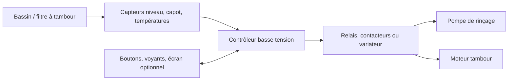

# Vue d'ensemble de l'architecture

## Diagramme de contexte

## Principes d'architecture

- Garder la logique de commande en basse tension.
- Isoler clairement la partie puissance.
- Préférer des modules du commerce pour le prototype.
- Documenter toute décision structurante dans le journal de décisions.
- Organiser le firmware autour d'une machine à états testable.
