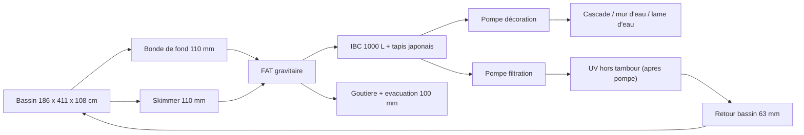
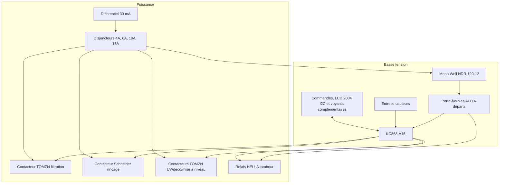

# Architecture matérielle

## Blocs materiels

| Bloc | Rôle | Options envisagées |
| --- | --- | --- |
| Carte de contrôle | Exécute la logique de lavage et sécurité | KC868-A16 ESP32 classique REV.1.6.3 recuee pour la V1 |
| Entrées capteurs | Detectent niveau de lavage, niveau critique, capot, température bassin et température ambiante | Flotteurs, capteurs pression, inductifs, contacts secs, sondes de température |
| Sorties puissance | Pilotent pompe, moteur et prises auxiliaires | Sorties MOSFET 12 VDC vers relais HELLA, contacteurs TOMZN et relais d'interface du contacteur Schneider 230 VAC |
| Interface locale | Permet conduite, signalisation et diagnostic | LCD 2004 / 20x4 I2C 3,3 V, boutons, voyants |
| Communication distante | Option V2 pour supervision et notifications à distance | Wi-Fi cible ; BLE seul insuffisant, Ethernet non disponible sur site, SMS non retenu par défaut |
| Temps fiable | Support futur d'horodatage V2 | Module RTC DS3231 I2C 3,3 V avec batterie rechargeable ; synchronisation réseau possible plus tard en complement, sans dependance exclusive à Internet |
| Alimentation | Fournit basse tension stable | 12 VDC retenu via Mean Well NDR-120-12, 120 W, 10 A |

## Composants materiels deja choisis

| Sous-ensemble | Choix retenu | Impact de conception |
| --- | --- | --- |
| Toile de filtration tambour | Inox 74 microns | Fixe la finesse de filtration mécanique de référence |
| Capteurs de niveau | CR18-8DN | Imposent une interface d'entrée compatible NPN, 12-24 VDC, 3 fils |
| Plateforme de contrôle | KC868-A16 ESP32 classique REV.1.6.3, 16 entrees `X1` a `X16` et 16 sorties MOSFET `Y1` a `Y16` 12/24 VDC | Carte recue et validee a vide le 2026-07-22 ; couvre les 9 entrees et 9 sorties V1 avec 7 voies libres de chaque type ; remplace l'A32 surdimensionnee selon ADR-0012. Les charges et auxiliaires restent a valider. |
| Alimentation 12 VDC | Mean Well NDR-120-12, 120 W, 10 A, rail DIN | Alimente automate, capteurs, IHM, accessoires et moteur tambour via départs fusibles |
| Porte-fusibles 12 VDC | Porte-fusibles ATO 4 emplacements | Distribution 12 VDC ; adaptateur rail DIN imprime 3D realise et fonctionnel |
| Moteur tambour | Motorreducteur Fyearfly 12 VDC 10 rpm | Simplifie la vitesse de tambour par rapport au moteur d'essuie-glace candidat |
| Relais moteur tambour | HELLA 4RD 933 332-551, 12 V, charge inductive 15 A | Commande le moteur tambour ; support rail DIN imprime 3D realise et fonctionnel |
| Pompe de rinçage | VEVOR / Leo EKJ-802S, 220-240 VAC, 800 W indique projet | Impose une commande secteur adaptée à une charge moteur et une mesure du débit réel sur la rampe et les buses déjà achetées et fabriquées |
| Contacteur pompe de rinçage | Schneider Electric TeSys LC1D18P7, 3P, AC-3 18 A, bobine 230 VAC | Sa bobine 230 VAC est commandee par le contact d'un relais d'interface a bobine 12 VDC, lui-meme pilote par une sortie MOSFET A16 ; reference du relais a choisir et valider |
| Contacteurs filtration, UV, décoration, mise à niveau | TOMZN TOCT1-25Z, 25 A, bobine 12 VDC | Pilotés directement en 12 VDC par les sorties MOSFET de l'A16 si la mesure confirme moins de 500 mA par bobine, avec suppression de surtension adaptee |
| Ecran local | LCD 2004 / 20x4 I2C 3,3 V, fond bleu retenu | Afficheur texte principal de l'IHM locale ; raccordement cible sur un bus I2C auxiliaire separe via `GPIO32` / `GPIO33` de l'A16, sans charger le bus I2C interne des entrees/sorties |
| Horloge temps reel | Module RTC DS3231 I2C 3,3 V avec batterie rechargeable | Source locale d'heure fiable pour V2, et horodatage MVP seulement si simple ; adresse I2C attendue `0x68`, raccordement cible sur le bus I2C auxiliaire du port d'extension si la cohabitation avec le LCD est validee |
| Sondes de temperature | 2 x DS18B20 étanches inox 3 fils, longueur cible 3 m | Meme modele pour `TEMP_BASSIN` et `TEMP_LOCAL` ; alimentation 3,3 V, pull-up 4,7 kΩ sur `DATA`. Brochage banc confirme : rouge VCC, noir GND, jaune DATA ; ROMs associees par role. |

## Carte KC868-A16 effectivement recue

La carte disponible est une **Kincony KC868-A16 REV.1.6.3**, a ESP32-WROOM-32 classique. Le test `kc868_a16_hw_safe` du 2026-07-22 a confirme le bus interne `GPIO4/GPIO5` et les quatre adresses `0x21`, `0x22`, `0x24`, `0x25`. Les essais par contact sec ont confirme que `0x22` lit physiquement `X1` a `X8`, puis `0x21` lit `X9` a `X16`. La serigraphie physique utilise `X1` a `X16` pour les entrees et `Y1` a `Y16` pour les sorties MOSFET. Les aliases firmware `I1` a `I9` et `O1` a `O9` suivent respectivement `X1` a `X9` et `Y1` a `Y9`.

Le test a ecrit l'etat brut OFF `0xFF 0xFF` aux deux banques de sorties et le build safe a refuse toute sortie appliquee. Avec les groupes de sorties alimentes en 12 V et sans charge, chaque borne `Y` mesure 100 a 200 mV au boot : l'etat OFF physique est confirme. Les impulsions de banc ont ensuite valide la polarite active et la commande individuelle isolee de `Y1-Y16`. Voir [VR-0001](../validation/VR-0001-reception-kc868-a16-rev1.6.3.md).

## Données hydrauliques d'entrée

L'installation cible a contrôler comprend un FAT avec :

- une emprise interne totale de 78 cm x 47 cm ;
- un trop-plein physique fixe à 30,5 cm de hauteur d'eau ;
- un compartiment eau propre de 62 cm x 47 cm contenant un tambour de 31 cm de diamètre sur 57 cm de longueur utile ;
- deux entrées de 110 mm : une bonde de fond et un skimmer ;
- deux sorties de 110 mm pour conserver le flux hydraulique ;
- une goutiere d'évacuation des dechets rinces vers un tuyau de 100 mm ;
- un report de niveau côté eau propre via un tube de 32 mm ;
- une rampe d'aspersion en 32 mm avec buses.

La rotation du tambour est retenue avec un motorreducteur Fyearfly 12 VDC 10 rpm, en fonctionnement intermittent pendant les cycles de lavage, tests ou commandes manuelles autorisées. Ce choix remplace le candidat initial de moteur d'essuie-glace SWF 403.835 et évite de dépendre d'une réduction mécanique importante pour atteindre une vitesse exploitable.

Le rinçage est envisagé avec une pompe de surface VEVOR / Leo EKJ-802S en 220-240 VAC. La rampe d'aspersion 32 mm et les buses sont déjà achetées et fabriquées ; elles font donc partie du périmètre matériel MVP. La courbe disponible indique environ 3,6 m3/h a très faible hauteur utile et environ 2,4 m3/h à 21 m ; le débit effectif devra être mesuré sur cette rampe réelle.

Le FAT sera installe dans un local de filtration maconne, isole en XPS 5 cm, sans pluie directe sur le FAT. Un capot transparent relevable est prévu au-dessus du petit batiment pour permettre de voir le tambour tourner sans ouvrir le FAT ; ce capot et le couvercle transparent désignent la même pièce physique. Sa matiere et son niveau d'isolation restent à définir.

Ces données doivent être prises en compte pour les choix de capteurs, l'implantation du niveau de lavage côté eau propre, l'ajout d'une mesure de température bassin, l'ajout d'une mesure de température ambiante local et les contraintes de débit autour du filtre.

La liste de signaux à prévoir pour le MVP est détaillée dans [04-table-entrees-sorties.md](04-table-entrees-sorties.md).

## Chaine hydraulique de référence

## Interfaces mécaniques et instrumentation

| Sous-ensemble | Interface connue | Impact de conception |
| --- | --- | --- |
| Tube de report de niveau | 32 mm, bouche en partie haute avec event de 1 mm | Permet une fixation protégée des deux capteurs côté eau propre EP_LAVAGE et EP_CRITIQUE, et facilite le nettoyage |
| Capteurs de niveau | 2 x CR18-8DN câblés en MVP, M18, distance ajustable 8 mm, sortie NPN normalement ouverte, alimentation 12-24 VDC, 10 mA max, DC 3 fils | EP_LAVAGE au-dessus de EP_CRITIQUE sur supports réglables en hauteur ; réserve mécanique non câblée possible pour un troisième capteur futur ; interface directe sur entrées digitales KC868-A16 retenue par défaut, avec validation banc obligatoire avant câblage final |
| Goutiere de trop-plein | seuil fixe à 30,5 cm | Fixe la cote maximale exploitable pour les seuils de pilotage |
| Support du FAT | a fabriquer | Conditionne tout le régime gravitaire par rapport au bassin |
| Capot | à créer avec fin de course OMRCH ME-8104, contact `1NO1NC` | Ajoute l'entrée de sécurité `CAPOT_OUVERT`. Le montage doit donner capot fermé = boucle fermée, capot ouvert ou fil coupé = boucle ouverte ; choix `NO` ou `NC` à valider au multimètre selon la mécanique réelle. |
| Joint a levre tambour | a poser | Indispensable pour separer correctement eau sale et eau propre |
| Moteur tambour | Fyearfly 12 VDC 10 rpm | Courant réel, couple disponible, sens de rotation et fixation mécanique à valider avant schéma définitif |
| Transmission tambour | A définir autour du motorreducteur 10 rpm | La vitesse finale tambour doit être validée en essai réel ; la réduction 3:1 du candidat SWF n'est plus l'hypothèse de base |
| Protection moteur tambour | Fusible ATO 5 A sur le départ moteur et relais HELLA 12 V 15 A inductif | Courant de blocage annoncé 6,5 A d'après screenshot fournisseur ; calibre 5 A retenu pour essai ; comportement réel de protection à vérifier sur montage MVP |
| Pompe de rinçage | VEVOR / Leo EKJ-802S, raccords 1 pouce, IPX4, classe I | Pompe 230 VAC de surface, a protéger electriquement et a maintenir hors immersion |
| Rampe de rinçage | Tuyau 32 mm + buses déjà achetés et fabriqués | Le point débit/pression réel de la pompe devra être mesuré sur cet ensemble |
| Sonde température bassin | DS18B20 étanche inox 3 fils, longueur cible 3 m | A implanter dans une eau représentative : arrivée gravitaire avant pompe/UV ou bassin en zone brassée, ombragée et accessible ; montage protégé et démontable ; alimentation 3,3 V, pull-up 4,7 kΩ sur `DATA` ; alerte informative en V1 avec seuils initiaux < 4 deg C et > 28 deg C |
| Sonde température ambiante local | DS18B20 étanche inox 3 fils, longueur cible 3 m, même modèle que la sonde bassin | Hors coffret, dans l'air du local, loin de l'alimentation, des contacteurs, des pompes, du soleil et du volume chaud sous capot ; support ventilé et accessible pour conserver une mesure d'air représentative ; alerte informative en V1 avec seuils initiaux < 2 deg C et > 40 deg C |
| IHM locale | LCD 2004 / 20x4 I2C 3,3 V, commandes physiques, voyants MARCHE, ALARME et LAVAGE | L'écran porte le détail ; raccordement cible sur `GPIO32` / `GPIO33` des ports capteurs KC868-A16 via un bus I2C auxiliaire separe ; sélecteur AUTO / MAINTENANCE 22 mm 2 positions maintenues `1NO + 1NC` ; boutons poussoirs 22 mm momentanés `1NO1NC` : reset bleu, test jaune, manuel tambour noir, manuel rinçage noir ; voyants LED étanches 16 mm 12 VDC retenus pour le MVP : MARCHE vert, ALARME rouge et LAVAGE jaune |
| Liaison distante | option V2 Wi-Fi | Le matériel MVP est la base définitive de la V2 et doit être prêt pour une V2 Wi-Fi sans remplacement de plateforme principale ; la notification ne doit pas compromettre le fonctionnement local |
| Horloge fiable | RTC DS3231 retenue, implementation MVP optionnelle | Module RTC DS3231 I2C 3,3 V avec batterie rechargeable, adresse attendue `0x68`. Raccordement cible sur `GPIO32` / `GPIO33` de la KC868-A16 via un bus I2C auxiliaire separe, partage possible avec le LCD 2004 si les essais confirment pull-up 3,3 V, adresses distinctes et stabilite. Sert au temps civil, aux logs et aux statistiques ; les temporisations de securite restent sur timers internes. |
| Position tambour | option V1.1 à étudier | Peut aider pour l'indexation et certains diagnostics avances |

L'UV est retenu hors tambour dans la chaine de filtration, après la pompe principale. Il reste asservi à la filtration autorisée et à l'absence de EP_CRITIQUE ; il n'est pas coupé sur un défaut FAT non critique si la filtration reste autorisée.

## Architecture electrique retenue V1

La decision de reference est [ADR-0004 - Architecture electrique V1](../decisions/ADR-0004-architecture-electrique-v1.md).

La commande matérielle visée correspond au MVP définitif, pas à une commande d'essais séparée. Les validations restantes servent à figer le schéma, les protections, les réglages et l'implantation, en conservant la même plateforme matérielle pour la V2.

### Tableau 230 VAC

| Depart | Protection retenue | Equipements | Commentaire |
| --- | --- | --- | --- |
| Protection amont cote maison | Disjoncteur dedie 16 A | Liaison maison vers coffret filtration | Calibre retenu pour la liaison existante d'environ 20 m, tant que sa section n'est pas confirmee en 2,5 mm2. |
| Tete de tableau | Interrupteur differentiel 2P 30 mA, 40 A, type A | Tableau local complet | Choix coherent avec les charges reelles du MVP ; la notice AquaForte DM-Vario demande 30 mA sans imposer type F ou B. |
| Alimentation 12 VDC | Disjoncteur 4 A courbe C | Mean Well NDR-120-12 | Depart dedie au controle basse tension. |
| Pompe de rincage | Disjoncteur 10 A courbe C | Pompe VEVOR / Leo EKJ-802S | Commande par contacteur Schneider LC1D18P7, bobine 230 VAC. Le calibre du disjoncteur reste 10 A courbe C. |
| Prises local | Disjoncteur 16 A courbe C | 1 prise bulleur bassin, 1 prise bulleur filtre bio, 2 prises maintenance | Les bulleurs restent hors controleur ; les prises maintenance sont reservees aux usages ponctuels. |
| Pompe filtration | Disjoncteur 6 A courbe C | Pompe principale de filtration | Depart separe et prioritaire car organe essentiel. |
| UV, pompe decoration, mise a niveau | Disjoncteur 6 A courbe C | UV, pompe decoration, mise a niveau automatique | Separé de la filtration afin qu'un defaut sur un organe non essentiel ne coupe pas la pompe de filtration. |
| Eclairage exterieur | Disjoncteur 6 A courbe C | 6 spots LED exterieurs 3 W avec detecteurs | Depart distinct hors automatisme FAT ; charge nominale 18 W, soit environ 0,08 A sous 230 VAC, avec environ 10 a 15 m de cable. |

### Distribution 12 VDC

| Depart 12 VDC | Fusible | Usage |
| --- | --- | --- |
| Moteur tambour | 5 A | Motorreducteur Fyearfly 12 VDC 10 rpm via relais HELLA |
| Automate | 3 A | KC868-A16, alimentation principale et deux alimentations des banques de sorties selon schema final |
| Capteurs et boutons | 1 A | Capteurs de niveau, capot et commandes locales |
| Ecran, voyants, accessoires | 1 A | IHM locale, signalisation et accessoires |

Le porte-fusibles ATO devra etre fixe proprement dans le coffret. Preference si l'achat reste ouvert : porte-fusibles ou repartiteur fusible DC natif rail DIN. Si le modele ATO 4 emplacements est conserve et n'a pas de fixation rail DIN native, un adaptateur imprime en 3D uniquement mecanique sera concu pour assurer le maintien, l'acces aux fusibles, l'absence de contrainte sur les cosses et le reperage des quatre departs.

### Interface des capteurs CR18-8DN

Les entrees digitales du KC868-A16 sont optocouplees et prevues pour des contacts ramenes vers `GND`. Le CR18-8DN fournit une sortie `NPN` collecteur ouvert : marron sur `+12 VDC`, bleu sur `0 V`, noir vers l'entree digitale.

Le cablage direct est retenu en premiere intention pour `EP_LAVAGE` et `EP_CRITIQUE`, sans relais d'interface ni conditionneur supplementaire. Cette decision reste soumise a un test banc avec les vrais capteurs et la revision A16 recue, afin de confirmer le courant d'entree, le sens logique, la stabilite de lecture, le comportement en fil coupe et l'absence de declenchements parasites avec les longueurs de cable reelles.

### Interface du contact de capot

Le contact de capot V1 retenu est un fin de course industriel OMRCH `ME-8104`, momentane, avec contact `1NO1NC`. Il est raccorde comme un contact sec vers `GND` sur une entree digitale du KC868-A16.

Le comportement fonctionnel attendu est : capot ferme = boucle fermee vers l'entree automate ; capot ouvert, fil coupe ou connecteur debranche = boucle ouverte. Le choix pratique entre les bornes `NO` et `NC` du `ME-8104` doit etre valide au multimetre apres montage mecanique, car le nom des bornes decrit l'etat du switch au repos, pas forcement l'etat capot ferme.

Le fin de course doit etre fixe sur la partie fixe du bâti ou du petit batiment, et actionne par une patte ou came reglable solidaire du capot transparent. Le reglage doit eviter qu'un capot entrouvert soit interprete comme ferme.

### Interface de l'ecran local

L'ecran local V1 retenu est un LCD 2004 / 20x4 I2C 3,3 V, fond bleu, avec module I2C de type PCF8574 ou equivalent. Il est alimente par le depart 12 VDC `Ecran, voyants, accessoires` seulement si le module integre une regulation adaptee ; par defaut, son alimentation logique et ses lignes I2C doivent rester compatibles 3,3 V.

Le raccordement cible utilise deux des trois GPIO capteurs de la KC868-A16, avec `GPIO32` et `GPIO33` affectes a un bus I2C auxiliaire separe porte par le second controleur `TwoWire` de l'ESP32. Ce choix evite d'ajouter un peripherique sur le bus I2C interne deja utilise par les PCF8574 des sorties et des entrees digitales. Le brochage de la revision recue et l'ordre exact `SDA` / `SCL` seront figes dans le firmware et le schema apres validation banc.

La validation banc doit verifier l'adresse I2C reelle, probablement `0x27` ou `0x3F`, le contraste, le retroeclairage, la lisibilite en facade, le comportement au redemarrage et l'absence de pull-up vers 5 V sur `SDA` / `SCL`. Si le module recu n'est pas reellement compatible 3,3 V, ajouter un convertisseur de niveau I2C 3,3 V / 5 V ou remplacer le module par une version 3,3 V confirmee.

### Interface de l'horloge RTC

L'heure fiable V2 retenue est un module RTC DS3231 I2C 3,3 V avec batterie rechargeable. Le module doit etre alimente en 3,3 V cote KC868-A16 / ESP32, avec `SDA` et `SCL` tires au 3,3 V uniquement. L'adresse I2C attendue est `0x68`.

Le raccordement cible reutilise le bus I2C auxiliaire separe du port d'extension `GPIO32` / `GPIO33`, partage avec le LCD 2004 I2C si la validation banc confirme la stabilite du bus et l'absence de conflit d'adresse. Si la cohabitation LCD + RTC est instable, la RTC devra etre deplacee sur un autre bus I2C si des GPIO libres le permettent.

La batterie rechargeable livree avec le module sert a conserver l'heure pendant les coupures d'alimentation principale. Le banc doit confirmer que la cellule livree est bien rechargeable, que l'heure est conservee apres coupure et que le module ne presente pas de pull-up I2C vers 5 V.

### Interface des sondes de temperature

Les deux sondes de temperature V1 retenues sont des DS18B20 etanches inox 3 fils, longueur cible 3 m. Le meme modele est utilise pour le bassin et pour le local afin de simplifier l'achat, le stock de rechange, le cablage et le firmware.

Le raccordement retenu est un bus 1-Wire commun alimente en 3,3 V, sans mode parasite : `VCC` sur `3.3 V`, `GND` sur `0 V` commun, `DATA` sur `GPIO14` de la KC868-A16, avec une resistance de pull-up `4,7 kΩ` entre `DATA` et `3.3 V`. Sur la KC868-A16, le bornier utilisateur `HT3` (parfois marque `GPIO3`) correspond a `GPIO14` ; il ne faut jamais utiliser l'entree optocouplee `X14`. Le brochage confirme est rouge = `VCC`, noir = `GND`, jaune = `DATA`. Les ROMs sont figees dans le profil : `TEMP_BASSIN = 28A3AFC800000062`, `TEMP_LOCAL = 284C19CC000000B2`; les deux lectures et leur role ont ete valides par rechauffement doux.

Si des GPIO libres sont disponibles, la preference est de separer `TEMP_BASSIN` et `TEMP_LOCAL` sur deux bus 1-Wire distincts. Si les GPIO sont limites, un bus commun reste acceptable en V1 puisque ces alertes sont informatives et non bloquantes.

Les couleurs de fils annoncees par les vendeurs ne doivent pas etre prises comme reference unique. Le banc doit verifier le brochage reel de chaque lot avant cablage definitif, ainsi que l'identification stable des sondes pour ne pas inverser eau et local dans le firmware.

### Commandes de puissance

| Organe | Commande automate | Organe de puissance retenu | Remarque |
| --- | --- | --- | --- |
| Moteur tambour | Sortie MOSFET A16 12 VDC vers bobine HELLA | Relais HELLA 4RD 933 332-551, 12 V, 15 A inductif | Mesurer le courant de bobine, ajouter la suppression adaptee si absente et imprimer le support rail DIN. |
| Pompe de rincage | Sortie MOSFET A16 vers relais d'interface 12 VDC, puis contact 230 VAC vers bobine LC1D18P7 | Contacteur moteur Schneider TeSys LC1D18P7, AC-3 18 A | Relais d'interface rail DIN a choisir avec contact `AC-15 >= 1 A sous 230 VAC` ; separation BT/secteur obligatoire. |
| Pompe filtration | Sortie MOSFET A16 12 VDC | Contacteur modulaire TOMZN TOCT1-25Z 25 A | Valider courant de bobine inferieur a 500 mA et suppression de surtension. |
| UV | Sortie MOSFET A16 12 VDC | Contacteur modulaire TOMZN TOCT1-25Z 25 A | Valider courant de bobine inferieur a 500 mA ; asservi a la filtration autorisee et a EP_CRITIQUE absent. |
| Pompe decoration | Sortie MOSFET A16 12 VDC | Contacteur modulaire TOMZN TOCT1-25Z 25 A | Valider courant de bobine inferieur a 500 mA ; suit les memes securites hydrauliques que la filtration. |
| Mise a niveau | Sortie MOSFET A16 12 VDC | Contacteur modulaire TOMZN TOCT1-25Z 25 A ou sortie equivalente | Valider courant de bobine inferieur a 500 mA ; coupee sur EP_CRITIQUE. |

## Schéma de principe

## Decisions matérielles a prendre

- reference finale de l'interrupteur differentiel 2P 30 mA, 40 A, type A ;
- cotes exactes EP_LAVAGE et EP_CRITIQUE sur le tube de report après mesure du niveau normal réel ;
- courant réel, fixation et sens de rotation du motorreducteur Fyearfly 12 VDC 10 rpm ;
- validation du fusible 5 A moteur tambour en référence au courant de blocage annoncé 6,5 A, avec mesure du courant en charge et vérification du comportement en blocage ;
- commande secteur de la pompe de rinçage, raccordement à la terre et validation du contacteur Schneider LC1D18P7 dans le schema final ;
- débit ou pression de rinçage de référence après mesure sur la rampe et les buses déjà fabriquées ;
- mesure terrain de la cote support FAT avant fabrication, afin d'aligner trop-plein physique et niveau hydraulique cible du bassin ;
- calcul final de la geometrie des ouvertures du tambour avant découpe ou perçage, avec objectif 0,20 à 0,23 m2 de surface filtrante utile ;
- validation banc des deux sondes DS18B20 étanches inox : brochage réel des fils, alimentation 3,3 V, pull-up 4,7 kΩ, lecture stable, perte de sonde et identification eau/local ;
- validation banc du LCD 2004 I2C 3,3 V : adresse, contraste, lisibilite, pull-up I2C et affectation `GPIO32` / `GPIO33` ;
- validation banc de la RTC DS3231 I2C 3,3 V : adresse `0x68`, batterie rechargeable livree, conservation de l'heure apres coupure, pull-up I2C 3,3 V et cohabitation avec le LCD 2004 sur `GPIO32` / `GPIO33` ;
- validation des références finales des voyants LED étanches 16 mm 12 VDC : MARCHE vert, ALARME rouge et LAVAGE jaune, avec joint de façade, raccordement arrière et profondeur compatibles coffret ;
- architecture Wi-Fi V2 autour du KC868-A16, sans remplacement de plateforme principale ;
- architecture de notification pour une V2 : embarquée, serveur local, service mail ou service push simple ;
- besoin ou non d'un capteur de position tambour ;
- stratégie matérielle d'indexation du tambour hors lavage pour V1.1 ;
- methode empirique d'estimation de la consommation d'eau de rinçage pour V1.1 ou V2 ;
- validation banc de l'interface directe KC868-A16 / CR18-8DN, notamment courant d'entree, sens logique, stabilité, rupture de fil et comportement avec longueurs de câble réelles ;
- validation mecanique et electrique du contact capot OMRCH ME-8104 : bornes a utiliser, capot ferme boucle fermee, capot ouvert ou fil coupe boucle ouverte, alignement de la came et repetabilite ;
- choix des GPIO 1-Wire pour `TEMP_BASSIN` et `TEMP_LOCAL`, bus separes preferes si disponibles ;
- sections de cables retenues en premiere intention : 2 x 2,5 mm2 pour le moteur tambour 12 VDC, 0,5 mm2 pour voyants et boutons, 1,5 mm2 pour les circuits 230 VAC cote filtration y compris cablage interne d'armoire ; borniers, repérage et implantation physique des protections ;
- reference finale materielle du disjoncteur 6 A courbe C pour l'eclairage exterieur, avec validation de la section et du cheminement du cable ;
- adaptateur rail DIN imprime en 3D du porte-fusibles ATO si le composant retenu n'est pas DIN natif ;
- référence finale du coffret, minimum IP55, préférence IP65, avec presse-etoupes et gestion de condensation si necessaire ;
- connecteurs et borniers.
