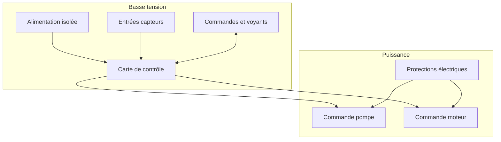

# Architecture matérielle

## Blocs matériels

| Bloc | Rôle | Options envisagées |
| --- | --- | --- |
| Carte de contrôle | Exécute la logique de lavage et sécurité | ESP32, automate compact, carte Arduino industrielle |
| Entrées capteurs | Détectent niveau, défauts, rotation | Flotteurs, capteurs pression, inductifs, contacts secs |
| Sorties puissance | Pilotent pompe et moteur | Relais, contacteurs, variateur, module relais opto-isolé |
| Interface locale | Permet conduite et diagnostic | Boutons, voyants, écran simple |
| Alimentation | Fournit basse tension stable | Alimentation DIN 12 V ou 24 V, conversion locale si besoin |

## Schéma de principe

## Décisions matérielles à prendre

- tension de commande : 12 V ou 24 V ;
- type de carte de contrôle ;
- type de capteur principal de déclenchement ;
- choix relais/contacteurs/variateur ;
- niveau de protection du coffret ;
- connecteurs et borniers.
