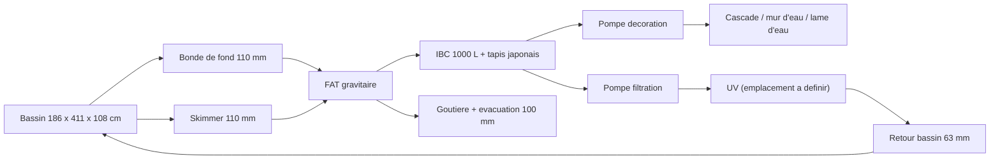
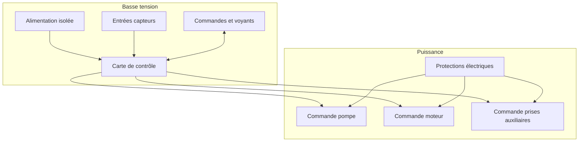

# Architecture matérielle

## Blocs matériels

| Bloc | Rôle | Options envisagées |
| --- | --- | --- |
| Carte de contrôle | Exécute la logique de lavage et sécurité | ESP32, automate compact, carte Arduino industrielle |
| Entrées capteurs | Détectent niveau de lavage, niveau bas, défauts, rotation | Flotteurs, capteurs pression, inductifs, contacts secs |
| Sorties puissance | Pilotent pompe, moteur et prises auxiliaires | Relais, contacteurs, variateur, module relais opto-isolé |
| Interface locale | Permet conduite et diagnostic | Boutons, voyants, écran simple |
| Alimentation | Fournit basse tension stable | Alimentation DIN 12 V ou 24 V, conversion locale si besoin |

## Composants materiels deja choisis

| Sous-ensemble | Choix retenu | Impact de conception |
| --- | --- | --- |
| Toile de filtration tambour | Inox 74 microns | Fixe la finesse de filtration mecanique de reference |
| Capteurs de niveau | CR18-8DN | Imposent une interface d'entree compatible NPN, 12-24 VDC, 3 fils |

## Données hydrauliques d'entrée

L'installation cible à contrôler comprend un FAT avec :

- une emprise interne totale de 78 cm x 47 cm ;
- un trop-plein physique fixe à 30,5 cm de hauteur d'eau ;
- un compartiment eau propre de 62 cm x 47 cm contenant un tambour de 31 cm de diamètre sur 57 cm de longueur utile ;
- deux entrées de 110 mm : une bonde de fond et un skimmer ;
- deux sorties de 110 mm pour conserver le flux hydraulique ;
- une goutiere d'evacuation des dechets rinces vers un tuyau de 100 mm ;
- un report de niveau cote eau propre via un tube de 32 mm ;
- une rampe d'aspersion en 32 mm avec buses.

Ces données doivent être prises en compte pour les choix de capteurs, l'implantation du niveau de lavage et les contraintes de débit autour du filtre.

## Chaine hydraulique de reference

## Interfaces mecaniques et instrumentation

| Sous-ensemble | Interface connue | Impact de conception |
| --- | --- | --- |
| Tube de report de niveau | 32 mm, bouche en partie haute avec event de 1 mm | Permet une fixation protegee des capteurs et facilite le nettoyage |
| Capteurs de niveau | CR18-8DN, M18, distance ajustable 8 mm, sortie NPN, alimentation 12-24 VDC, 10 mA, DC 3 fils | Necessitent un support mecanique adapte et des entrees compatibles ou conditionnees |
| Goutiere de trop-plein | seuil fixe a 30,5 cm | Fixe la cote maximale exploitable pour les seuils de pilotage |
| Support du FAT | a fabriquer | Conditionne tout le regime gravitaire par rapport au bassin |
| Capot | a creer avec capteur d'ouverture | Ajoute une entree de securite supplementaire |
| Joint a levre tambour | a poser | Indispensable pour separer correctement eau sale et eau propre |

## Schéma de principe

## Décisions matérielles à prendre

- tension de commande : 12 V ou 24 V ;
- type de carte de contrôle ;
- nombre de capteurs CR18-8DN et implantation exacte sur le tube de report ;
- compatibilite native ou conditionnement des entrees pour capteurs NPN 12-24 VDC ;
- nombre de prises auxiliaires à couper et puissance par voie ;
- choix relais/contacteurs/variateur ;
- niveau de protection du coffret ;
- connecteurs et borniers.
