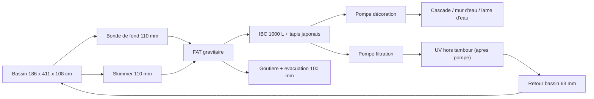
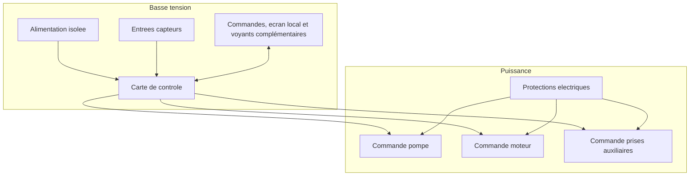

# Architecture matérielle

## Blocs materiels

| Bloc | Rôle | Options envisagées |
| --- | --- | --- |
| Carte de contrôle | Exécute la logique de lavage et sécurité | Choix à brainstormer : automate compact / module industriel DIN ou carte microcontrôleur type ESP32 / Arduino industriel, selon coût, effort de développement, robustesse, maintenabilité, capacité d'heure fiable V2 et compatibilité Wi-Fi V2 sans remplacement de plateforme |
| Entrées capteurs | Detectent niveau de lavage, niveau critique, capot, température bassin et température ambiante | Flotteurs, capteurs pression, inductifs, contacts secs, sondes de température |
| Sorties puissance | Pilotent pompe, moteur et prises auxiliaires | Relais, contacteurs, variateur, module relais opto-isole |
| Interface locale | Permet conduite, signalisation et diagnostic | Boutons, voyants, écran simple |
| Communication distante | Option V2 pour supervision et notifications à distance | Wi-Fi cible ; BLE seul insuffisant, Ethernet non disponible sur site, SMS non retenu par défaut |
| Temps fiable | Support futur d'horodatage V2 | RTC, temps local conserve, module temps, synchronisation réseau ou capacité equivalente selon plateforme ; ne pas dependre exclusivement d'Internet |
| Alimentation | Fournit basse tension stable | Tension de commande ouverte a ce stade : 12 V ou 24 V, avec 12 V séparé pour le moteur tambour si besoin |

## Composants materiels deja choisis

| Sous-ensemble | Choix retenu | Impact de conception |
| --- | --- | --- |
| Toile de filtration tambour | Inox 74 microns | Fixe la finesse de filtration mécanique de référence |
| Capteurs de niveau | CR18-8DN | Imposent une interface d'entrée compatible NPN, 12-24 VDC, 3 fils |
| Moteur tambour candidat | Moteur d'essuie-glace avant SWF 403.835, 12 V DC | Impose une alimentation 12 V suffisamment dimensionnée, une commande petite vitesse et une protection surintensité/blocage |
| Pompe de rinçage | VEVOR / Leo EKJ-802S, 220-240 VAC, 800 W indique projet | Impose une commande secteur adaptée à une charge moteur et une mesure du débit réel aux buses |

## Données hydrauliques d'entrée

L'installation cible a contrôler comprend un FAT avec :

- une emprise interne totale de 78 cm x 47 cm ;
- un trop-plein physique fixe à 30,5 cm de hauteur d'eau ;
- un compartiment eau propre de 62 cm x 47 cm contenant un tambour de 31 cm de diamètre sur 57 cm de longueur utile ;
- deux entrées de 110 mm : une bonde de fond et un skimmer ;
- deux sorties de 110 mm pour conserver le flux hydraulique ;
- une goutiere d'évacuation des dechets rinces vers un tuyau de 100 mm ;
- un report de niveau côté eau propre via un tube de 32 mm ;
- une rampe d'aspersion en 32 mm avec buses.

La rotation du tambour est envisagée avec un moteur d'essuie-glace avant SWF 403.835 de Peugeot 106 phase 2, utilisé en petite vitesse, en 12 V DC et en fonctionnement intermittent. La transmission prévue est un pignon moteur de 10 cm vers un engrenage tambour de 30 cm, soit une réduction 3:1.

Le rinçage est envisagé avec une pompe de surface VEVOR / Leo EKJ-802S en 220-240 VAC. La courbe disponible indique environ 3,6 m3/h a très faible hauteur utile et environ 2,4 m3/h à 21 m ; le débit effectif aux buses devra être mesure sur la rampe réelle.

Le FAT sera installe dans un local de filtration maconne, isole en XPS 5 cm, sans pluie directe sur le FAT. Un capot transparent relevable est prévu au-dessus du petit batiment pour permettre de voir le tambour tourner sans ouvrir le FAT ; ce capot et le couvercle transparent désignent la même pièce physique. Sa matiere et son niveau d'isolation restent à définir.

Ces données doivent être prises en compte pour les choix de capteurs, l'implantation du niveau de lavage côté eau propre, l'ajout d'une mesure de température bassin, l'ajout d'une mesure de température ambiante local et les contraintes de débit autour du filtre.

La liste de signaux à prévoir pour le prototype est détaillée dans [04-table-entrees-sorties.md](04-table-entrees-sorties.md).

## Chaine hydraulique de référence

## Interfaces mécaniques et instrumentation

| Sous-ensemble | Interface connue | Impact de conception |
| --- | --- | --- |
| Tube de report de niveau | 32 mm, bouche en partie haute avec event de 1 mm | Permet une fixation protégée des deux capteurs côté eau propre EP_LAVAGE et EP_CRITIQUE, et facilite le nettoyage |
| Capteurs de niveau | CR18-8DN, M18, distance ajustable 8 mm, sortie NPN, alimentation 12-24 VDC, 10 mA, DC 3 fils | Necessitent un support mécanique adapté et des entrées compatibles ou conditionnees |
| Goutiere de trop-plein | seuil fixe à 30,5 cm | Fixe la cote maximale exploitable pour les seuils de pilotage |
| Support du FAT | a fabriquer | Conditionne tout le régime gravitaire par rapport au bassin |
| Capot | à créer avec capteur d'ouverture | Ajoute une entrée de sécurité supplémentaire |
| Joint a levre tambour | a poser | Indispensable pour separer correctement eau sale et eau propre |
| Moteur tambour | SWF 403.835, 12 V DC, connecteur 5 broches | Brochage, vitesse, courant et sens de rotation à valider avant schéma définitif |
| Transmission tambour | Pignon 10 cm vers engrenage 30 cm | Reduction 3:1, vitesse tambour estimée 13 à 20 tr/min avant mesure |
| Protection moteur tambour | Fusible initial 10 à 15 A et protection matérielle surintensité/blocage obligatoire | Le retour défaut vers l'automate est optionnel en V1 si le module choisi le fournit simplement |
| Pompe de rinçage | VEVOR / Leo EKJ-802S, raccords 1 pouce, IPX4, classe I | Pompe 230 VAC de surface, a protéger electriquement et a maintenir hors immersion |
| Rampe de rinçage | Tuyau 32 mm + buses | Le choix des buses fixera le point débit/pression réel de la pompe |
| Sonde température bassin | sonde numérique étanche type DS18B20 candidate | A implanter dans le bassin ou une zone très représentative de l'eau du bassin ; alerte informative en V1 avec seuils initiaux < 4 deg C et > 28 deg C |
| Sonde température ambiante local | sonde numérique simple candidate | Fournit une mesure représentative de l'air du local de filtration ; alerte informative en V1 avec seuils initiaux < 2 deg C et > 40 deg C |
| IHM locale | écran texte ou petit afficheur, commandes physiques, voyants MARCHE et ALARME | L'écran porte le détail ; voyant MARCHE vert et voyant ALARME rouge sont retenus en V1, voyant LAVAGE jaune ou ambre optionnel |
| Liaison distante | option V2 Wi-Fi | Le matériel MVP doit être prêt pour une V2 Wi-Fi sans remplacement de plateforme principale ; la notification ne doit pas compromettre le fonctionnement local |
| Horloge fiable | capacité plateforme V2 obligatoire, implementation MVP optionnelle | La plateforme V1 doit permettre une heure fiable en V2 sans remplacement matériel principal, par RTC, temps local conserve, module temps, synchronisation réseau ou equivalent, sans dépendance exclusive à Internet |
| Position tambour | option V1.1 à étudier | Peut aider pour l'indexation et certains diagnostics avances |

L'UV est retenu hors tambour dans la chaine de filtration, après la pompe principale. Il reste asservi à la filtration autorisée et à l'absence de EP_CRITIQUE ; il n'est pas coupé sur un défaut FAT non critique si la filtration reste autorisée.

## Schéma de principe

## Decisions matérielles a prendre

- tension de commande : 12 V ou 24 V, decision ouverte ;
- type de carte de contrôle, à comparer selon coût, effort de développement, robustesse et maintenabilité ;
- nombre de capteurs CR18-8DN et implantation exacte sur le tube de report ;
- brochage exact du moteur tambour SWF 403.835 et isolation propre des fonctions parking en V1, sauf contrainte de brochage simple ;
- alimentation 12 V moteur, calibre fusible et protection matérielle surintensité/blocage ;
- commande secteur de la pompe de rinçage, protection moteur et raccordement à la terre ;
- débit ou pression de rinçage de référence après essais sur la rampe et les buses ;
- mesure terrain de la cote support FAT avant fabrication, afin d'aligner trop-plein physique et niveau hydraulique cible du bassin ;
- calcul final de la geometrie des ouvertures du tambour avant découpe ou perçage, avec objectif 0,20 à 0,23 m2 de surface filtrante utile ;
- type de sonde de température bassin et implantation exacte ;
- type de sonde de température ambiante local et implantation exacte ;
- type d'IHM locale : LED, écran ou combinaison ;
- nombre de voyants, couleurs et signification ;
- architecture Wi-Fi V2 : Wi-Fi natif ou module Wi-Fi ajoutable proprement sans remplacement de plateforme principale ;
- architecture de notification pour une V2 : embarquée, serveur local, service mail ou service push simple ;
- besoin ou non d'un capteur de position tambour ;
- stratégie matérielle d'indexation du tambour hors lavage pour V1.1 ;
- methode empirique d'estimation de la consommation d'eau de rinçage pour V1.1 ou V2 ;
- compatibilité native ou conditionnement des entrées pour capteurs NPN 12-24 VDC ;
- interface d'entrée nécessaire pour la sonde de température ;
- interface d'entrée nécessaire pour la sonde de température ambiante ;
- nombre de prises auxiliaires à couper et puissance par voie ;
- choix relais/contacteurs/variateur ;
- niveau de protection du coffret dans un local humide non expose à la pluie directe ;
- connecteurs et borniers.
