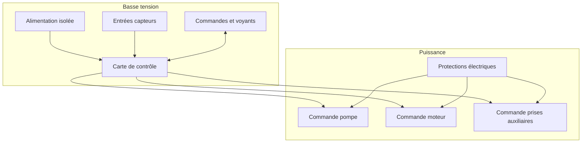

# Architecture matérielle

## Blocs matériels

| Bloc | Rôle | Options envisagées |
| --- | --- | --- |
| Carte de contrôle | Exécute la logique de lavage et sécurité | ESP32, automate compact, carte Arduino industrielle |
| Entrées capteurs | Détectent niveau de lavage, niveau bas, défauts, rotation | Flotteurs, capteurs pression, inductifs, contacts secs |
| Sorties puissance | Pilotent pompe, moteur et prises auxiliaires | Relais, contacteurs, variateur, module relais opto-isolé |
| Interface locale | Permet conduite et diagnostic | Boutons, voyants, écran simple |
| Alimentation | Fournit basse tension stable | Alimentation DIN 12 V ou 24 V, conversion locale si besoin |

## Données hydrauliques d'entrée

L'installation cible à contrôler comprend un FAT avec :

- deux entrées de 110 mm : une bonde de fond et un skimmer ;
- deux sorties de 110 mm pour conserver le flux hydraulique.

Ces données doivent être prises en compte pour les choix de capteurs, l'implantation du niveau de lavage et les contraintes de débit autour du filtre.

## Schéma de principe

## Décisions matérielles à prendre

- tension de commande : 12 V ou 24 V ;
- type de carte de contrôle ;
- type de capteur principal de déclenchement ;
- architecture de détection du niveau bas de sécurité ;
- nombre de prises auxiliaires à couper et puissance par voie ;
- choix relais/contacteurs/variateur ;
- niveau de protection du coffret ;
- connecteurs et borniers.
