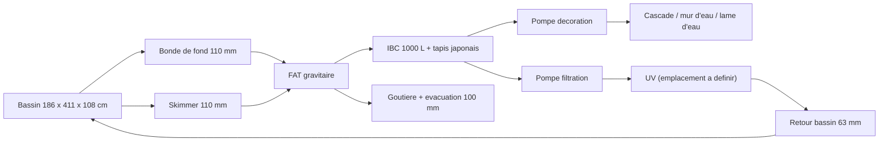
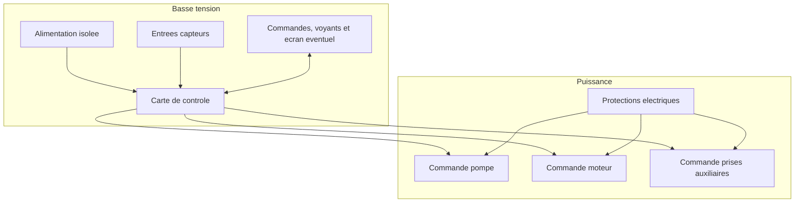

# Architecture materielle

## Blocs materiels

| Bloc | Role | Options envisagees |
| --- | --- | --- |
| Carte de controle | Execute la logique de lavage et securite | ESP32, automate compact, carte Arduino industrielle |
| Entrees capteurs | Detectent niveau de lavage, niveau bas, defauts, rotation, temperature bassin et temperature ambiante | Flotteurs, capteurs pression, inductifs, contacts secs, sondes de temperature |
| Sorties puissance | Pilotent pompe, moteur et prises auxiliaires | Relais, contacteurs, variateur, module relais opto-isole |
| Interface locale | Permet conduite, signalisation et diagnostic | Boutons, voyants, ecran simple, buzzer |
| Communication distante | Permet supervision et notifications a distance | Wi-Fi, BLE, Ethernet, modem cellulaire, passerelle externe |
| Alimentation | Fournit basse tension stable | Alimentation DIN 12 V ou 24 V, conversion locale si besoin |

## Composants materiels deja choisis

| Sous-ensemble | Choix retenu | Impact de conception |
| --- | --- | --- |
| Toile de filtration tambour | Inox 74 microns | Fixe la finesse de filtration mecanique de reference |
| Capteurs de niveau | CR18-8DN | Imposent une interface d'entree compatible NPN, 12-24 VDC, 3 fils |

## Donnees hydrauliques d'entree

L'installation cible a controler comprend un FAT avec :

- une emprise interne totale de 78 cm x 47 cm ;
- un trop-plein physique fixe a 30,5 cm de hauteur d'eau ;
- un compartiment eau propre de 62 cm x 47 cm contenant un tambour de 31 cm de diametre sur 57 cm de longueur utile ;
- deux entrees de 110 mm : une bonde de fond et un skimmer ;
- deux sorties de 110 mm pour conserver le flux hydraulique ;
- une goutiere d'evacuation des dechets rinces vers un tuyau de 100 mm ;
- un report de niveau cote eau propre via un tube de 32 mm ;
- une rampe d'aspersion en 32 mm avec buses.

Ces donnees doivent etre prises en compte pour les choix de capteurs, l'implantation du niveau de lavage, l'ajout d'une mesure de temperature bassin, l'ajout d'une mesure de temperature ambiante local et les contraintes de debit autour du filtre.

## Chaine hydraulique de reference

## Interfaces mecaniques et instrumentation

| Sous-ensemble | Interface connue | Impact de conception |
| --- | --- | --- |
| Tube de report de niveau | 32 mm, bouche en partie haute avec event de 1 mm | Permet une fixation protegee des capteurs et facilite le nettoyage |
| Capteurs de niveau | CR18-8DN, M18, distance ajustable 8 mm, sortie NPN, alimentation 12-24 VDC, 10 mA, DC 3 fils | Necessitent un support mecanique adapte et des entrees compatibles ou conditionnees |
| Goutiere de trop-plein | seuil fixe a 30,5 cm | Fixe la cote maximale exploitable pour les seuils de pilotage |
| Support du FAT | a fabriquer | Conditionne tout le regime gravitaire par rapport au bassin |
| Capot | a creer avec capteur d'ouverture | Ajoute une entree de securite supplementaire |
| Joint a levre tambour | a poser | Indispensable pour separer correctement eau sale et eau propre |
| Sonde temperature bassin | a choisir et a implanter | Fournit une mesure exploitable pour alertes et futur mode hiver |
| Sonde temperature ambiante local | a choisir et a implanter | Fournit une mesure exploitable pour alertes environnementales du local ou du coffret |
| IHM locale | a definir | Doit remonter clairement le statut, les alarmes et idealement les modes principaux |
| Liaison distante | a definir | Doit permettre de notifier sans compromettre le fonctionnement local |
| Position tambour | option a etudier | Peut aider pour l'indexation et certains diagnostics avances |
| Compteur d'eau rincage | option a etudier | Permet une mesure directe de la consommation d'eau et des pertes associees |

## Schema de principe

## Decisions materielles a prendre

- tension de commande : 12 V ou 24 V ;
- type de carte de controle ;
- nombre de capteurs CR18-8DN et implantation exacte sur le tube de report ;
- type de sonde de temperature bassin et implantation exacte ;
- type de sonde de temperature ambiante local et implantation exacte ;
- type d'IHM locale : LED, ecran, buzzer ou combinaison ;
- nombre de voyants, couleurs et signification ;
- type de connectivite distante : Wi-Fi, BLE, Ethernet, modem ou passerelle ;
- architecture de notification : embarquee, serveur local, service mail ou service SMS ;
- besoin ou non d'un capteur de position tambour ;
- strategie materielle d'indexation du tambour hors lavage ;
- besoin ou non d'un compteur d'eau sur le rincage ou l'appoint ;
- architecture de mesure de consommation eau : directe, estimee ou mixte ;
- compatibilite native ou conditionnement des entrees pour capteurs NPN 12-24 VDC ;
- interface d'entree necessaire pour la sonde de temperature ;
- interface d'entree necessaire pour la sonde de temperature ambiante ;
- nombre de prises auxiliaires a couper et puissance par voie ;
- choix relais/contacteurs/variateur ;
- niveau de protection du coffret ;
- connecteurs et borniers.
