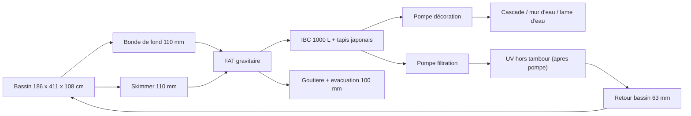
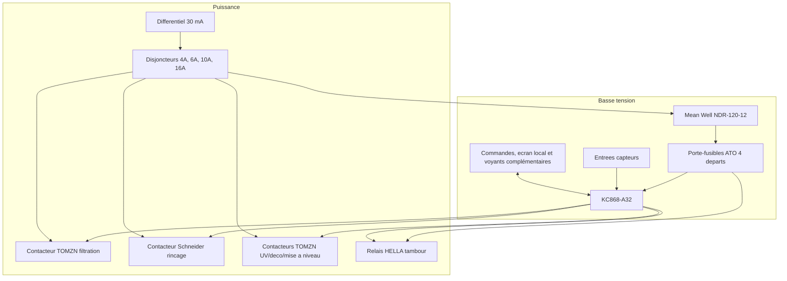

# Architecture matérielle

## Blocs materiels

| Bloc | Rôle | Options envisagées |
| --- | --- | --- |
| Carte de contrôle | Exécute la logique de lavage et sécurité | KC868-A32 retenu pour la V1 |
| Entrées capteurs | Detectent niveau de lavage, niveau critique, capot, température bassin et température ambiante | Flotteurs, capteurs pression, inductifs, contacts secs, sondes de température |
| Sorties puissance | Pilotent pompe, moteur et prises auxiliaires | Relais automate vers relais HELLA 12 VDC, contacteur Schneider 230 VAC et contacteurs TOMZN 12 VDC selon organe |
| Interface locale | Permet conduite, signalisation et diagnostic | Boutons, voyants, écran simple |
| Communication distante | Option V2 pour supervision et notifications à distance | Wi-Fi cible ; BLE seul insuffisant, Ethernet non disponible sur site, SMS non retenu par défaut |
| Temps fiable | Support futur d'horodatage V2 | RTC, temps local conserve, module temps, synchronisation réseau ou capacité equivalente selon plateforme ; ne pas dependre exclusivement d'Internet |
| Alimentation | Fournit basse tension stable | 12 VDC retenu via Mean Well NDR-120-12, 120 W, 10 A |

## Composants materiels deja choisis

| Sous-ensemble | Choix retenu | Impact de conception |
| --- | --- | --- |
| Toile de filtration tambour | Inox 74 microns | Fixe la finesse de filtration mécanique de référence |
| Capteurs de niveau | CR18-8DN | Imposent une interface d'entrée compatible NPN, 12-24 VDC, 3 fils |
| Plateforme de contrôle | KC868-A32 | Fixe la base des entrées/sorties V1 et la logique de cablage |
| Alimentation 12 VDC | Mean Well NDR-120-12, 120 W, 10 A, rail DIN | Alimente automate, capteurs, IHM, accessoires et moteur tambour via départs fusibles |
| Moteur tambour | Motorreducteur Fyearfly 12 VDC 10 rpm | Simplifie la vitesse de tambour par rapport au moteur d'essuie-glace candidat |
| Relais moteur tambour | HELLA 4RD 933 332-551, 12 V, charge inductive 15 A | Commande le moteur tambour ; support rail DIN a imprimer en 3D |
| Pompe de rinçage | VEVOR / Leo EKJ-802S, 220-240 VAC, 800 W indique projet | Impose une commande secteur adaptée à une charge moteur et une mesure du débit réel aux buses |
| Contacteur pompe de rinçage | Schneider Electric TeSys LC1D12P7, 3P, AC-3 12 A, bobine 230 VAC | Piloté par un relais du KC868-A32 pour commander la pompe de rinçage |
| Contacteurs filtration, UV, décoration, mise à niveau | TOMZN TOCT1-25Z, 25 A, bobine 12 VDC | Pilotés en 12 VDC par les relais de l'automate selon les sécurités |

## Données hydrauliques d'entrée

L'installation cible a contrôler comprend un FAT avec :

- une emprise interne totale de 78 cm x 47 cm ;
- un trop-plein physique fixe à 30,5 cm de hauteur d'eau ;
- un compartiment eau propre de 62 cm x 47 cm contenant un tambour de 31 cm de diamètre sur 57 cm de longueur utile ;
- deux entrées de 110 mm : une bonde de fond et un skimmer ;
- deux sorties de 110 mm pour conserver le flux hydraulique ;
- une goutiere d'évacuation des dechets rinces vers un tuyau de 100 mm ;
- un report de niveau côté eau propre via un tube de 32 mm ;
- une rampe d'aspersion en 32 mm avec buses.

La rotation du tambour est retenue avec un motorreducteur Fyearfly 12 VDC 10 rpm, en fonctionnement intermittent pendant les cycles de lavage, tests ou commandes manuelles autorisées. Ce choix remplace le candidat initial de moteur d'essuie-glace SWF 403.835 et évite de dépendre d'une réduction mécanique importante pour atteindre une vitesse exploitable.

Le rinçage est envisagé avec une pompe de surface VEVOR / Leo EKJ-802S en 220-240 VAC. La courbe disponible indique environ 3,6 m3/h a très faible hauteur utile et environ 2,4 m3/h à 21 m ; le débit effectif aux buses devra être mesure sur la rampe réelle.

Le FAT sera installe dans un local de filtration maconne, isole en XPS 5 cm, sans pluie directe sur le FAT. Un capot transparent relevable est prévu au-dessus du petit batiment pour permettre de voir le tambour tourner sans ouvrir le FAT ; ce capot et le couvercle transparent désignent la même pièce physique. Sa matiere et son niveau d'isolation restent à définir.

Ces données doivent être prises en compte pour les choix de capteurs, l'implantation du niveau de lavage côté eau propre, l'ajout d'une mesure de température bassin, l'ajout d'une mesure de température ambiante local et les contraintes de débit autour du filtre.

La liste de signaux à prévoir pour le prototype est détaillée dans [04-table-entrees-sorties.md](04-table-entrees-sorties.md).

## Chaine hydraulique de référence

## Interfaces mécaniques et instrumentation

| Sous-ensemble | Interface connue | Impact de conception |
| --- | --- | --- |
| Tube de report de niveau | 32 mm, bouche en partie haute avec event de 1 mm | Permet une fixation protégée des deux capteurs côté eau propre EP_LAVAGE et EP_CRITIQUE, et facilite le nettoyage |
| Capteurs de niveau | CR18-8DN, M18, distance ajustable 8 mm, sortie NPN, alimentation 12-24 VDC, 10 mA, DC 3 fils | Necessitent un support mécanique adapté et des entrées compatibles ou conditionnees |
| Goutiere de trop-plein | seuil fixe à 30,5 cm | Fixe la cote maximale exploitable pour les seuils de pilotage |
| Support du FAT | a fabriquer | Conditionne tout le régime gravitaire par rapport au bassin |
| Capot | à créer avec capteur d'ouverture | Ajoute une entrée de sécurité supplémentaire |
| Joint a levre tambour | a poser | Indispensable pour separer correctement eau sale et eau propre |
| Moteur tambour | Fyearfly 12 VDC 10 rpm | Courant réel, couple disponible, sens de rotation et fixation mécanique à valider avant schéma définitif |
| Transmission tambour | A définir autour du motorreducteur 10 rpm | La vitesse finale tambour doit être validée en essai réel ; la réduction 3:1 du candidat SWF n'est plus l'hypothèse de base |
| Protection moteur tambour | Fusible ATO 7,5 A sur le départ moteur et relais HELLA 12 V 15 A inductif | Le courant réel et le comportement au blocage restent à mesurer |
| Pompe de rinçage | VEVOR / Leo EKJ-802S, raccords 1 pouce, IPX4, classe I | Pompe 230 VAC de surface, a protéger electriquement et a maintenir hors immersion |
| Rampe de rinçage | Tuyau 32 mm + buses | Le choix des buses fixera le point débit/pression réel de la pompe |
| Sonde température bassin | sonde numérique étanche type DS18B20 candidate | A implanter dans le bassin ou une zone très représentative de l'eau du bassin ; alerte informative en V1 avec seuils initiaux < 4 deg C et > 28 deg C |
| Sonde température ambiante local | sonde numérique simple candidate | Fournit une mesure représentative de l'air du local de filtration ; alerte informative en V1 avec seuils initiaux < 2 deg C et > 40 deg C |
| IHM locale | écran texte ou petit afficheur, commandes physiques, voyants MARCHE et ALARME | L'écran porte le détail ; voyant MARCHE vert et voyant ALARME rouge sont retenus en V1, voyant LAVAGE jaune ou ambre optionnel |
| Liaison distante | option V2 Wi-Fi | Le matériel MVP doit être prêt pour une V2 Wi-Fi sans remplacement de plateforme principale ; la notification ne doit pas compromettre le fonctionnement local |
| Horloge fiable | capacité plateforme V2 obligatoire, implementation MVP optionnelle | La plateforme V1 doit permettre une heure fiable en V2 sans remplacement matériel principal, par RTC, temps local conserve, module temps, synchronisation réseau ou equivalent, sans dépendance exclusive à Internet |
| Position tambour | option V1.1 à étudier | Peut aider pour l'indexation et certains diagnostics avances |

L'UV est retenu hors tambour dans la chaine de filtration, après la pompe principale. Il reste asservi à la filtration autorisée et à l'absence de EP_CRITIQUE ; il n'est pas coupé sur un défaut FAT non critique si la filtration reste autorisée.

## Architecture electrique retenue V1

La decision de reference est [ADR-0004 - Architecture electrique V1](../decisions/ADR-0004-architecture-electrique-v1.md).

### Tableau 230 VAC

| Depart | Protection retenue | Equipements | Commentaire |
| --- | --- | --- | --- |
| Tete de tableau | Interrupteur differentiel 30 mA | Tableau local complet | Type et calibre definitifs a arbitrer en backlog. |
| Alimentation 12 VDC | Disjoncteur 4 A courbe C | Mean Well NDR-120-12 | Depart dedie au controle basse tension. |
| Pompe de rincage | Disjoncteur 10 A courbe C | Pompe VEVOR / Leo EKJ-802S | Commande par contacteur Schneider LC1D12P7, bobine 230 VAC. |
| Prises local | Disjoncteur 16 A courbe C | 1 prise bulleur bassin, 1 prise bulleur filtre bio, 2 prises maintenance | Les bulleurs restent hors controleur ; les prises maintenance sont reservees aux usages ponctuels. |
| Pompe filtration | Disjoncteur 6 A courbe C | Pompe principale de filtration | Depart separe et prioritaire car organe essentiel. |
| UV, pompe decoration, mise a niveau | Disjoncteur 6 A courbe C | UV, pompe decoration, mise a niveau automatique | Separé de la filtration afin qu'un defaut sur un organe non essentiel ne coupe pas la pompe de filtration. |

### Distribution 12 VDC

| Depart 12 VDC | Fusible | Usage |
| --- | --- | --- |
| Moteur tambour | 7,5 A | Motorreducteur Fyearfly 12 VDC 10 rpm via relais HELLA |
| Automate | 3 A | KC868-A32 |
| Capteurs et boutons | 1 A | Capteurs de niveau, capot et commandes locales |
| Ecran, voyants, accessoires | 1 A | IHM locale, signalisation et accessoires |

### Commandes de puissance

| Organe | Commande automate | Organe de puissance retenu | Remarque |
| --- | --- | --- | --- |
| Moteur tambour | Relais KC868-A32 vers commande 12 VDC | Relais HELLA 4RD 933 332-551, 12 V, 15 A inductif | Support rail DIN a imprimer en 3D. |
| Pompe de rincage | Relais KC868-A32 vers bobine 230 VAC | Contacteur moteur Schneider TeSys LC1D12P7, AC-3 12 A | Charge moteur secteur a raccorder a la terre. |
| Pompe filtration | Relais KC868-A32 vers bobine 12 VDC | Contacteur modulaire TOMZN TOCT1-25Z 25 A | Depart separe des organes non essentiels. |
| UV | Relais KC868-A32 vers bobine 12 VDC | Contacteur modulaire TOMZN TOCT1-25Z 25 A | Asservi a la filtration autorisee et a EP_CRITIQUE absent. |
| Pompe decoration | Relais KC868-A32 vers bobine 12 VDC | Contacteur modulaire TOMZN TOCT1-25Z 25 A | Suit les memes securites hydrauliques que la filtration. |
| Mise a niveau | Relais KC868-A32 vers bobine 12 VDC | Contacteur modulaire TOMZN TOCT1-25Z 25 A ou sortie equivalente | Coupee sur EP_CRITIQUE. |

## Schéma de principe

## Decisions matérielles a prendre

- type et calibre de l'interrupteur differentiel 30 mA en tete de tableau ;
- nombre de capteurs CR18-8DN et implantation exacte sur le tube de report ;
- courant réel, fixation et sens de rotation du motorreducteur Fyearfly 12 VDC 10 rpm ;
- validation du fusible 7,5 A moteur tambour après mesure du courant en charge et au blocage ;
- commande secteur de la pompe de rinçage, raccordement à la terre et validation du contacteur Schneider LC1D12P7 dans le schema final ;
- débit ou pression de rinçage de référence après essais sur la rampe et les buses ;
- mesure terrain de la cote support FAT avant fabrication, afin d'aligner trop-plein physique et niveau hydraulique cible du bassin ;
- calcul final de la geometrie des ouvertures du tambour avant découpe ou perçage, avec objectif 0,20 à 0,23 m2 de surface filtrante utile ;
- type de sonde de température bassin et implantation exacte ;
- type de sonde de température ambiante local et implantation exacte ;
- type d'IHM locale : LED, écran ou combinaison ;
- nombre de voyants, couleurs et signification ;
- architecture Wi-Fi V2 autour du KC868-A32, sans remplacement de plateforme principale ;
- architecture de notification pour une V2 : embarquée, serveur local, service mail ou service push simple ;
- besoin ou non d'un capteur de position tambour ;
- stratégie matérielle d'indexation du tambour hors lavage pour V1.1 ;
- methode empirique d'estimation de la consommation d'eau de rinçage pour V1.1 ou V2 ;
- compatibilité native ou conditionnement des entrées pour capteurs NPN 12-24 VDC ;
- interface d'entrée nécessaire pour la sonde de température ;
- interface d'entrée nécessaire pour la sonde de température ambiante ;
- sections de cables, borniers, repérage et implantation physique des protections ;
- niveau de protection du coffret dans un local humide non expose à la pluie directe ;
- connecteurs et borniers.
