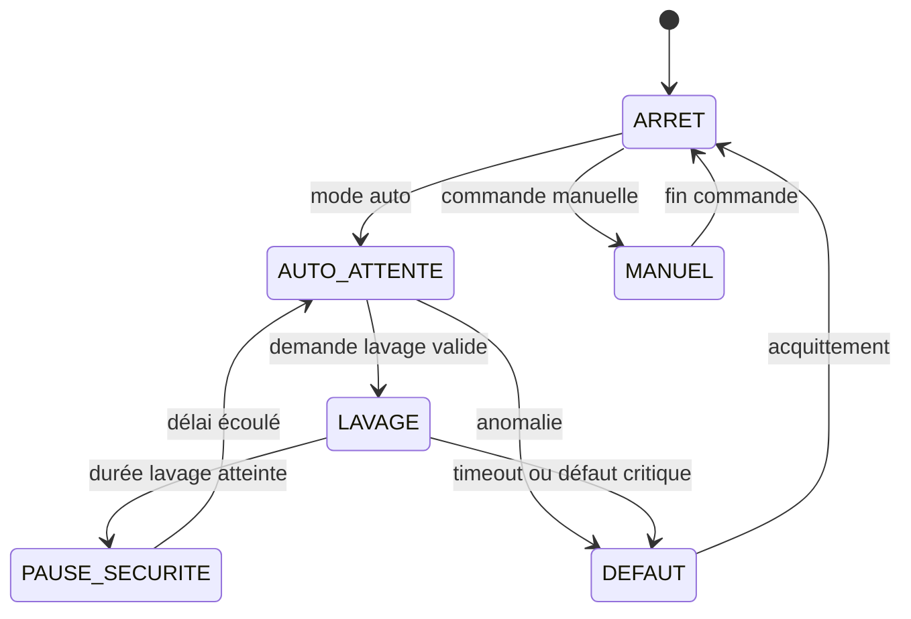

# Architecture logicielle

## Modules pressentis

| Module | Responsabilité |
| --- | --- |
| Entrées | Lire les capteurs et boutons, appliquer anti-rebond/filtrage. |
| Temporisations | Centraliser les délais, durées et timeouts. |
| Machine à états | Décider des transitions et de l'état courant. |
| Sorties | Piloter relais, voyants, buzzer et autres actionneurs. |
| Configuration | Stocker les paramètres modifiables. |
| Journalisation | Enregistrer cycles, alarmes et événements importants. |

## Machine à états initiale

## Paramètres configurables

- durée de lavage ;
- délai minimal entre cycles ;
- durée maximale de marche continue ;
- nombre maximal de cycles dans une fenêtre de temps ;
- logique de déclenchement ;
- comportement après coupure d'alimentation ;
- activation ou non des extensions de journalisation.
