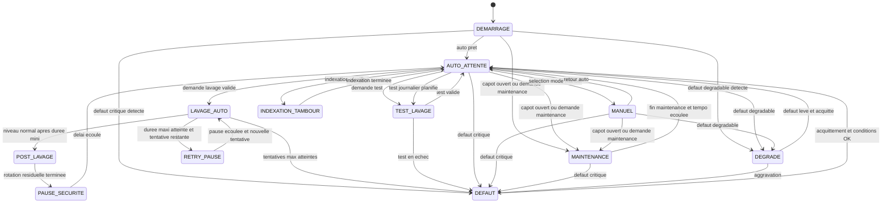

# Architecture logicielle

## Modules pressentis

| Module | Responsabilite |
| --- | --- |
| Entrees | Lire les capteurs, la temperature bassin, la temperature ambiante et les boutons, appliquer anti-rebond et filtrage. |
| Temporisations | Centraliser les delais, durees et timeouts. |
| Machine a etats | Decider des transitions, du mode courant et des verrouillages. |
| Diagnostics | Evaluer auto-tests, coherence EP_BAS et EP_CRITIQUE, consequences hydrauliques observables, temperatures et criteres de passage en degrade ou defaut. |
| Communication distante | Option V2 : publier et notifier les etats et evenements importants vers l'exterieur. |
| Sorties | Piloter relais, voyants, buzzer, ecran local et autres actionneurs. |
| Configuration | Stocker les parametres modifiables et la politique de reprise. |
| Journalisation | Enregistrer cycles, alarmes et evenements importants. |
| Statistiques | Calculer, consolider et exposer les indicateurs de lavage a court et moyen terme. |

## Machine a etats cible

## Regles de reprise apres coupure d'alimentation

Au demarrage, le logiciel doit :

1. initialiser les sorties dans un etat sur ;
2. relire capteurs, capot, commandes operateur et eventuels etats memorises ;
3. executer les auto-diagnostics de base ;
4. choisir le mode cible selon priorite securite puis exploitation.

Priorite de decision recommandee :

- defaut critique actif : rester en DEFAUT avec sorties protegees coupees ;
- capot ouvert ou demande maintenance : entrer en MAINTENANCE ;
- defaut degradable detecte : entrer en DEGRADE ;
- sinon : entrer en AUTO_ATTENTE sans attente operateur supplementaire.

L'arret total n'apparait pas comme un etat logiciel de la machine a etats ci-dessus. Il correspond a une consignation ou a une coupure electrique maitrisee, explicite pour l'exploitation, et geree hors du cycle logiciel nominal.

## Capteurs de reference cote eau propre

| Capteur | Role logique |
| --- | --- |
| EP_BAS | Demande de lavage par niveau eau propre bas |
| EP_CRITIQUE | Danger hydraulique, risque pompe a sec et arret de securite |

## Limites de diagnostic en V1

Sans capteur supplementaire, la V1 ne prouve pas directement :

- un tambour bloque ;
- une pompe de rincage HS ;
- une pompe filtration reellement branchee ou debiteuse ;
- une pompe decoration reellement branchee ou debiteuse ;
- un UV reellement allume ;
- une fuite local ;
- un niveau haut cote eau sale ;
- une pompe a air HS.

Le logiciel diagnostique donc surtout les consequences visibles cote eau propre et les incoherences de commande.

## Principe de diagnostic indirect

La logique de diagnostic devrait suivre cette regle simple :

- nommer d'abord l'effet observe ;
- associer ensuite des causes probables a verifier ;
- ne conclure a une panne d'organe que si un retour d'etat dedie est ajoute plus tard.

Exemples de libelles preferes :

- niveau eau propre anormal ;
- lavage inefficace ;
- risque pompe a sec ;
- cycle de lavage incoherent ;
- temperature anormale ;
- capot ouvert ;
- commande incoherente.

## Gestion des modes

| Mode | Autorisations principales | Interdictions principales |
| --- | --- | --- |
| AUTO_ATTENTE | Surveillance et lavage automatique | Commandes manuelles directes |
| MANUEL | Commande individuelle des sorties | Contournement des verrouillages critiques |
| MAINTENANCE | Arret propre, intervention humaine, tests limites | Demarrage automatique tambour et lavage auto |
| DEGRADE | Fonctionnement restreint pour maintien de vie du bassin | Retour silencieux au nominal sans acquittement |
| TEST_LAVAGE | Cycle complet automatique sous supervision | Usage si preconditions non remplies |
| DEFAUT | Affichage, alarme, acquittement | Actionnement non securise des organes |

## Statuts a remonter localement

L'IHM locale devrait pouvoir presenter au minimum :

- mode actif : auto, manuel, maintenance, degrade ou defaut ;
- lavage en cours ou attente ;
- presence d'une alarme active ;
- etat des mesures critiques si un ecran est retenu ;
- message ou code de defaut si le niveau d'IHM le permet.

## Donnees utiles a presenter localement

L'IHM locale devrait idealement pouvoir presenter ou rendre accessibles :

- mode actuel ;
- etat lavage, repos ou defaut ;
- niveau eau propre : OK, bas ou critique ;
- heure du dernier lavage ;
- nombre de lavages aujourd'hui ;
- defaut actif ;
- temperature eau ;
- temperature local ;
- etat pompe principale ;
- etat pompe decoration ;
- etat UV.

## Statistiques de lavage a consolider

Le logiciel devrait consolider au minimum :

- nombre de lavages par heure ;
- nombre de lavages par jour ;
- duree moyenne d'un lavage ;
- duree totale de lavage par jour ;
- intervalle moyen entre lavages ;
- intervalle minimum entre lavages ;
- tendance glissante sur 7 jours ;
- tendance glissante sur 30 jours.

## Indicateurs de consommation d'eau

Le logiciel devrait aussi consolider au minimum :

- litres par lavage ;
- litres par jour ;
- litres par semaine ;
- litres perdus vers evacuation ;
- estimation du remplissage necessaire.

Ces indicateurs doivent pouvoir etre etiquetes comme mesures ou estimes selon l'instrumentation disponible.

## Temps de fonctionnement a consolider

Le logiciel devrait aussi cumuler au minimum :

- heures moteur tambour ;
- heures pompe rincage ;
- heures pompe decoration ;
- heures pompe principale ;
- heures UV.

## Indicateur derive d'encrassement

Le logiciel devrait aussi calculer un indicateur derive simple :

`Indice encrassement = nombre de lavages par heure x duree moyenne lavage`

Cet indicateur peut aider a suivre :

- la charge du bassin ;
- le colmatage de la toile ;
- la baisse d'efficacite du rincage ;
- les effets de debit ou de saison.

## Sequencement cible du lavage

Le moteur tambour et la pompe de rincage sont commandes ensemble au debut de chaque tentative. Le logiciel doit ensuite :

1. confirmer la demande de lavage par un retard capteur configurable ;
2. lancer une tentative et imposer une duree mini ;
3. verifier le retour au niveau normal ;
4. soit conclure avec rotation residuelle puis anti-redemarrage ;
5. soit poursuivre jusqu'a duree maxi ;
6. soit relancer apres une courte pause si des tentatives restent ;
7. soit declarer un defaut lavage critique et couper la pompe principale.

## Logique de defaut hydraulique recommandee

La logique d'etat observable recommandee est la suivante :

1. EP_BAS = 0 et EP_CRITIQUE = 0 : fonctionnement normal ;
2. EP_BAS = 1 et EP_CRITIQUE = 0 : demande de lavage ;
3. apres lavage, EP_BAS retourne a 0 : lavage reussi ;
4. apres lavage, EP_BAS reste a 1 : lavage douteux puis relance selon tentatives restantes ;
5. EP_CRITIQUE = 1 : defaut critique, arret filtration et UV ;
6. EP_CRITIQUE = 1 alors que EP_BAS = 0 : capteurs incoherents, mise en securite.

## Fonctions periodiques recommandees

Le logiciel devrait aussi pouvoir gerer deux fonctions periodiques :

1. un test journalier automatique du lavage avec verdict diagnostique ;
2. une indexation du tambour pour modifier la zone immergee au repos.

Ces fonctions doivent rester secondaires par rapport aux verrouillages de securite et au mode courant.

## Gestion programmee de la pompe decoration

Le logiciel peut aussi gerer une programmation horaire simple de la pompe decoration. Cette fonction devrait :

- verifier si la pompe decoration est globalement autorisee ;
- verifier si l'heure courante est dans une plage active ;
- appliquer ensuite les securites globales avant autorisation de sortie ;
- appliquer les memes securites hydrauliques que la pompe principale, la pompe decoration aspirant au meme endroit ;
- permettre une inhibition simple pour l'hiver ou une longue periode d'arret.

## Evenements candidats a remonter a distance en V2

La supervision distante devrait au minimum pouvoir traiter :

- entree en defaut critique ;
- passage en degrade ;
- niveau eau propre critique ;
- capteurs niveau incoherents ;
- lavage inefficace critique ;
- absence anormale de lavage ;
- commande UV incoherente ;
- alarme temperature eau ou temperature ambiante ;
- echec du test journalier automatique ;
- redemarrages frequents de l'automate ;
- retour a un etat nominal apres incident ;
- perte puis retour de la connectivite distante si cette information est disponible.

## Notifications immediates candidates en V2

Une premiere version simple peut envoyer immediatement au minimum :

- niveau eau propre critique ;
- lavage inefficace critique ;
- risque pompe a sec ;
- capteurs niveau incoherents ;
- capot ouvert en situation dangereuse ;
- temperature anormale critique ;
- coupure courant ;
- retour courant.

## Synthese quotidienne candidate en V2

Si la fonction est activee, le logiciel devrait pouvoir generer une synthese quotidienne contenant au minimum :

- statut global du filtre ;
- nombre de lavages du jour ;
- duree moyenne de lavage ;
- volume d'eau estime ou mesure consomme ;
- dernier defaut connu ;
- temperature eau.

Cette synthese doit rester optionnelle et configurable independamment des notifications immediates.

## Parametres configurables

- duree de lavage ;
- duree de lavage mini ;
- duree de lavage maxi ;
- temps rotation apres rincage ;
- delai minimal entre cycles ;
- duree maximale de marche continue ;
- nombre maximal de cycles dans une fenetre de temps ;
- nombre maximum de tentatives de lavage ;
- pause entre tentatives ;
- retard capteur niveau ;
- temps de confirmation defaut ;
- tempo redemarrage pompe principale ;
- temps capot ouvert avant alarme ;
- duree anormale sans lavage ;
- seuil redemarrages automate sur une periode ;
- duree maximale de commande continue par sortie ;
- regles de calcul des statistiques ;
- regle de calcul de l'indice d'encrassement ;
- regle de calcul de la consommation d'eau ;
- debit de rincage de reference si estimation ;
- regles de cumul des temps de fonctionnement ;
- profondeur historique 7 jours et 30 jours ;
- heure ou fenetre du test journalier ;
- timeout du test journalier ;
- pas ou angle d'indexation du tambour ;
- frequence d'indexation du tambour ;
- logique de declenchement ;
- tempo de reprise apres maintenance ;
- politique de reprise apres coupure d'alimentation ;
- activation ou non des extensions de journalisation ;
- criteres de passage en degrade ;
- liste des alarmes indirectes actives ;
- seuils d'alerte temperature basse et temperature haute ;
- seuils d'alerte temperature ambiante basse et temperature ambiante haute ;
- comportement des voyants, couleurs et clignotements ;
- politique d'envoi des notifications distantes ;
- temporisation anti-repetition des notifications ;
- activation ou non de la synthese quotidienne ;
- heure d'envoi de la synthese quotidienne ;
- contenu exact de la synthese quotidienne ;
- liste des notifications immediates actives ;
- activation globale pompe decoration programmee ;
- liste des tranches horaires pompe decoration ;
- inhibition saisonniere ou hivernale pompe decoration ;
- activation ou non du mode hiver.

## Points d'attention pour le firmware

- Distinguer clairement les defauts critiques des defauts degradables.
- Eviter qu'une coupure secteur ne remette les sorties en marche sans reevaluation des securites.
- Centraliser les interverrouillages pour qu'ils s'appliquent de la meme facon en auto, manuel et test.
- Garder le mode test separe du mode manuel afin de pouvoir valider un cycle complet avec verdict automatique.
- Ne pas emettre de diagnostic du type tambour bloque ou pompe HS sans capteur ou retour de marche dedie.
- Traiter la perte de mesure temperature comme une alerte explicite, distincte d'une temperature simplement hors plage.
- Traiter la perte de mesure temperature ambiante comme une alerte explicite, distincte d'une ambience simplement hors plage.
- Concevoir la supervision distante comme une fonction additionnelle qui ne bloque jamais le fonctionnement local.
- Distinguer dans la configuration les notifications immediates et la synthese quotidienne.
- Journaliser si une notification immediate a ete emise ou supprimee par anti-repetition pour aider au diagnostic.
- Definir une priorite claire entre commande manuelle, programmation horaire de la pompe decoration et securites globales.
- Conditionner le comportement de la pompe decoration a son point reel d'aspiration si elle peut contribuer a vider une zone sensible.
- Memoriser le compteur de tentatives et le compteur de lavages par heure et par jour pour les diagnostics.
- Memoriser le temps de retour EP_BAS a l'etat normal, le nombre d'activations de EP_CRITIQUE, les ouvertures capot et leur duree.
- Garder une definition stable des statistiques pour pouvoir comparer les tendances dans le temps.
- Garder une definition stable de l'indice d'encrassement pour que sa derive reste interpretable.
- Indiquer explicitement si la consommation d'eau est mesuree ou seulement estimee.
- Garantir que les compteurs de temps de fonctionnement restent coherents apres redemarrage ou coupure.
- Empiler proprement les planifications periodiques pour que test journalier et indexation ne perturbent pas la logique de lavage nominale.
