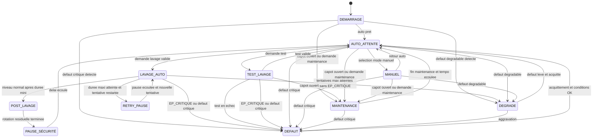

# Architecture logicielle

## Modules pressentis

| Module | Responsabilite |
| --- | --- |
| Entrées | Lire les capteurs, la température bassin, la température ambiante et les boutons, appliquer anti-rebond et filtrage. |
| Temporisations | Centraliser les delais, durées et timeouts. |
| Machine à états | Decider des transitions, du mode courant et des verrouillages. |
| Diagnostics | Évaluer auto-tests, cohérence EP_LAVAGE et EP_CRITIQUE, conséquences hydrauliques observables, températures et critères de passage en dégradé ou défaut. |
| Communication distante | Option V2 : publier et notifier les états et événements importants vers l'exterieur. |
| Temps système | Option V2 : fournir une heure fiable pour horodatage, historiques, notifications et syntheses. |
| Sorties | Piloter relais, voyants, écran local et autres actionneurs. |
| Configuration | Stocker les paramètres modifiables et la politique de reprise. |
| Journalisation | Enregistrer cycles, alarmes et événements importants. |
| Statistiques | Calculer, consolider et exposer les indicateurs de lavage a court et moyen terme. |

## Machine à états cible

## Règles de reprise après coupure d'alimentation

Au démarrage, le logiciel doit :

1. initialiser les sorties dans un état sûr ;
2. relire capteurs, capot, commandes opérateur et eventuels états memorises ;
3. exécuter les auto-diagnostics de base ;
4. choisir le mode cible selon priorité sécurité puis exploitation.

Priorité de decision recommandée :

- `EP_CRITIQUE` actif ou défaut critique actif : rester en DÉFAUT avec sorties protégées coupées, jusqu'au retour normal puis acquittement valide ;
- capot ouvert ou demande maintenance : entrer en MAINTENANCE ;
- `EP_LAVAGE` actif sans `EP_CRITIQUE` : entrer en DÉGRADÉ contrôle, autoriser la filtration et l'UV si la filtration est autorisée, puis lancer un lavage immédiat si les préconditions sont OK ;
- défaut degradable détecte : entrer en DÉGRADÉ ;
- sinon : entrer en AUTO_ATTENTE sans attente opérateur supplémentaire.

Dans le cas `EP_LAVAGE` actif au démarrage, si le lavage de reprise ne ramene pas le niveau à l'état normal, le logiciel doit inhiber les nouveaux lavages automatiques, maintenir l'alarme et conserver filtration + UV tant que `EP_CRITIQUE` reste absent et que le bypass passif assure le passage vers la biofiltration.

Après un EP_CRITIQUE confirmé, la reprise doit se faire en deux temps : retour niveau normal stable et acquittement local valide, puis redémarrage de la filtration, puis réautorisation de l'UV après une courte temporisation de stabilisation hydraulique.

En fonctionnement, `CAPOT_OUVERT` reste prioritaire sur le sélecteur `AUTO / MAINTENANCE` : un capot ouvert force l'état maintenance ou sécurité même si le sélecteur est physiquement sur AUTO. Le capot est le couvercle transparent unique du FAT, câblé en normalement fermé : capot fermé = contact fermé ; fil coupé, connecteur débranché ou capot ouvert = `CAPOT_OUVERT`.

Le filtrage du capot doit être asymetrique : ouverture confirmée rapidement après anti-rebond court de 100 à 500 ms, fermeture stable pendant 1 à 2 s avant réautorisation des commandes dangereuses ou reprise automatique.

Capot ouvert hors action dangereuse, l'IHM doit afficher l'état informatif permanent `MAINTENANCE - CAPOT OUVERT`. Cet état ne demande pas d'acquittement. Après fermeture stable, le contrôleur revient automatiquement au mode demande par le sélecteur si aucune alarme bloquante capot dangereux n'a été créée. Si le capot s'est ouvert pendant une action dangereuse, la fermeture ne suffit pas : l'acquittement reste requis.

Si le capot reste ouvert au-delà d'une temporisation configurable, valeur initiale 10 minutes, l'IHM doit afficher `A15 - CAPOT OUVERT LONG` et allumer `VOYANT_ALARME` rouge fixe, sans clignotement en V1. Cette alerte signale un oubli probable et rappelle que le lavage tambour est indisponible tant que le capot reste ouvert. Elle n'ajoute pas de blocage supplémentaire : le blocage provient deja de l'état `CAPOT_OUVERT`. Elle disparaît automatiquement après fermeture stable du capot, sans acquittement ni maintien artificiel du voyant rouge.

Le logiciel conserve une trace minimale persistante et non bloquante de A15. Cette trace est écrite quand A15 survient et doit rester présente après coupure d'alimentation. La V1 conserve au minimum un compteur persistant et, si c'est simple, le dernier événement. Si une horloge fiable existe facilement en MVP, le dernier événement est horodaté ; sinon le compteur persistant suffit. Une mémoire circulaire courte de quelques événements recents est acceptable, mais un historique long n'est pas requis en V1. Au redémarrage, le logiciel relit le capot : si A15 était actif avant coupure et que le capot est encore ouvert, A15 est réaffiché après lecture stable ; si le capot est ouvert mais qu'A15 n'était pas encore actif, l'état informatif `MAINTENANCE - CAPOT OUVERT` est affiche et la temporisation A15 repart.

L'arrêt total n'apparaît pas comme un état logiciel de la machine à états ci-dessus. Il correspond a une consignation ou a une coupure électrique maîtrisée, explicite pour l'exploitation, et geree hors du cycle logiciel nominal.

## Capteurs de référence côté eau propre

La logique V1 repose sur une cote simple côté eau propre, sans comparaison automatisee avec un niveau côté eau sale.

| Capteur | Rôle logique |
| --- | --- |
| EP_LAVAGE | Demande de lavage par niveau eau propre abaisse |
| EP_CRITIQUE | Danger hydraulique, risque pompe à sec et arrêt de sécurité |

## Limites de diagnostic en V1

Sans capteur supplémentaire, la V1 ne prouve pas directement :

- un tambour bloque ;
- une pompe de rinçage HS ;
- une pression ou un débit réel de rinçage absent ;
- une pompe filtration reellement branchee ou debiteuse ;
- une pompe décoration reellement branchee ou debiteuse ;
- un UV reellement allumé ;
- une fuite local ;
- un niveau haut côté eau sale ;
- une pompe a air HS.

Le logiciel diagnostique donc surtout les conséquences visibles côté eau propre et les incohérences de commande.

## Principe de diagnostic indirect

La logique de diagnostic devrait suivre cette règle simple :

- nommer d'abord l'effet observé ;
- associer ensuite des causes probables à vérifier ;
- ne conclure a une panne d'organe que si un retour d'état dédié est ajoute plus tard.

Exemples de libellés preferes :

- niveau eau propre anormal ;
- lavage inefficace ;
- risque pompe à sec ;
- cycle de lavage incohérent ;
- température anormale ;
- capot ouvert ;
- commande incohérente.

Les auto-diagnostics indirects obligatoires V1 sont : EP_CRITIQUE, incohérence EP_CRITIQUE actif avec EP_LAVAGE inactif, lavage inefficace après 3 tentatives, capot ouvert dangereux, capot ouvert trop longtemps A15, commande UV incohérente, perte sonde température eau/local. Les diagnostics absence anormale de lavage, lavage trop fréquent, moteur tambour bloqué, pompe de rinçage HS, pression absente, fuite local et niveau eau sale sont reportés V1.1 ou V2.

La V1 n'ajoute pas de capteur dédié pour diagnostiquer directement rotation tambour, courant mesuré, fuite local ou niveau eau sale. Les protections matérielles restent obligatoires ; un simple contact défaut fourni par un module de protection peut être lu s'il existe naturellement, sans devenir une mesure détaillée de cause. Le moteur Fyearfly retenu n'apporte pas de fonction parking utilisée par le logiciel V1 ; l'indexation reste au temps en V1.1, sauf ajout futur d'un capteur de position.

## Gestion des modes

| Mode | Autorisations principales | Interdictions principales |
| --- | --- | --- |
| AUTO_ATTENTE | Surveillance et lavage automatique | Commandes manuelles directes |
| MANUEL | Commande individuelle des sorties | Contournement des verrouillages critiques |
| MAINTENANCE | Arrêt propre, intervention humaine, tests limites | Démarrage automatique tambour et lavage auto |
| DÉGRADÉ | Fonctionnement restreint pour maintien de vie du bassin | Retour silencieux au nominal sans acquittement |
| TEST_LAVAGE | Cycle complet automatique borne sous supervision | Relances multiples ou usage si préconditions non remplies |
| DÉFAUT | Affichage, alarme, acquittement | Actionnement non sécurisé des organes |

## Commandes manuelles et test V1

Les commandes `MANU_TAMBOUR` et `MANU_RINCAGE` sont des commandes a action maintenue. La sortie correspondante n'est active que tant que le bouton est maintenu et que les interverrouillages restent valides. Les deux commandes sont refusées capot ouvert ; ce refus preventif affiche un message local simple sans créer d'alarme bloquante si aucune sortie dangereuse n'a démarré.

Le bouton `TEST_LAVAGE` lance un seul cycle complet autonome et borne après appui bref si les préconditions sont satisfaites. Il est autorisé en AUTO et en MAINTENANCE si le capot est fermé, EP_CRITIQUE absent, les capteurs de niveau cohérents et aucun défaut critique bloquant actif. Ce cycle est interrompu immédiatement par capot ouvert, EP_CRITIQUE ou défaut critique.

Le test ne reprend pas la stratégie de relances multiples du lavage automatique. Si EP_LAVAGE est inactif au départ, le verdict cible est `TEST OK - CYCLE EXÉCUTÉ` si le cycle s'exécute sans sécurité critique ; il ne faut pas afficher `lavage efficace`. Si EP_LAVAGE est actif au départ, le verdict cible est `TEST OK - NIVEAU OK` si EP_LAVAGE revient normal, sinon `TEST ÉCHEC - EP_LAVAGE ACTIF` ou `TEST ÉCHEC - LAVAGE INEFFICACE`. Le test seul ne déclare pas un défaut lavage maintenu.

Une demande de test avec capot ouvert est refusée sans mouvement avec `A13 - TEST REFUSÉ CAPOT`. Une demande avec EP_CRITIQUE actif, capteurs de niveau incohérents ou défaut critique bloquant est refusée avec `A14 - TEST REFUSÉ SÉCURITÉ`.

## Statuts a remonter localement

L'IHM locale V1 retient un écran texte ou petit afficheur. Elle doit presenter au minimum :

- mode actif : auto, manuel, maintenance, dégradé ou défaut ;
- état niveau : OK, lavage ou critique ;
- état lavage : repos, cycle ou inhibe ;
- presence d'une alarme active ;
- température eau ;
- message ou code de défaut si l'écran le permet.

La priorité d'affichage des alarmes V1 est :

1. EP_CRITIQUE ou capteurs niveau incohérents ;
2. capot ouvert pendant action dangereuse ;
3. défaut lavage maintenu ;
4. capot ouvert trop longtemps (`A15`) ;
5. alertes température ;
6. informations de fonctionnement.

En cas de reset refusé, l'écran doit afficher une cause courte et explicite, par exemple `RESET REFUSÉ - EP_CRITIQUE ACTIF`, `RESET REFUSÉ - EP_LAVAGE ACTIF` ou `RESET REFUSÉ - CAPTEURS INCOHÉRENTS`.

Le bypass passif n'est pas instrumente en V1. L'IHM ne doit donc pas afficher un état mesure `BYPASS ACTIF`; elle doit préférer `MODE DEGRADE - BYPASS SUPPOSE` lorsque le lavage est inefficace sans EP_CRITIQUE et que la filtration reste maintenue.

Les alarmes V1 doivent utiliser le format `Axx - MESSAGE COURT`. Liste minimale initiale :

| Code | Message |
| --- | --- |
| A01 | NIVEAU CRITIQUE |
| A02 | CAPTEURS NIVEAU INCOHÉRENTS |
| A03 | CAPOT OUVERT DANGER |
| A04 | LAVAGE INEFFICACE |
| A05 | RESET REFUSÉ |
| A06 | TEMP EAU BASSE |
| A07 | TEMP EAU HAUTE |
| A08 | TEMP LOCAL BASSE |
| A09 | TEMP LOCAL HAUTE |
| A10 | MODE DÉGRADÉ - BYPASS SUPPOSÉ |
| A11 | SONDE EAU ABSENTE |
| A12 | SONDE LOCAL ABSENTE |
| A13 | TEST REFUSÉ CAPOT |
| A14 | TEST REFUSÉ SÉCURITÉ |
| A15 | CAPOT OUVERT LONG |

Les voyants physiques restent des complements de lecture rapide : `VOYANT_MARCHE` vert et `VOYANT_ALARME` rouge sont retenus en V1. `VOYANT_ALARME` s'allumé fixe pour les alarmes actives et pour `A15 - CAPOT OUVERT LONG`. Aucun clignotement n'est retenu en V1. `VOYANT_LAVAGE` jaune ou ambre reste optionnel si le câblage est simple ; l'écran reste la source du détail.

## Données utiles a presenter localement

L'IHM locale devrait idealement pouvoir presenter ou rendre accessibles :

- mode actuel ;
- état lavage, repos ou défaut ;
- niveau eau propre : OK, bas ou critique ;
- heure du dernier lavage ;
- nombre de lavages aujourd'hui ;
- défaut actif ;
- température eau ;
- température local ;
- état pompe principale ;
- état pompe décoration ;
- état UV.

## Statistiques de lavage V1.1 a consolider

Les statistiques avancées sont reportées en V1.1. Le logiciel devrait alors consolider au minimum :

- nombre de lavages par heure ;
- nombre de lavages par jour ;
- durée moyenne d'un lavage ;
- durée totale de lavage par jour ;
- intervalle moyen entre lavages ;
- intervalle minimum entre lavages ;
- tendance glissante sur 7 jours ;
- tendance glissante sur 30 jours.

## Indicateurs de consommation d'eau V1.1 ou V2

Ces indicateurs sont reportés en V1.1 ou V2. Le logiciel pourrait consolider au minimum :

- litres par lavage ;
- litres par jour ;
- litres par semaine ;
- litres perdus vers évacuation ;
- estimation du remplissage nécessaire.

Ces indicateurs sont estimés empiriquement à partir des essais : `volume estime = debit mesure aux buses x durée de rinçage cumulee`. Les pertes vers évacuation et le besoin de remplissage restent indicatifs tant qu'aucun compteur d'eau dédié n'est ajouté.

## Temps de fonctionnement V1.1 a consolider

Les compteurs détaillés sont reportés en V1.1. La cible V1.1 est un compteur cumulé simple par organe principal, sans remise à zéro maintenance ni seuil de rappel. Le logiciel devrait alors cumuler au minimum :

- heures moteur tambour ;
- heures pompe rinçage ;
- heures pompe décoration ;
- heures pompe principale ;
- heures UV.

## Indicateur dérive d'encrassement V1.1 ou V2

L'indice d'encrassement est reporté en V1.1 ou V2. Un indicateur dérive simple candidat est :

`Indice encrassement = nombre de lavages par heure x duree moyenne lavage`

Cette formule est retenue comme indicateur expérimental stable afin de comparer les périodes. Elle ne déclenche aucune action automatique. Les alertes futures devront reposer sur une dérive relative après observation, par exemple un doublement par rapport à la médiane récente ou une hausse continue sur plusieurs jours.

Cet indicateur peut aider a suivre :

- la charge du bassin ;
- le colmatage de la toile ;
- la baisse d'efficacité du rinçage ;
- les effets de débit ou de saison.

## Sequencement cible du lavage

Le moteur tambour et la pompe de rinçage sont commandes ensemble au début de chaque tentative. Le logiciel doit ensuite :

1. confirmer la demande de lavage par un retard EP_LAVAGE configurable, cible initiale 5 à 15 s ;
2. lancer une tentative et imposer une durée mini ;
3. vérifier le retour au niveau normal ;
4. soit conclure avec rotation résiduelle 2 à 5 s puis anti-redémarrage 30 à 120 s ;
5. soit poursuivre jusqu'à durée maxi ;
6. soit relancer après une courte pause si des tentatives restent ;
7. soit déclarer un défaut lavage, inhiber le lavage automatique et maintenir la pompe principale si EP_CRITIQUE est absent et qu'un bypass hydraulique maintient la biofiltration.

Si EP_LAVAGE redevient actif pendant l'anti-redémarrage après lavage reussi, le logiciel ne doit pas relancer immédiatement. Il attend la fin de l'anti-redémarrage, puis relit EP_LAVAGE avec le retard configuré avant de lancer un nouveau lavage si la demande persiste.

## Logique de défaut hydraulique recommandée

La logique d'état observable recommandée est la suivante :

1. EP_LAVAGE = 0 et EP_CRITIQUE = 0 : fonctionnement normal ;
2. EP_LAVAGE = 1 et EP_CRITIQUE = 0 : demande de lavage ;
3. après lavage, EP_LAVAGE retourne à 0 : lavage reussi ;
4. après lavage, EP_LAVAGE reste à 1 : lavage douteux puis relance selon tentatives restantes ; après tentatives max, défaut lavage maintenu, lavages automatiques inhibés et reset refusé tant que EP_LAVAGE reste actif ;
5. EP_CRITIQUE = 1 après anti-rebond très court, cible initiale 0,5 à 2 s : défaut critique, arrêt filtration et UV ;
6. EP_CRITIQUE = 1 alors que EP_LAVAGE = 0 : capteurs incohérents, défaut bloquant hydraulique et mise en sécurité complète des sorties protégées.

La philosophie capteur niveau est prudente : une perte de confiance dans EP_CRITIQUE rend le système bloquant hydraulique, alors qu'un doute limité a EP_LAVAGE interdit les lavages automatiques mais peut maintenir filtration et UV si EP_CRITIQUE reste sain.

## Fonctions périodiques recommandees après V1

Ces fonctions sont hors V1 stricte. Le logiciel devrait pouvoir gérer plus tard deux fonctions périodiques :

1. un test journalier automatique du lavage avec verdict diagnostique, en V1.1 ;
2. une indexation du tambour pour modifier la zone immergée au repos, en V1.1.

Ces fonctions doivent rester secondaires par rapport aux verrouillages de sécurité et au mode courant.

## Gestion programmee de la pompe décoration V1.1 ou V2

Cette fonction est hors V1 stricte. Le logiciel peut aussi gérer plus tard une programmation horaire simple de la pompe décoration. Cette fonction devrait :

- vérifier si la pompe décoration est globalement autorisée ;
- vérifier si l'heure courante est dans une des deux plages actives maximum, identiques tous les jours ;
- appliquer ensuite les sécurités globales avant autorisation de sortie ;
- appliquer les mêmes sécurités hydrauliques que la pompe principale, la pompe décoration aspirant au même endroit ;
- permettre une inhibition simple actif/inactif pour l'hiver ou une longue période d'arrêt, sans automatisme saisonnier au départ.

La priorité de commande retenue est : sécurités hydrauliques et défauts bloquants, commande manuelle locale, commande distante, puis programmation horaire.

## Événements candidats a remonter à distance en V2

La supervision distante devrait au minimum pouvoir traiter :

- entrée en défaut critique ;
- passage en dégradé ;
- niveau eau propre critique ;
- capteurs niveau incohérents ;
- lavage inefficace critique ;
- absence anormale de lavage ;
- commande UV incohérente ;
- alarme température eau ou température ambiante ;
- échec du test journalier automatique, à partir de la V1.1 ;
- redémarrages fréquents de l'automate ;
- retour à un état nominal après incident ;
- perte puis retour de la connectivité distante si cette information est disponible.

## Notifications immédiates candidates en V2

Une première version simple peut envoyer immédiatement au minimum :

- `EP_CRITIQUE` ;
- capteurs niveau incohérents ;
- capot ouvert en situation dangereuse ;
- capot ouvert trop longtemps (`A15`) ;
- lavage inefficace ;
- retour courant après coupure ;
- perte sonde température persistante.

Le canal cible V2 est le Wi-Fi. Le MVP ne doit pas implémenter la connectivité active, mais la plateforme retenue doit pouvoir recevoir cette fonction sans remplacement matériel principal. Ethernet n'est pas disponible sur site, BLE seul est insuffisant en portée et SMS n'est pas retenu par défaut.

La consultation distante V2 doit commencer par un état simple : état courant, dernière alarme, dernier lavage, température eau/local et dernier redémarrage. L'historique détaillé est reporté V2.1.

## Synthèse quotidienne candidate en V2

Si la fonction est activée, le logiciel devrait pouvoir generer une synthèse quotidienne contenant au minimum :

- statut global du filtre ;
- nombre de lavages du jour ;
- durée moyenne de lavage ;
- volume d'eau estimé ou mesure consomme ;
- dernier défaut connu ;
- température eau.

Cette synthèse doit rester optionnelle et configurable indépendamment des notifications immédiates.

La synthèse quotidienne V2 est désactivée par défaut. Si elle est activée, l'horaire par défaut est 18h00 et le canal est le même que celui des notifications Wi-Fi V2. Les notifications immédiates restent indépendantes.

L'état distant ne doit pas exposer un champ `BASSIN NIVEAU BAS` sans capteur bassin distinct. Avec l'instrumentation retenue, `EP_CRITIQUE` est affiche comme `NIVEAU FAT CRITIQUE`.

## Paramètres configurables

- durée de lavage ;
- durée de lavage mini ;
- durée de lavage mini, cible initiale 10 s ;
- durée de lavage maxi, cible initiale 45 s ;
- temps rotation après rinçage, cible initiale 2 à 5 s ;
- délai minimal entre cycles / anti-redémarrage, cible initiale 30 à 120 s ;
- durée maximale de marche continue ;
- nombre maximal de cycles dans une fenêtre de temps ;
- nombre maximum de tentatives de lavage, cible initiale 3 ;
- pause entre tentatives, cible initiale 30 à 120 s ;
- retard EP_LAVAGE, cible initiale 5 à 15 s ;
- confirmation EP_CRITIQUE, cible initiale 0,5 à 2 s ;
- temps de confirmation défaut non critique ;
- tempo redémarrage pompe principale ;
- tempo stabilisation UV après reprise filtration ;
- temps capot ouvert avant alarme ;
- durée anormale sans lavage ;
- seuil redémarrages automate sur une période ;
- durée maximale de commande continue par sortie ;
- règles de calcul des statistiques, V1.1 ;
- règle de calcul stable de l'indice d'encrassement, V1.1 ou V2 ;
- règle empirique de calcul de la consommation d'eau, débit mesuré aux buses x durée de rinçage cumulée, V1.1 ou V2 ;
- débit de rinçage de référence mesure aux buses après montage réel ;
- éventuel retour pressostat, débitmètre ou courant pompe rinçage reporte V1.1/V2 si les essais montrent trop d'ambiguite ;
- règles de cumul des temps de fonctionnement ;
- profondeur historique 7 jours et 30 jours, V1.1 ;
- heure ou fenêtre du test journalier, V1.1, par défaut 11h-15h ;
- timeout du test journalier, V1.1 ;
- durée courte d'indexation tambour tant qu'aucun capteur de position n'est retenu ;
- fréquence d'indexation du tambour ;
- logique de declenchement ;
- tempo de reprise après maintenance ;
- politique de reprise après coupure d'alimentation ;
- activation ou non des extensions de journalisation ;
- critères de passage en dégradé ;
- liste des alarmes indirectes actives ;
- seuils d'alerte température eau basse et haute, cibles initiales < 4 deg C et > 28 deg C ;
- seuils d'alerte température local basse et haute, cibles initiales < 2 deg C et > 40 deg C ;
- comportement des voyants, couleurs et clignotements ;
- politique d'envoi des notifications distantes ;
- temporisation anti-repetition des notifications ;
- activation ou non de la synthèse quotidienne, désactivée par défaut en V2 ;
- heure d'envoi de la synthèse quotidienne, défaut 18h00 si activée ;
- contenu exact de la synthèse quotidienne ;
- liste des notifications immédiates actives ;
- activation globale pompe décoration programmee, interrupteur actif/inactif ;
- liste des tranches horaires pompe décoration, deux plages maximum par jour identiques tous les jours ;
- inhibition saisonniere ou hivernale pompe décoration par interrupteur logiciel, sans automatisme au départ ;
- activation ou non du mode hiver.

## Points d'attention pour le firmware

- Distinguer clairement les défauts critiques des défauts degradables.
- Éviter qu'une coupure secteur ne remette les sorties en marche sans reevaluation des sécurités.
- Conserver les logs persistants deja ecrits avant coupure, notamment A15.
- Implémenter en V1 un mini-journal persistant court : compteurs par code d'événement plus dernier événement global, ou mémoire circulaire 8/16 événements si simple.
- Persister au minimum A15, EP_CRITIQUE, capot ouvert dangereux, lavage inefficace, redémarrage après coupure et acquittements réussis des alarmes bloquantes.
- Ne pas journaliser un par un les refus répétitifs d'acquittement en V1 ; afficher seulement le dernier refus localement avec sa cause.
- Au redémarrage, redétecter l'état courant du capot et réafficher A15 si l'alerte était deja active avant coupure et que le capot est encore ouvert.
- Centraliser les interverrouillages pour qu'ils s'appliquent de la même façon en auto, manuel et test.
- Garder le mode test séparé du mode manuel afin de pouvoir valider un cycle complet borné avec verdict automatique.
- Traiter le capot ouvert comme prioritaire sur le sélecteur AUTO / MAINTENANCE.
- Coder `CAPOT_OUVERT` comme entrée normalement fermée fail-safe avec temporisation asymetrique ouverture/fermeture.
- Afficher `MAINTENANCE - CAPOT OUVERT` tant que le capot est ouvert hors action dangereuse, puis revenir au mode demande après fermeture stable si aucune alarme bloquante n'existe.
- Déclencher `A15 - CAPOT OUVERT LONG` si le capot reste ouvert au-delà de la temporisation configurée, valeur initiale 10 minutes, allumer `VOYANT_ALARME` rouge fixe, puis effacer A15 automatiquement après fermeture stable sans maintien artificiel du voyant.
- Conserver une trace minimale persistante et non bloquante de A15, sous forme de compteur persistant plus dernier événement si simple ; horodater le dernier événement seulement si une horloge fiable existe facilement en MVP.
- Ne pas imposer l'implementation d'une horloge fiable en MVP, mais choisir une plateforme qui permet cette fonction en V2 sans remplacement matériel principal et sans dépendance exclusive à Internet.
- Commander le tambour et le rinçage manuel uniquement tant que les boutons dedies restent maintenus.
- Refuser `MANU_TAMBOUR` et `MANU_RINCAGE` capot ouvert sans alarme bloquante si aucune sortie dangereuse n'a démarré.
- Autoriser le test lavage en AUTO et MAINTENANCE sous préconditions, puis l'interrompre immédiatement sur capot ouvert, EP_CRITIQUE ou défaut critique.
- Ne pas émettre de diagnostic du type tambour bloque ou pompe HS sans capteur ou retour de marche dédié.
- Traiter la perte de mesure température eau comme une alerte explicite `A11 - SONDE EAU ABSENTE`, distincte d'une température simplement hors plage.
- Traiter la perte de mesure température ambiante comme une alerte explicite `A12 - SONDE LOCAL ABSENTE`, distincte d'une ambiance simplement hors plage.
- Concevoir la supervision distante comme une fonction additionnelle qui ne bloque jamais le fonctionnement local.
- Distinguer dans la configuration les notifications immédiates et la synthèse quotidienne.
- Journaliser si une notification immédiate a été emise ou supprimee par anti-repetition pour aider au diagnostic.
- Appliquer la priorité pompe décoration retenue : sécurités hydrauliques et défauts bloquants, commande manuelle locale, commande distante, puis programmation horaire.
- Conditionner le comportement de la pompe décoration a son point réel d'aspiration si elle peut contribuer a vider une zone sensible.
- Mémoriser le compteur de tentatives et le compteur de lavages par heure et par jour pour les diagnostics.
- Mémoriser le temps de retour EP_LAVAGE à l'état normal, le nombre d'activations de EP_CRITIQUE, les ouvertures capot et leur durée.
- Garder une definition stable des statistiques pour pouvoir comparer les tendances dans le temps.
- Garder une definition stable de l'indice d'encrassement pour que sa dérive reste interpretable.
- Indiquer explicitement que la consommation d'eau de rinçage est estimée empiriquement.
- Garantir que les compteurs de temps de fonctionnement restent cohérents après redémarrage ou coupure.
- Empiler proprement les planifications périodiques après V1 pour que test journalier et indexation ne perturbent pas la logique de lavage nominale.
- Pour le test journalier V1.1, distinguer un cycle exécute OK d'un retour hydraulique OK lorsque EP_LAVAGE était actif au départ.
- Pour l'indexation V1.1 sans capteur de position, raisonner en durée courte configurable et ne pas afficher d'angle atteint.
- Separer les statistiques nominales des tests, échecs et interruptions afin de garder des moyennes exploitables.
