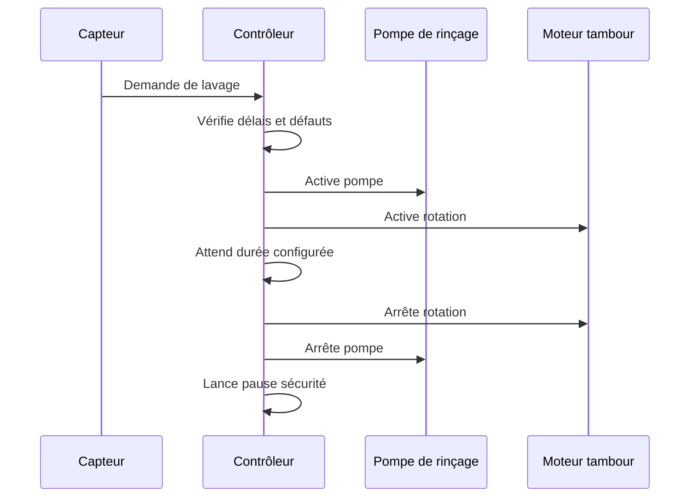
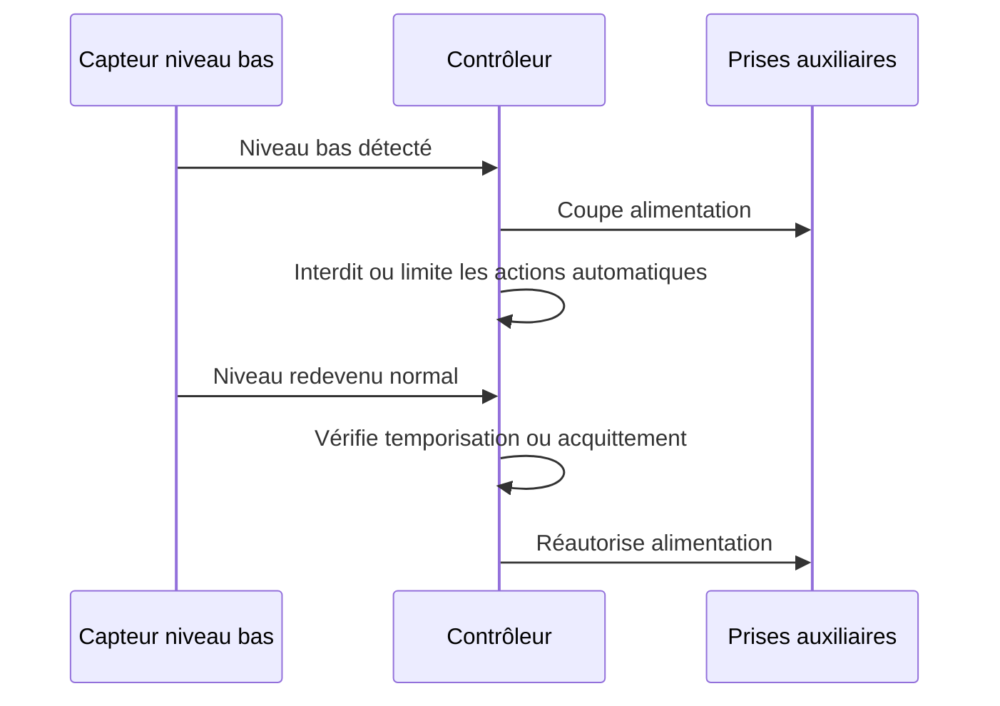

# Exigences fonctionnelles

## Tableau des exigences

| ID | Exigence | Priorité | Commentaire |
| --- | --- | --- | --- |
| F-001 | Le système doit détecter un besoin de lavage à partir du niveau d'eau dans le filtre à tambour. | Must | Les capteurs de niveau retenus sont des CR18-8DN ; leur nombre exact, leur position et la logique finale restent à figer. |
| F-002 | Le système doit démarrer une pompe de rinçage pendant le cycle de lavage. | Must | La sortie devra probablement piloter un relais ou contacteur. |
| F-003 | Le système doit commander la rotation du tambour pendant le cycle de lavage. | Must | La commande dépendra du moteur retenu. |
| F-004 | Le système doit arrêter automatiquement le cycle après une durée configurable. | Must | Valeur à définir lors des essais. |
| F-005 | Le système doit imposer un délai minimal entre deux cycles automatiques. | Must | Protection contre un capteur instable ou un filtre saturé. |
| F-006 | Le système doit proposer un mode manuel de lavage. | Should | Le mode manuel doit conserver les protections essentielles. |
| F-007 | Le système doit signaler les états marche, cycle en cours et défaut. | Should | Voyants, écran ou interface réseau selon architecture. |
| F-008 | Le système devrait journaliser les cycles et défauts. | Could | Utile pour diagnostic mais non bloquant au prototype. |
| F-009 | Le système doit commander un seuil de niveau bas de sécurité distinct du seuil de lavage. | Must | Ce seuil protège l'installation en cas de manque d'eau. |
| F-010 | Le système doit couper la pompe principale de filtration lorsque le seuil bas est atteint. | Must | Évite de vider le bassin et protège la pompe contre la marche à sec. |
| F-011 | Le système doit couper la pompe décoration lorsque le seuil bas est atteint. | Must | Évite de vider le bassin et protège la pompe contre la marche à sec. |
| F-012 | Le système doit couper l'UV lorsque le seuil bas est atteint. | Must | Évite un fonctionnement hors d'eau et sans refroidissement correct. |
| F-013 | Le système doit interdire toute rotation du tambour et toute activation de la pompe de rinçage tant que le niveau bas persiste. | Must | La fonction de lavage du FAT doit être complètement inhibée en niveau bas. |
| F-014 | Le système doit couper la mise à niveau automatique du bassin lorsque le seuil bas est atteint. | Must | Évite de remplir indéfiniment le bassin en cas de fuite. |
| F-015 | Le système doit maintenir alimenté le bulleur de la cuve bio même lorsque le seuil bas est atteint. | Must | Permet de préserver les bactéries de filtration biologique. |
| F-016 | Le système doit maintenir alimenté le bulleur du bassin même lorsque le seuil bas est atteint. | Must | Permet de maintenir l'oxygénation des poissons et de limiter la glace en hiver. |
| F-017 | Le système doit maintenir les sorties coupées ou inhibées tant que la condition de niveau bas persiste. | Must | Le redémarrage doit être maîtrisé pour éviter les oscillations. |
| F-018 | Le système devrait permettre de configurer un délai ou une logique de réarmement après retour à un niveau normal. | Should | Permet d'éviter une remise en service trop brusque après incident. |

## Reperes de niveau a definir

Les quatre reperes suivants doivent etre definis explicitement pour finaliser la logique hydraulique et de pilotage :

| Repere | Zone de mesure | Role attendu |
| --- | --- | --- |
| Niveau normal cote sale | Compartiment eau sale | Reference hydraulique nominale en fonctionnement normal |
| Niveau normal cote propre | Compartiment eau propre ou report de niveau | Reference hydraulique nominale en fonctionnement normal |
| Niveau de declenchement du lavage | Cote propre ou logique derivee du differentiel sale/propre | Seuil de lancement d'un cycle de lavage |
| Niveau bas de securite | Cote propre ou report de niveau | Seuil de mise en securite de l'installation |

Ces reperes doivent ensuite etre traduits en cotes physiques, en nombre de capteurs et en logique logicielle.

## Sorties à couper et à maintenir sur niveau bas

### Sorties à couper ou inhiber

- Pompe principale de filtration.
- Pompe décoration.
- UV.
- Rotation du tambour.
- Pompe de rinçage.
- Mise à niveau automatique du bassin.

### Sorties à maintenir alimentées

- Bulleur de la cuve bio.
- Bulleur du bassin.

## Séquence nominale de lavage

## Séquence de sécurité niveau bas

