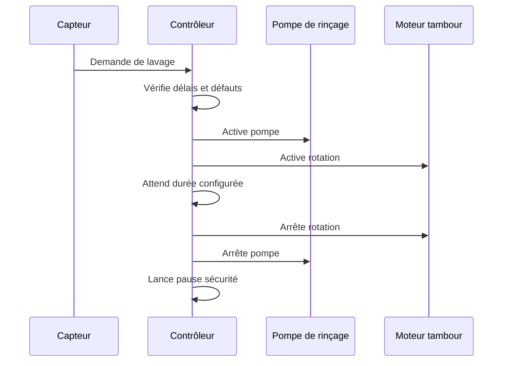

# Exigences fonctionnelles

## Tableau des exigences

| ID | Exigence | Priorité | Commentaire |
| --- | --- | --- | --- |
| F-001 | Le système doit détecter un besoin de lavage à partir d'un capteur de niveau ou d'encrassement. | Must | Le type exact de capteur reste à choisir. |
| F-002 | Le système doit démarrer une pompe de rinçage pendant le cycle de lavage. | Must | La sortie devra probablement piloter un relais ou contacteur. |
| F-003 | Le système doit commander la rotation du tambour pendant le cycle de lavage. | Must | La commande dépendra du moteur retenu. |
| F-004 | Le système doit arrêter automatiquement le cycle après une durée configurable. | Must | Valeur à définir lors des essais. |
| F-005 | Le système doit imposer un délai minimal entre deux cycles automatiques. | Must | Protection contre un capteur instable ou un filtre saturé. |
| F-006 | Le système doit proposer un mode manuel de lavage. | Should | Le mode manuel doit conserver les protections essentielles. |
| F-007 | Le système doit signaler les états marche, cycle en cours et défaut. | Should | Voyants, écran ou interface réseau selon architecture. |
| F-008 | Le système devrait journaliser les cycles et défauts. | Could | Utile pour diagnostic mais non bloquant au prototype. |

## Séquence nominale de lavage

