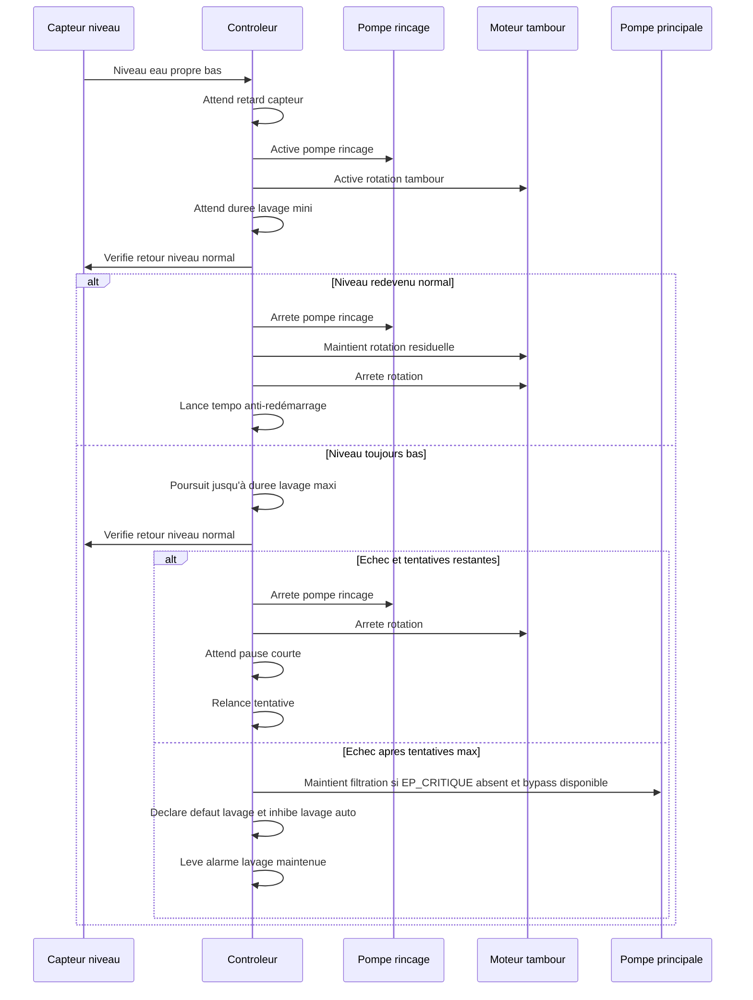
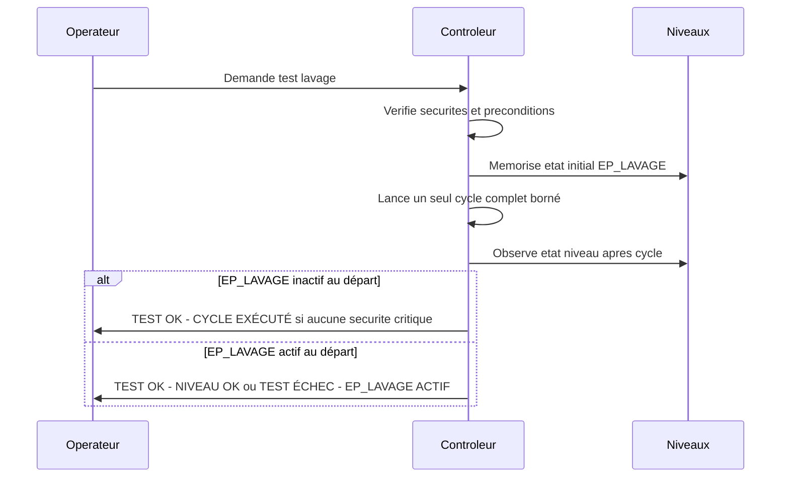
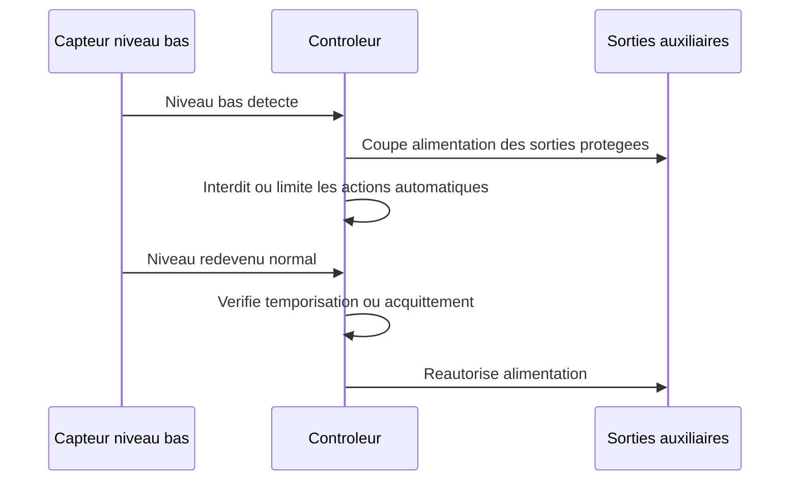

# Exigences fonctionnelles

## Tableau des exigences

| ID | Exigence | Priorité | Commentaire |
| --- | --- | --- | --- |
| F-001 | Le système doit détecter un besoin de lavage à partir du niveau d'eau côté propre du filtre à tambour. | Must | La logique de pilotage V1 repose sur deux niveaux côté eau propre : EP_LAVAGE et EP_CRITIQUE, mesures sur le report de niveau. |
| F-002 | Le système doit démarrér une pompe de rinçage pendant le cycle de lavage. | Must | Pompe 230 VAC commandee via contacteur Schneider TeSys LC1D12P7, bobine 230 VAC, pilote par un relais du KC868-A32. |
| F-003 | Le système doit commander la rotation du tambour pendant le cycle de lavage. | Must | Moteur Fyearfly 12 VDC 10 rpm commande via relais HELLA 12 V, fusible ATO 7,5 A. |
| F-004 | Le système doit arrêter automatiquement le cycle après une durée configurable. | Must | Valeur initiale V1 : durée maximale 45 s, ajustable après essais. |
| F-005 | Le système doit imposer un délai minimal entre deux cycles automatiques. | Must | Protection contre un capteur instable ou un filtre saturé. |
| F-006 | Le système doit proposer un mode manuel. | Must | Le détail des commandes manuelles et des protections associées est précise par F-022 et F-023. |
| F-007 | Le système doit signaler les états marche, cycle en cours et défaut. | Should | Voyants, écran ou interface réseau selon architecture. |
| F-008 | Le système devrait journaliser les cycles et défauts au-delà du mini-journal persistant V1 obligatoire. | Could | Utile pour diagnostic avancé mais non bloquant au MVP. Le socle persistant minimal de sécurité est défini par F-114 a F-116. |
| F-009 | Le système doit commander un seuil de niveau bas de sécurité distinct du seuil de lavage. | Must | Ce seuil protège l'installation en cas de manque d'eau. |
| F-010 | Le système doit couper la pompe principale de filtration lorsque le seuil bas est atteint. | Must | Le seuil bas V1 correspond à EP_CRITIQUE confirmé. Évite de vider le bassin et protège la pompe contre la marche à sec. |
| F-011 | Le système doit couper la pompe décoration lorsque le seuil bas est atteint. | Must | La pompe décoration suit exactement la même sécurité hydraulique que la filtration, car elle aspire au même endroit. |
| F-012 | Le système doit couper l'UV lorsque le seuil bas est atteint. | Must | L'UV est autorisé seulement si la filtration est autorisée et EP_CRITIQUE absent. |
| F-013 | Le système doit interdire toute rotation du tambour et toute activation de la pompe de rinçage tant que le niveau bas persiste. | Must | La fonction de lavage du FAT doit être complètement inhibée en niveau bas. |
| F-014 | Le système doit couper la mise à niveau automatique du bassin lorsque le seuil bas est atteint. | Must | Sur EP_CRITIQUE, le système ne sait pas encore distinguer manque d'eau réel, obstruction, fuite, capteur ou anomalie hydraulique ; le remplissage automatique pourrait masquer ou aggraver le problème. |
| F-015 | L'architecture doit laisser le bulleur de la cuve bio hors des sorties coupées par le contrôleur. | Must | Le bulleur sera branché directement sur le 220 V afin de préserver les bactéries de filtration biologique. |
| F-016 | L'architecture doit laisser le bulleur du bassin hors des sorties coupées par le contrôleur. | Must | Le bulleur sera branché directement sur le 220 V afin de maintenir l'oxygénation des poissons et de limiter la glace en hiver. |
| F-017 | Le système doit maintenir les sorties coupées ou inhibées tant que la condition de niveau bas persiste. | Must | Le redémarrage doit être maîtrisé pour éviter les oscillations. |
| F-018 | Le système devrait permettre de configurer un délai ou une logique de réarmement après retour à un niveau normal. | Should | Permet d'éviter une remise en service trop brusque après incident. |
| F-019 | Le système doit proposer un mode auto normal comme mode principal d'exploitation. | Must | C'est le mode nominal après mise en service et en exploitation courante. |
| F-020 | Le système doit permettre un arrêt total de l'automate pour maintenance ou consignation. | Must | Cet arrêt total doit être explicite et distinct d'un simple défaut. |
| F-021 | En cas de coupure de courant puis de retour alimentation, le système doit redémarrer dans un état opérationnel et converger vers un mode exploitable sans rester bloque dans un état d'attente indéfini. | Must | Au boot, toutes les sorties doivent être initialisées dans un état sûr, puis les sécurités doivent être relues avant remise en service. Par défaut, la cible est le mode auto normal si aucune sécurité ne l'interdit. |
| F-022 | Le système doit proposer un mode manuel V1 limité au pilotage sécurisé de la rotation du tambour, du rinçage, du cycle test et du reset alarme. | Must | Les pompes filtration, décoration et UV ne sont pas pilotées comme commandes manuelles indépendantes en V1 ; elles restent soumises aux autorisations et sécurités globales. |
| F-023 | Le mode manuel doit conserver des sécurités minimales, notamment l'interdiction d'une marche à sec et les verrouillages critiques liés à l'ouverture du compartiment. | Must | Le mode manuel ne doit pas permettre de contourner une protection critique. |
| F-024 | Le système doit proposer un mode maintenance dans lequel les alarmes sont inhibées partiellement et le tambour ne peut pas démarrér automatiquement. | Must | Ce mode est destiné aux interventions et au nettoyage. |
| F-025 | L'ouverture du capot ou du compartiment du FAT doit forcer ou proposer immédiatement le passage en mode maintenance, interdire le lavage automatique, couper la rotation tambour et couper le rinçage. | Must | Le capot concerne la zone FAT. L'UV est hors tambour et reste asservi à la filtration autorisée et à l'absence de EP_CRITIQUE. |
| F-026 | En mode maintenance, les pompes doivent pouvoir être arrêtées proprement, la rotation doit être coupée à l'ouverture du compartiment et une temporisation doit éviter un redémarrage brutal à la sortie du mode. | Must | La temporisation protège l'opérateur et l'hydraulique. |
| F-027 | Le système doit proposer un mode dégradé pour maintenir le bassin vivant lorsqu'un sous-ensemble non critique du FAT est indisponible. | Must | Le mode dégradé doit être signalé et journalisé. Le bypass est un mode de survie, pas un fonctionnement nominal long terme. |
| F-028 | Le mode dégradé doit au minimum couvrir les cas suivants : lavage inefficace répété sans passage immédiat en critique tant que le niveau critique n'est pas atteint, capteur de niveau principal indisponible avec bascule sur capteur de secours si disponible, lavages trop fréquents avec alarme et maintien de service, commande UV incohérente avec coupure UV et alarme. | Should | Les réactions exactes dependront du câblage final et de la presence d'un bypass. |
| F-029 | Le système doit proposer un mode test distinct du mode manuel permettant de lancer un cycle complet de lavage borné avec verdict automatique. | Must | Ce mode est utile après maintenance ou mise au point. Il valide la séquence tambour + rinçage + sécurités, sans devenir un mode de décolmatage agressif. |
| F-030 | Le système doit mesurer une température représentative de l'eau du bassin et rendre cette valeur disponible à l'automate. | Must | Mesure directe dans le bassin ou dans une zone très représentative proche du bassin ; éviter une mesure uniquement influencée par le local technique, la pompe, l'UV ou une zone stagnante. Technologie candidate V1 : sonde numérique étanche type DS18B20, sauf choix plus naturel imposé par la plateforme retenue. |
| F-031 | Le système doit permettre de remonter au minimum des alertes de température eau basse, température eau haute et perte de mesure du capteur. | Must | Seuils initiaux configurables : eau basse < 4 deg C, eau haute > 28 deg C. La perte de sonde eau est informative en V1 et affiche A11. Ces alertes ne bloquent pas les fonctions. Le mode hiver automatique est reporté V1.1/V2. |
| F-032 | Le système doit mesurer la température ambiante du local technique et rendre cette valeur disponible à l'automate. | Must | La mesure doit représenter l'air du local de filtration, pas seulement l'intérieur du coffret. Technologie candidate V1 : sonde numérique simple, sauf choix plus naturel imposé par la plateforme retenue. |
| F-033 | Le système doit permettre de remonter au minimum des alertes de température ambiante basse, température ambiante haute et perte de mesure du capteur. | Must | Seuils initiaux configurables : local bas < 2 deg C, local haut > 40 deg C. La perte de sonde local est informative en V1 et affiche A12. Ces alertes ne bloquent pas les fonctions. Les usages gel, surchauffe, condensation ou mode hiver sont reportés V1.1/V2. |
| F-034 | Le système doit disposer d'une IHM locale simple avec écran texte ou petit afficheur et commandes physiques essentielles à proximité du coffret. | Must | Les voyants seuls ne sont pas retenus pour la V1, car les états dégradé, lavage inhibe, niveau critique et température doivent rester lisibles sans mémoriser un code complexe. |
| F-035 | L'IHM locale doit permettre d'identifier au minimum les états auto normal, manuel, maintenance, dégradé, défaut, cycle en cours et alarme active. | Must | L'écran local porte le détail ; un voyant alarme ou marche peut compléter l'affichage si utile. |
| F-036 | Le système doit afficher localement les informations vitales de V1 : mode actuel, état niveau, état lavage, alarme active et température eau. | Must | Les autres informations peuvent être accessibles par page, défilement ou écran détail. |
| F-037 | Le système pourrait permettre une remontée à distance de l'état général, des alarmes et des défauts. | Could | Fonction cible pour une V2 ; le MVP doit rester pleinement exploitable sans elle. |
| F-038 | Le système pourrait permettre d'émettre des notifications à distance lors d'événements significatifs comme défaut critique, passage en dégradé, niveau bas, alarme température ou reprise après coupure. | Could | Fonction cible pour une V2 sur Wi-Fi. Les notifications doivent rester actionnables et anti-spam. |
| F-039 | Le mode auto doit déclencher le lavage lorsque le niveau eau propre reste en condition de demande pendant un retard configurable. | Must | La demande de lavage doit être robuste aux fluctuations de capteur. |
| F-040 | Une fois le lavage lance, le système doit maintenir rotation tambour et rinçage au moins pendant une durée minimale configurable. | Must | Valeur initiale V1 : 10 s, pour éviter des cycles trop courts et inefficaces. |
| F-041 | À l'issue de la durée minimale, si le niveau est redevenu normal, le système doit arrêter le rinçage, terminer une rotation résiduelle configurable puis appliquer une temporisation anti-redémarrage. | Must | Valeur initiale V1 : rotation résiduelle 2 à 5 s, puis anti-redémarrage 30 à 120 s. |
| F-042 | Si le niveau n'est pas redevenu normal à l'issue de la durée minimale, le système doit poursuivre le lavage jusqu'à une durée maximale configurable. | Must | Protection contre les cycles interminables. |
| F-043 | Si la durée maximale est atteinte et que le niveau est toujours en demande, le système doit attendre une courte pause configurable avant de relancer une tentative, dans la limite d'un nombre maximum configurable. | Must | Valeur initiale V1 : pause 30 à 120 s configurable, maximum 3 tentatives. |
| F-044 | Si le nombre maximum de tentatives est atteint sans retour à un niveau normal, le système doit déclarer un défaut lavage, inhiber le lavage automatique et maintenir une alarme jusqu'à acquittement. | Must | Valeur initiale V1 : 3 tentatives. Si EP_CRITIQUE n'est pas actif et qu'un bypass hydraulique permet de maintenir le passage vers la biofiltration, la pompe principale reste active pour préserver la filtration biologique. La coupure filtration reste réservée aux cas critiques comme EP_CRITIQUE actif ou incohérence capteurs. |
| F-045 | Le système doit surveiller et mémoriser la fréquence des lavages par heure et par jour afin de détecter un fonctionnement anormalement fréquent. | Should | Reporté V1.1 avec les statistiques de lavage. |
| F-046 | Le système devrait exécuter un test journalier automatique du lavage avec diagnostic du résultat lorsque les conditions de sécurité et d'exploitation le permettent. | Should | Reporté V1.1. La V1 conserve seulement un TEST_LAVAGE manuel. Fenêtre cible configurable, valeur par défaut 11h-15h, sans test de nuit. |
| F-047 | Le test journalier devrait vérifier au minimum la mise en route du tambour, du rinçage et le retour attendu des informations de niveau ou de diagnostic associées. | Should | Reporté V1.1 avec le test journalier automatique. Reussite si le cycle borné s'exécute sans sécurité ; si EP_LAVAGE est actif au départ, réussite seulement si EP_LAVAGE revient normal. |
| F-048 | Le système devrait éviter qu'une même portion du tambour reste immergée en permanence en prévoyant une indexation ou rotation périodique hors lavage. | Should | Reporté V1.1. Sans capteur position, indexation par courte rotation configurable après certains lavages réussis ou périodiquement ; pas d'angle précis sans mesure de position. |
| F-049 | La stratégie d'indexation du tambour devrait être configurable et compatible avec les sécurités capot, maintenance, niveau bas et défauts critiques. | Should | Reporté V1.1. Capteur de position non retenu par défaut ; à ajouter seulement si l'indexation au temps pose problème ou si une position reproductible devient nécessaire. |
| F-050 | Le système devrait enregistrer des statistiques de lavage exploitables pour le diagnostic du filtre. | Should | Reporté V1.1. Les statistiques nominales n'incluent que les lavages automatiques réussis ; tests, échecs et interruptions sont comptés à part. |
| F-051 | Les statistiques de lavage devraient inclure au minimum le nombre de lavages par heure, le nombre de lavages par jour, la durée moyenne d'un lavage, la durée totale de lavage par jour, l'intervalle moyen entre lavages et l'intervalle minimum observé. | Should | Reporté V1.1. Restitution locale simple : compteurs jour, dernier lavage et nombre d'échecs. Historique détaillé ou export reporte V2. |
| F-052 | Le système devrait permettre de suivre l'évolution de ces statistiques sur au moins 7 jours et 30 jours. | Should | Reporté V1.1 ou V2 selon la persistance retenue. |
| F-053 | Le système devrait calculer un indice simple d'encrassement du filtre à partir des statistiques de lavage. | Should | Reporté V1.1 ou V2. Indicateur expérimental non décisionnel, utilisé pour observer une tendance. |
| F-054 | L'indice d'encrassement devrait être calculé au minimum comme : nombre de lavages par heure x durée moyenne de lavage. | Should | Reporté V1.1 ou V2. La formule doit rester stable dans le temps pour permettre les comparaisons. Pas de seuil fixe au départ ; alerte future sur dérive relative après observation. |
| F-055 | Le système devrait permettre d'estimer empiriquement la consommation d'eau liée au rinçage du filtre. | Should | Reporté V1.1 ou V2. Estimation : débit mesuré aux buses x durée de rinçage cumulée. |
| F-056 | Les indicateurs de consommation d'eau devraient inclure au minimum les litres estimés par lavage, les litres estimés par jour, les litres estimés par semaine, les litres perdus vers l'évacuation et une estimation du remplissage nécessaire. | Should | Reporté V1.1 ou V2. Les pertes et le besoin de remplissage restent indicatifs tant qu'il n'y a pas de compteur d'eau dédié. |
| F-057 | Le système devrait suivre les temps de fonctionnement cumulés des principaux actionneurs. | Should | Reporté V1.1. Compteurs cumulés simples ; remises à zéro maintenance et seuils de rappel reportés V2. |
| F-058 | Les temps de fonctionnement devraient inclure au minimum les heures moteur tambour, les heures pompe rinçage, les heures pompe décoration, les heures pompe principale et les heures UV. | Should | Reporté V1.1, sous forme de compteurs cumulés par organe principal. |
| F-059 | Le système pourrait permettre d'émettre immédiatement une notification à distance lors des événements critiques retenus. | Could | Fonction cible pour une V2 en Wi-Fi. Liste V2 retenue : EP_CRITIQUE, capteurs incohérents, capot ouvert dangereux, A15, lavage inefficace, retour courant après coupure et perte sonde température persistante. |
| F-060 | Le système pourrait émettre une synthèse quotidienne de fonctionnement lorsque cette fonction est activée. | Could | Fonction cible pour une V2 Wi-Fi. Désactivée par défaut, configurable, avec horaire par défaut 18h00 si activée. |
| F-061 | La synthèse quotidienne pourrait inclure au minimum un statut global du filtre, le nombre de lavages du jour, la durée moyenne, l'eau estimée ou mesurée consommée, le dernier défaut et la température d'eau. | Could | Fonction cible pour une V2 ; le contenu exact pourra évoluer selon le canal Wi-Fi retenu. |
| F-062 | La synthèse quotidienne doit pouvoir être activée ou désactivée indépendamment des notifications immédiates si cette fonction distante est retenue. | Could | L'utilisateur doit pouvoir supprimer le résumé journalier sans perdre les alertes critiques, qui restent envoyées immédiatement selon leur propre politique anti-spam. |
| F-063 | Le système devrait permettre le pilotage automatique de la pompe décoration selon deux plages horaires maximum par jour. | Should | Reporté V1.1 ou V2. Les mêmes horaires s'appliquent tous les jours ; la programmation hebdomadaire est repoussée si un besoin réel apparaît. |
| F-064 | Le fonctionnement programmé de la pompe décoration doit pouvoir être desactive par un simple interrupteur logiciel actif/inactif. | Must | Applicable seulement si le pilotage programmé de la pompe décoration est retenu en V1.1 ou V2. Pas d'automatisme hiver au départ. |
| F-065 | La programmation et les commandes de la pompe décoration doivent rester soumises aux sécurités générales du système. | Must | Priorité : sécurités hydrauliques et défauts bloquants, commande manuelle locale, commande distante, puis programmation horaire. Aucune commande ne doit forcer la pompe décoration contre EP_CRITIQUE ou une sécurité supérieure. |
| F-066 | Le système doit formuler ses alarmes et défauts à partir des conséquences observables et des incohérences mesurables, sans affirmer une panne d'organe non instrumentée directement. | Must | Par exemple, préférer lavage inefficace a tambour bloque ou pompe HS si aucun retour d'état direct n'existe. |
| F-067 | La nomenclature de référence côté eau propre doit distinguer au minimum un capteur EP_LAVAGE pour la demande de lavage et un capteur EP_CRITIQUE pour le danger pompe et l'arrêt de sécurité. | Must | Ces deux entrées constituent le coeur de la logique hydraulique observable en V1. |
| F-068 | Le système doit détecter comme défaut critique toute combinaison incohérente des capteurs eau propre, notamment EP_CRITIQUE actif alors que EP_LAVAGE n'est pas actif si l'ordre physique des capteurs l'interdit. | Must | Cette vérification protège contre un capteur bloqué ou un câblage incohérent. |
| F-069 | Au redémarrage, si EP_LAVAGE ou EP_CRITIQUE sont actifs, le système ne doit pas relancer directement les sorties sans vérification de la situation hydraulique et sans appliquer la stratégie de reprise retenue. | Must | EP_LAVAGE actif et EP_CRITIQUE inactif autorisé une reprise dégradée avec filtration et UV si la filtration est autorisée, puis lavage immédiat. EP_CRITIQUE actif impose l'état sûr bloqué. |
| F-070 | Le système devrait détecter une absence anormale de lavage lorsque la filtration est commandée mais qu'aucun lavage n'est observé pendant une durée inhabituelle au regard de la saison ou de l'historique. | Should | Reporté V1.1, après observation du comportement normal du bassin. |
| F-071 | Le système doit couper l'UV et lever une alarme de commande incohérente si l'UV est commandé alors que la filtration n'est pas autorisée ou qu'un niveau critique eau propre est présent. | Must | En V1, l'UV est asservi à la commande de filtration autorisée et non a une mesure directe de débit. EP_LAVAGE seul ne coupe pas l'UV si la filtration reste autorisée et que le bypass hydraulique maintient le passage d'eau. |
| F-072 | Le système devrait surveiller un temps anormal de commande continue des sorties principales et alerter l'utilisateur en cas d'incohérence durable. | Should | Reporté V1.1 sauf verrouillage directement nécessaire à une sécurité V1. |
| F-073 | Le système devrait surveiller la fréquence des redémarrages de l'automate et signaler des coupures secteur anormalement répétitives. | Should | Reporté V1.1. |
| F-074 | Les statistiques internes devraient inclure au minimum le temps de retour de EP_LAVAGE à l'état normal, le nombre de tentatives par lavage, le nombre d'activations de EP_CRITIQUE, les températures min/max/moyenne, le nombre d'ouvertures capot et la durée capot ouvert. | Should | Reporté V1.1 avec les statistiques avancées. |
| F-075 | Le système doit bloquer le retour automatique au nominal pour les alarmes V1 suivantes : EP_CRITIQUE, capteurs niveau incohérents, capot ouvert pendant action dangereuse et défaut lavage maintenu après tentatives max. | Must | Les alertes température ou lavages fréquents peuvent informer sans bloquer si aucune sécurité critique n'est présente. |
| F-076 | Le système doit refuser l'acquittement d'une alarme si sa cause est toujours active et afficher clairement la cause du refus. | Must | Exemple attendu : reset refusé tant que EP_CRITIQUE reste actif. Le reset ne doit pas simplement masquer une condition dangereuse. |
| F-077 | Le capot ouvert doit avoir priorité sur le sélecteur AUTO / MAINTENANCE et forcer l'état maintenance ou sécurité même si le sélecteur est sur AUTO. | Must | Le capot représente une condition terrain plus forte que l'intention opérateur. |
| F-078 | Les commandes manuelles V1 MANU_TAMBOUR et MANU_RINCAGE doivent être de type maintenu appuyé : le relâchement du bouton coupe la commande associée. | Must | Évite les oublis et les mouvements inattendus pendant une intervention. |
| F-079 | Le bouton TEST_LAVAGE doit lancer un cycle complet autonome après appui bref en AUTO ou MAINTENANCE si les préconditions sont OK, avec arrêt immédiat si capot ouvert, EP_CRITIQUE ou défaut critique apparaît. | Must | Le test doit valider une séquence réelle tout en restant soumis aux sécurités prioritaires. Le mode MAINTENANCE n'est pas une cause de refus si les sécurités sont OK. |
| F-080 | Le signal EP_LAVAGE doit être filtré par une temporisation configurable avant de lancer un lavage automatique. | Must | Plage initiale cible : 5 à 15 s, afin d'éviter les cycles dus aux vagues, remous ou variations passagères. |
| F-081 | Le signal EP_CRITIQUE doit être confirmé par une temporisation anti-rebond très courte avant de déclencher la mise en sécurité. | Must | Plage initiale cible : 0,5 à 2 s. Le seuil critique ne doit pas être retardé par une temporisation longue. |
| F-082 | Après activation de EP_CRITIQUE, le redémarrage automatique doit être bloqué jusqu'au retour stable du niveau normal puis acquittement local valide. | Must | L'acquittement distant est réservé à une V2. EP_LAVAGE seul n'exige pas d'acquittement si le lavage réussit ; seule la temporisation anti-redémarrage s'applique. |
| F-083 | Après retour normal et acquittement suite à EP_CRITIQUE, le système doit relancer la filtration avant de réautoriser l'UV après une courte temporisation de stabilisation. | Must | Évite d'allumer l'UV pendant une transition hydraulique incertaine. La durée exacte est un paramètre à calibrer. |
| F-084 | Le système doit traiter EP_CRITIQUE actif alors que EP_LAVAGE est inactif comme une incohérence critique des capteurs niveau. | Must | Si l'ordre physique des capteurs rend cette combinaison impossible, le système doit couper filtration, décoration, UV, mise à niveau, tambour et rinçage, puis attendre retour cohérent et acquittement. |
| F-085 | En cas de défaut lavage maintenu après tentatives max avec EP_LAVAGE toujours actif et EP_CRITIQUE inactif, l'acquittement doit être refusé tant que EP_LAVAGE reste actif. | Must | Filtration et UV peuvent rester maintenus via bypass, mais le reset ne doit pas masquer une toile encore colmatée ou un niveau non revenu. |
| F-086 | Le système doit appliquer une stratégie prudente en cas de capteur niveau absent ou non fiable. | Must | Si la confiance dans EP_CRITIQUE est perdue, le défaut est bloquant hydraulique. Si le doute concerne seulement EP_LAVAGE et que EP_CRITIQUE est sain, les lavages automatiques sont inhibés mais la filtration peut être maintenue. |
| F-087 | Si EP_LAVAGE redevient actif pendant la temporisation anti-redémarrage, le système doit attendre la fin de cette temporisation puis relire EP_LAVAGE avec son retard configuré avant de lancer un nouveau lavage. | Must | Évite une boucle immédiate tout en traitant un vrai colmatage persistant après stabilisation. |
| F-088 | L'IHM locale doit appliquer une priorité d'affichage des alarmes V1. | Must | Priorité : EP_CRITIQUE ou incohérence capteurs, capot ouvert pendant action dangereuse, défaut lavage maintenu, capot ouvert trop longtemps A15, alertes température, puis infos de fonctionnement. Une alarme plus prioritaire masque A15 à l'écran sans l'effacer tant que le capot reste ouvert trop longtemps. |
| F-089 | En cas de reset refusé, l'IHM locale doit afficher une cause courte et explicite. | Must | Exemples attendus : RESET REFUSÉ - EP_CRITIQUE ACTIF, RESET REFUSÉ - EP_LAVAGE ACTIF, RESET REFUSÉ - CAPTEURS INCOHÉRENTS. |
| F-090 | L'IHM ne doit pas presenter le bypass passif comme un état mesure en V1. | Must | En défaut lavage sans EP_CRITIQUE, afficher une formulation prudente du type MODE DÉGRADÉ - BYPASS SUPPOSÉ, car le bypass n'est pas instrumente. |
| F-091 | Les alarmes et défauts V1 affichés localement doivent utiliser un format code court plus message texte. | Must | Format cible : `Axx - MESSAGE COURT`, par exemple `A01 - NIVEAU CRITIQUE`. Le code aide au diagnostic et le texte aide l'utilisateur. |
| F-092 | L'IHM locale V1 doit prévoir au minimum deux voyants physiques complémentaires : marche et alarme. | Must | L'écran porte le détail, mais un voyant marche vert et un voyant alarme rouge donnent un diagnostic immédiat. Un voyant lavage jaune ou ambre reste optionnel Should. |
| F-093 | Le bouton TEST_LAVAGE doit lancer un seul cycle complet borné, même si EP_LAVAGE est actif au début du test. | Must | Le test ne doit pas appliquer les relances multiples du lavage automatique et ne doit pas servir de mode de décolmatage agressif. |
| F-094 | Si TEST_LAVAGE est lance alors que EP_LAVAGE est inactif, le verdict doit confirmer l'exécution de la séquence sans prétendre prouver l'efficacité hydraulique. | Must | Verdict cible : `TEST OK - CYCLE EXÉCUTÉ` si aucune sécurité critique n'apparaît. |
| F-095 | Si TEST_LAVAGE est lance alors que EP_LAVAGE est actif, le verdict doit dependre du retour de EP_LAVAGE après le cycle borné. | Must | Verdict cible : `TEST OK - NIVEAU OK` si EP_LAVAGE redevient normal ; `TEST ÉCHEC - EP_LAVAGE ACTIF` ou `TEST ÉCHEC - LAVAGE INEFFICACE` sinon. Le test seul ne déclare pas un défaut lavage maintenu, sauf sécurité critique déclenchée. |
| F-096 | TEST_LAVAGE doit être autorisé en AUTO et en MAINTENANCE si le capot est fermé, EP_CRITIQUE absent, les capteurs de niveau cohérents et aucun défaut critique bloquant actif. | Must | Le test reste un cycle autonome local, utilisable après intervention sans devoir repasser en AUTO. |
| F-097 | Une demande TEST_LAVAGE avec capot ouvert doit être refusée immédiatement avec un message explicite. | Must | Message cible : `A13 - TEST REFUSÉ CAPOT`. Aucune rotation tambour ni rinçage ne doit démarrér. |
| F-098 | Une demande TEST_LAVAGE avec EP_CRITIQUE actif, capteurs de niveau incohérents ou défaut critique bloquant doit être refusée immédiatement avec un message explicite. | Must | Message cible : `A14 - TEST REFUSÉ SÉCURITÉ`. |
| F-099 | Les commandes manuelles MANU_TAMBOUR et MANU_RINCAGE doivent être refusées si le capot FAT est ouvert. | Must | Refus sans mouvement ni rinçage, avec message local simple du type `COMMANDE REFUSÉE - CAPOT`. |
| F-100 | Une commande manuelle refusée avant activation d'une sortie ne doit pas créer d'alarme bloquante à acquitter. | Must | L'alarme bloquante reste réservée au cas ou le capot s'ouvre pendant une action dangereuse deja en cours. |
| F-101 | Le capot FAT V1 doit être un capot transparent permettant de voir le tambour tourner sans ouvrir le FAT. | Must | Le capot et le couvercle transparent désignent la même pièce physique, pas deux organes separes. |
| F-102 | Le contact CAPOT_OUVERT doit être câblé en normalement fermé, fermé lorsque le capot est fermé. | Must | Une coupure de fil, un connecteur débranché ou une perte de contact doit être interprété comme capot ouvert. |
| F-103 | Le signal CAPOT_OUVERT doit utiliser un anti-rebond court à l'ouverture et une validation plus lente à la fermeture avant réautorisation. | Must | Cibles V1 : ouverture confirmée en 100 à 500 ms ; fermeture stable 1 à 2 s avant reprise ou autorisation. |
| F-104 | Le système doit signaler localement un capot reste ouvert trop longtemps. | Must | Alerte V1 `A15 - CAPOT OUVERT LONG`, déclenchée après temporisation configurable. Valeur initiale : 10 minutes. Cette alerte rappelle que le lavage tambour est indisponible tant que le capot reste ouvert. |
| F-105 | Tant que le capot est ouvert hors action dangereuse, l'IHM doit afficher un état informatif permanent `MAINTENANCE - CAPOT OUVERT`. | Must | Cet état ne demande pas d'acquittement. Il distingue une intervention normale d'une alarme capot dangereux. |
| F-106 | Après fermeture stable du capot, le système doit revenir automatiquement au mode demande par le sélecteur si aucune alarme bloquante capot dangereux n'a été créée. | Must | Si une alarme capot dangereux a été créée, la reprise exige fermeture stable puis acquittement valide. |
| F-107 | Lorsque `A15 - CAPOT OUVERT LONG` est actif, le voyant rouge VOYANT_ALARME doit être allumé fixe. | Must | L'écran porte le détail, mais le voyant rouge rend l'oubli visible localement sans regarder l'écran. |
| F-108 | `A15 - CAPOT OUVERT LONG` doit disparaître automatiquement après fermeture stable du capot. | Must | Aucun acquittement n'est requis pour A15. L'acquittement reste réservé à l'ouverture capot pendant action dangereuse. |
| F-109 | Le système doit conserver une trace minimale persistante et non bloquante de `A15 - CAPOT OUVERT LONG`. | Must | La trace est écrite quand l'événement A15 survient et doit rester présente après coupure d'alimentation. Trace V1 minimale : compteur persistant plus dernier événement si simple à implémenter ; si une horloge fiable existe facilement, le dernier événement est horodaté. Un historique long n'est pas requis en V1. Cette trace aide a comprendre une période sans lavage, sans bloquer le fonctionnement. |
| F-110 | Le voyant rouge VOYANT_ALARME ne doit pas clignoter pour `A15 - CAPOT OUVERT LONG` en V1. | Must | Le clignotement est réservé a une évolution éventuelle V1.1 si une hierarchie visuelle plus fine devient nécessaire. |
| F-111 | Après disparition de `A15 - CAPOT OUVERT LONG`, le voyant rouge ne doit pas rester allumé artificiellement pour mémoriser l'alerte. | Must | Le voyant rouge suit les alarmes actives. La memorisation est portée par la trace minimale A15. |
| F-112 | Le choix de plateforme V1 doit permettre une heure fiable en V2 sans remplacement de la plateforme principale. | Must | L'horodatage fiable n'est pas obligatoire dans le MVP, mais la plateforme retenue doit permettre l'ajout ou l'usage d'une horloge fiable : RTC, temps local conserve, module temps, synchronisation réseau ou equivalent. La solution V2 ne doit pas dependre exclusivement d'Internet. |
| F-113 | Après coupure d'alimentation, si la condition capot ouvert trop longtemps est toujours présente ou était deja active avant coupure et que le capot est encore ouvert au redémarrage, le système doit redétecter et réafficher `A15 - CAPOT OUVERT LONG`. | Must | Le log persistant prouve l'événement deja survenu ; l'état courant est recalcule au redémarrage à partir du capot et de l'état A15 non résolu. Si A15 n'était pas encore actif avant coupure, la temporisation repart au redémarrage tant que le capot reste ouvert. |
| F-114 | Le mini-journal persistant V1 doit conserver les événements de diagnostic indispensables. | Must | Événements minimum : `A15 - CAPOT OUVERT LONG`, activation `EP_CRITIQUE`, `A03 - CAPOT OUVERT DANGER`, `A04 - LAVAGE INEFFICACE` et redémarrage après coupure. Les alertes température ne sont pas persistantes en MVP. |
| F-115 | Le mini-journal persistant V1 doit rester volontairement court. | Must | Format minimal : compteurs persistants par code d'événement plus dernier événement global. Une mémoire circulaire de 8 ou 16 événements est acceptable seulement si la plateforme le rend simple. Un historique long est hors MVP. |
| F-116 | Les acquittements réussis des alarmes bloquantes doivent être tracés dans le mini-journal persistant V1. | Must | Les refus répétitifs d'acquittement ne sont pas journalises un par un en V1 ; le dernier refus reste affiché localement avec sa cause. |
| F-117 | L'UV doit être implanté hors tambour, après la pompe principale sur la ligne de filtration. | Must | Il reste asservi à la filtration autorisée et à l'absence de EP_CRITIQUE. Un défaut FAT non critique ne coupe pas l'UV si la filtration reste autorisée. |
| F-118 | La cote finale du support FAT doit être définie par mesure terrain avant fabrication. | Must | La cote ne doit pas être inventee en spécification. La mesure doit aligner le trop-plein physique du FAT avec le niveau hydraulique cible du bassin afin d'éviter un mauvais régime gravitaire. |
| F-119 | La geometrie des ouvertures du tambour doit être validée par calcul avant découpe ou perçage. | Must | Objectif V1 : obtenir environ 0,20 à 0,23 m2 de surface filtrante utile sous toile inox 74 microns. Le dessin final des ouvertures est une étape mécanique dédiée. |
| F-120 | Les auto-diagnostics indirects obligatoires V1 doivent être limites aux conditions observables et sécurités retenues. | Must | Minimum V1 : EP_CRITIQUE, incohérence EP_CRITIQUE actif avec EP_LAVAGE inactif, lavage inefficace après 3 tentatives, capot ouvert dangereux, capot ouvert trop longtemps A15, commande UV incohérente, perte sonde température eau/local. |
| F-121 | Le débit de rinçage de référence V1 doit être mesure aux buses après montage réel. | Must | La courbe pompe peut servir d'estimation provisoire, mais la valeur de référence pour calculs ou estimations doit venir du montage réel : pompe, rampe, buses et pertes de charge. |
| F-122 | La V1 ne doit pas ajouter de pressostat, débitmètre ou retour courant pour confirmer le rinçage. | Must | Le diagnostic reste indirect : en cas de non-retour de EP_LAVAGE après lavage, afficher `A04 - LAVAGE INEFFICACE`. Les capteurs dedies de rinçage sont reportés V1.1/V2 si les essais montrent trop d'ambiguite. |
| F-123 | La V1 ne doit pas ajouter de capteurs dedies de diagnostic direct pour rotation tambour, courant mesuré, fuite local ou niveau eau sale. | Must | Les protections matérielles nécessaires restent obligatoires. Un simple retour défaut fourni nativement par un module de protection peut être exploité sans transformer la V1 en diagnostic direct détaillé. |
| F-124 | Le logiciel V1 ne doit pas dépendre d'une fonction de parking ou de position moteur. | Must | Le moteur Fyearfly retenu ne fournit pas de fonction parking utilisée par le controleur. L'indexation reste au temps en V1.1, sauf ajout futur d'un capteur de position. |
| F-125 | Le mode hiver automatique est hors V1. | Must | La V1 affiche seulement les alertes température eau/local et pertes de sondes. Les adaptations automatiques de circulation, temporisations, protection antigel ou priorité aeration sont reportées V1.1/V2 après observation réelle. |
| F-126 | Le choix matériel MVP doit rester compatible avec une connectivité Wi-Fi V2 sans remplacement de la plateforme principale. | Must | La connectivité active reste hors MVP, mais le matériel retenu doit permettre Wi-Fi natif ou ajout d'un module Wi-Fi intégré proprement. Ethernet n'est pas requis, BLE seul est insuffisant et SMS n'est pas retenu par défaut. |
| F-127 | Les notifications V2 doivent appliquer une politique anti-spam. | Should | Envoi à l'apparition, rappel périodique rare si l'état reste actif, et notification de retour à la normale pour les alarmes importantes. |
| F-128 | La V2 distante doit permettre une consultation d'état simple en plus des notifications. | Should | Minimum : état courant, dernière alarme, dernier lavage, température eau/local et dernier redémarrage. L'historique détaillé est reporté V2.1. |
| F-129 | Le test journalier automatique V1.1 doit être lance dans une fenêtre configurable et reportable. | Should | Fenêtre par défaut 11h-15h. Report automatique si sécurité active, capot ouvert, EP_CRITIQUE, lavage deja en cours ou alarme bloquante. |
| F-130 | Le test journalier automatique V1.1 doit produire un verdict explicite. | Should | `TEST JOURNALIER OK` si le cycle borné s'exécute sans sécurité ; si EP_LAVAGE est actif au départ, OK seulement si EP_LAVAGE revient normal. Échec sur sécurité, timeout, capot ouvert, EP_CRITIQUE ou EP_LAVAGE toujours actif. |
| F-131 | Les statistiques de lavage V1.1 doivent separer lavages nominaux, tests, échecs et interruptions. | Should | Les moyennes nominales ne doivent pas être polluees par les tests journaliers, les tentatives echouees ou les interruptions. |
| F-132 | La restitution V1.1 des statistiques doit rester locale et simple. | Should | Afficher au minimum compteurs jour, dernier lavage et nombre d'échecs. Historique détaillé et export sont reportés V2. |
| F-133 | L'indice d'encrassement V1.1 doit rester un indicateur d'observation. | Should | Il ne déclenche aucune action automatique. Les alertes futures reposent sur une dérive relative après observation, par exemple doublement par rapport à la médiane récente ou hausse continue sur plusieurs jours. |
| F-134 | Les compteurs horaires V1.1 doivent rester simples. | Should | Compteur cumulé par organe principal. Les remises à zéro maintenance et seuils de rappel sont reportés V2. |
| F-135 | La synthèse quotidienne V2 doit être désactivée par défaut et configurable. | Should | Si elle est activée, l'horaire par défaut est 18h00, le canal est le même que les notifications Wi-Fi V2, et les notifications immédiates restent indépendantes. |
| F-136 | L'IHM distante ne doit pas afficher "bassin niveau bas" sans capteur bassin distinct. | Must | En V1/V2, EP_CRITIQUE correspond a un niveau FAT critique côté eau propre ; le libellé distant attendu est `NIVEAU FAT CRITIQUE`. |
| F-137 | La programmation pompe décoration V1.1/V2 doit rester limitee a deux plages horaires maximum par jour. | Should | Les mêmes plages s'appliquent tous les jours ; la programmation hebdomadaire est reportée tant qu'aucun besoin concret n'est demontre. |
| F-138 | La pompe décoration programmee doit disposer d'un interrupteur logiciel actif/inactif. | Should | Cet interrupteur couvre les longues périodes d'arrêt, y compris l'hiver, sans automatisme saisonnier au départ. |
| F-139 | Les commandes pompe décoration doivent respecter un ordre de priorité unique. | Must | Ordre retenu : sécurités hydrauliques et défauts bloquants, commande manuelle locale, commande distante, puis programmation horaire. |

## Reperes de niveau à définir

Les quatre reperes suivants doivent être definis explicitement pour finaliser la logique hydraulique et de pilotage :

| Repere | Zone de mesure | Rôle attendu |
| --- | --- | --- |
| Niveau normal côté sale | Compartiment eau sale | Référence hydraulique nominale en fonctionnement normal |
| Niveau normal côté propre | Compartiment eau propre ou report de niveau | Référence hydraulique nominale en fonctionnement normal |
| Niveau de declenchement du lavage | Côté propre sur le report de niveau | Seuil de lancement d'un cycle de lavage |
| Niveau bas de sécurité | Côté propre ou report de niveau | Seuil de mise en sécurité de l'installation |

La logique de lavage V1 ne repose pas sur une comparaison eau sale / eau propre. Elle utilisé une cote simple côté eau propre avec deux niveaux fonctionnels : EP_LAVAGE pour lancer ou vérifier un lavage, et EP_CRITIQUE pour la mise en sécurité hydraulique.

Ces reperes doivent ensuite être traduits en cotes physiques, en nombre de capteurs et en logique logicielle.

## Capteurs eau propre de référence

Dans l'hypothèse actuelle, les deux capteurs côté eau propre sont nommes comme suit :

| Capteur | Rôle |
| --- | --- |
| EP_LAVAGE | Niveau eau propre abaisse, demande de lavage |
| EP_CRITIQUE | Niveau eau propre très bas, danger pompe et arrêt de sécurité |

Ces deux entrées constituent le coeur de la logique observable du FAT en V1.

La V1 retient deux capteurs de niveau seulement. Le support mécanique doit si possible laisser une réserve pour ajouter un troisieme capteur plus tard si les essais montrent un besoin de redondance, d'hysteresis physique ou de diagnostic supplémentaire.

## Principe de diagnostic et de formulation des alarmes

En l'absence de retour direct de rotation, de mesure de courant, de pressostat de rinçage, de détection de fuite local, de niveau haut côté eau sale ou de retour marche réel des charges, l'automate ne doit pas prétendre diagnostiquer directement certaines pannes.

La philosophie retenue est donc :

- diagnostiquer d'abord les conséquences hydrauliques observables côté eau propre ;
- nommer les alarmes par leur effet constate et non par une cause supposée ;
- guider l'utilisateur vers une liste de verifications probables plutot que vers une conclusion trop affirmative.

Exemples de formulations a privilegier :

- niveau eau propre anormal ;
- lavage inefficace ;
- risque pompe à sec ;
- cycle de lavage incohérent ;
- température anormale ;
- capot ouvert ;
- commande incohérente.

Exemples de formulations a éviter en V1 sans capteur supplémentaire :

- tambour bloque ;
- pompe de rinçage HS ;
- pompe filtration HS ;
- UV sans débit réel ;
- fuite local filtration ;
- niveau haut eau sale.

Les auto-diagnostics indirects obligatoires en V1 sont volontairement bornes :

- EP_CRITIQUE confirmé ;
- incohérence EP_CRITIQUE actif avec EP_LAVAGE inactif ;
- lavage inefficace après 3 tentatives ;
- capot ouvert pendant une action dangereuse ;
- capot ouvert trop longtemps `A15` ;
- commande UV incohérente avec la filtration autorisée ou EP_CRITIQUE ;
- perte de sonde température eau ou local.

Les diagnostics suivants sont reportés V1.1 ou V2 : absence anormale de lavage, lavage trop fréquent, moteur tambour bloqué, pompe de rinçage HS et pression de rinçage absente.

La V1 reste aussi en diagnostic indirect pour rotation tambour, courant mesuré, fuite local et niveau eau sale. Les protections matérielles obligatoires, comme la protection surintensité ou blocage moteur, restent hors de cette exclusion. Si un module de protection retenu fournit naturellement un contact défaut simple, il peut être exploité comme information complementaire sans ajouter de capteur dédié.

## Taxonomie minimale des messages V1

Les messages V1 affichés localement doivent combiner un code court et un texte lisible. Les libellés sont volontairement basés sur l'effet observé et non sur une panne supposée.

| Code | Message V1 | Condition principale | Priorité affichage |
| --- | --- | --- | --- |
| A01 | NIVEAU CRITIQUE | EP_CRITIQUE confirmé | 1 |
| A02 | CAPTEURS NIVEAU INCOHÉRENTS | Combinaison impossible EP_LAVAGE / EP_CRITIQUE | 1 |
| A03 | CAPOT OUVERT DANGER | Capot ouvert pendant action dangereuse ou demande d'action dangereuse | 2 |
| A04 | LAVAGE INEFFICACE | EP_LAVAGE persistant après tentatives max sans EP_CRITIQUE | 3 |
| A05 | RESET REFUSÉ | Acquittement demande alors que la cause reste active | Selon cause |
| A06 | TEMP EAU BASSE | Température eau sous seuil informatif | 4 |
| A07 | TEMP EAU HAUTE | Température eau au-dessus seuil informatif | 4 |
| A08 | TEMP LOCAL BASSE | Température local sous seuil informatif | 4 |
| A09 | TEMP LOCAL HAUTE | Température local au-dessus seuil informatif | 4 |
| A10 | MODE DÉGRADÉ - BYPASS SUPPOSÉ | Lavage inefficace sans EP_CRITIQUE avec filtration maintenue | 3 |
| A11 | SONDE EAU ABSENTE | Perte de mesure température eau | 4 |
| A12 | SONDE LOCAL ABSENTE | Perte de mesure température local | 4 |
| A13 | TEST REFUSÉ CAPOT | TEST_LAVAGE demande avec capot ouvert | 2 |
| A14 | TEST REFUSÉ SÉCURITÉ | TEST_LAVAGE demande avec EP_CRITIQUE, capteurs incohérents ou défaut critique | 1 |
| A15 | CAPOT OUVERT LONG | Capot reste ouvert au-delà de la temporisation configurée, valeur initiale 10 min | 3 |

Les variantes de reset refusé doivent afficher une cause courte quand l'écran le permet, par exemple `A05 - RESET REFUSÉ EP_CRITIQUE`, `A05 - RESET REFUSÉ EP_LAVAGE` ou `A05 - RESET REFUSÉ CAPTEURS`.

## Modes de fonctionnement

| Mode | Usage | Comportement attendu |
| --- | --- | --- |
| Auto normal | Exploitation courante | Surveillance niveaux, lavage automatique, gestion des alarmes et temporisations |
| Manuel | Tests ponctuels et dépannage | Pilotage independant des sorties avec sécurités minimales maintenues |
| Maintenance | Intervention humaine sur le FAT | Pas de démarrage automatique du tambour, rinçage et rotation inhibés sauf commande maintenue autorisée, UV maintenu si filtration autorisée |
| Dégradé | Maintien de vie du bassin malgre un sous-ensemble HS | Fonctionnement restreint mais stable avec alarme active |
| Test | Vérification après intervention | Cycle complet automatisé avec verdict valide ou défaut |
| Arrêt total | Consignation ou maintenance lourde | Sorties arrêtées selon procédure maîtrisée |

L'arrêt total est une fonction d'exploitation explicite, mais il peut être réalisé hors de la machine à états logicielle par une procédure de consignation ou de coupure électrique maîtrisée.

## Mesure de température bassin

La fonction température doit au minimum couvrir :

- acquisition reguliere de la température d'eau du bassin ;
- disponibilité de la valeur pour diagnostic local et alertes ;
- détection d'une perte de mesure ou d'une valeur incohérente ;
- possibilité d'utiliser plus tard cette mesure dans un mode hiver ou une supervision.

En V1, la température eau est une alerte informative. Elle ne bloque pas le lavage, la filtration, l'UV ou les sorties auxiliaires. Les seuils initiaux configurables sont : eau basse < 4 deg C et eau haute > 28 deg C. Une perte de mesure est affichée separement via `A11 - SONDE EAU ABSENTE`.

## Mesure de température ambiante local

La fonction température ambiante doit au minimum couvrir :

- acquisition reguliere de la température du local technique ou du volume représentatif autour de l'automate ;
- disponibilité de la valeur pour diagnostic local et alertes ;
- détection d'une perte de mesure ou d'une valeur incohérente ;
- possibilité d'utiliser plus tard cette mesure pour surveiller le risque de gel, de surchauffe ou de condensation.

En V1, la température ambiante est une alerte informative. Elle ne déclenche pas automatiquement de mode hiver ni de coupure d'équipement. Les seuils initiaux configurables sont : local bas < 2 deg C et local haut > 40 deg C. Une perte de mesure est affichée separement via `A12 - SONDE LOCAL ABSENTE`.

## IHM locale et signalisation

L'IHM locale doit au minimum couvrir :

- remontée visuelle claire de l'état global du système ;
- distinction des modes principaux et des états d'alarme ;
- identification locale d'un cycle de lavage en cours ;
- affichage simple du mode actuel, de l'état niveau, de l'état lavage, de l'alarme active et de la température eau ;
- bouton physique dédié au reset alarme, accepte seulement si les conditions de retour au service sont satisfaites ;
- possibilité de définir un code couleur et un nombre de voyants cohérents ;
- écran texte ou petit afficheur retenu en V1 pour éviter une interprétation uniquement par codes lumineux.

Les voyants physiques V1 complémentaires à l'écran sont :

- `MARCHE`, obligatoire, vert : contrôleur alimente / système opérationnel ou auto OK selon câblage retenu ;
- `ALARME`, obligatoire, rouge : alarme active ou défaut ;
- `LAVAGE`, optionnel, jaune ou ambre : cycle lavage, dégradé ou maintenance si le câblage reste simple.

Le code couleur recommandé est vert pour marche / auto OK, rouge pour alarme ou défaut, jaune ou ambre pour lavage, dégradé ou maintenance si un voyant additionnel est retenu. `A15 - CAPOT OUVERT LONG` allumé le voyant rouge `VOYANT_ALARME` fixe, sans clignotement en V1. À la fermeture stable du capot, `A15` disparaît et le voyant rouge suit immédiatement l'état des alarmes actives restantes.

Si plusieurs alarmes ou informations se concurrencent sur l'écran, la priorité d'affichage V1 est :

1. EP_CRITIQUE ou capteurs niveau incohérents ;
2. capot ouvert pendant action dangereuse ;
3. défaut lavage maintenu ;
4. capot ouvert trop longtemps (`A15`) ;
5. alertes température ;
6. infos de fonctionnement.

Un reset refusé doit afficher une cause courte et explicite, par exemple `RESET REFUSÉ - EP_CRITIQUE ACTIF`, `RESET REFUSÉ - EP_LAVAGE ACTIF` ou `RESET REFUSÉ - CAPTEURS INCOHÉRENTS`.

Le bypass passif n'etant pas instrumente en V1, l'IHM ne doit pas afficher `BYPASS ACTIF` comme une mesure. En cas de lavage inefficace sans EP_CRITIQUE avec maintien filtration, la formulation cible est `MODE DEGRADE - BYPASS SUPPOSE`.

## Contenu utile de l'interface locale

Même si l'IHM reste simple, les informations suivantes sont considerees comme particulierement utiles a afficher localement :

- mode actuel ;
- état lavage, repos ou défaut ;
- niveau eau propre : OK, bas ou critique ;
- heure du dernier lavage ;
- nombre de lavages aujourd'hui ;
- défaut actif ;
- température eau ;
- température local ;
- état pompe principale ;
- état pompe décoration ;
- état UV.

Si l'IHM retenue ne permet pas d'afficher tout cela en même temps, elle doit au minimum donner accès à ces informations par pages, défilement ou codes clairement documentés.

## Remontée d'état à distance

La fonction de notification à distance est hors MVP et doit être étudiée pour une V2 afin de couvrir :

- consultation ou reception de l'état global du système ;
- remontée des alarmes et défauts importants ;
- canal cible adapté au site : Wi-Fi ;
- maîtrise des notifications répétitives pour éviter le spam d'alarmes ;
- comportement dégradé acceptable en cas de perte de connectivité.

Le matériel MVP doit être choisi pour permettre cette V2 Wi-Fi sans remplacer la plateforme principale. Ethernet n'est pas requis sur le site, BLE seul n'a pas la portée nécessaire et SMS n'est pas retenu par défaut à cause du coût.

### Notifications immédiates candidates pour une V2

Une première liste simple et utile de notifications immédiates comprend :

- `EP_CRITIQUE` ;
- capteurs niveau incohérents ;
- capot ouvert en situation dangereuse ;
- capot ouvert trop longtemps (`A15`) ;
- lavage inefficace ;
- retour courant après coupure ;
- perte sonde température persistante.

La politique anti-spam V2 cible un envoi à l'apparition, un rappel périodique rare si l'état reste actif, et un retour à la normale pour les alarmes importantes.

La consultation d'état distante V2 doit rester simple : état courant, dernière alarme, dernier lavage, température eau/local et dernier redémarrage. L'historique détaillé est reporté V2.1.

### Synthèse quotidienne candidate pour une V2

La supervision distante peut aussi envoyer une synthèse quotidienne lorsque cette fonction est activée. Cette fonction V2 est désactivée par défaut. Si elle est activée, l'horaire par défaut est 18h00 et le canal est le même que celui des notifications Wi-Fi V2.

Exemple de contenu utile :

- statut global : filtre OK ou état en défaut ;
- nombre de lavages aujourd'hui ;
- durée moyenne d'un lavage ;
- eau estimée ou mesurée consommée ;
- dernier défaut ;
- température eau.

Cette synthèse doit pouvoir être désactivée sans désactiver les notifications immédiates. Les alertes critiques conservent donc leur envoi immédiat, leur anti-spam et leur retour à la normale, même si le résumé journalier est coupé.

La supervision distante ne doit pas afficher `BASSIN NIVEAU BAS` sans capteur bassin distinct. Avec l'instrumentation retenue, `EP_CRITIQUE` doit être présente comme `NIVEAU FAT CRITIQUE`.

## Pilotage horaire de la pompe décoration V1.1 ou V2

Cette fonction est hors V1. La pompe décoration peut utilement être geree plus tard par une petite logique de programmation, par exemple pour arrêter la fontaine la nuit ou la désactiver l'hiver.

La fonction devrait au minimum couvrir :

- activation ou desactivation globale de la pompe décoration par interrupteur logiciel actif/inactif ;
- deux plages horaires maximum par jour, identiques tous les jours ;
- état visible localement de la pompe décoration : active, arrêtée, inhibée ou hors plage ;
- maintien des sécurités générales, en particulier niveau bas et défaut critique ;
- application des mêmes sécurités hydrauliques que la pompe principale, la pompe décoration aspirant au même endroit ;
- absence d'automatisme hiver au départ ; l'arrêt saisonnier passe par l'interrupteur logiciel.

L'ordre de priorité retenu est : sécurités hydrauliques et défauts bloquants, commande manuelle locale, commande distante, puis programmation horaire.

## Test journalier et diagnostic V1.1

Le test journalier automatique est reporté en V1.1. La V1 conserve un TEST_LAVAGE manuel. Il doit être lance dans une fenêtre configurable, valeur par défaut 11h-15h, sans lancement de nuit. Le test est reporté automatiquement si une sécurité active, capot ouvert, EP_CRITIQUE, lavage deja en cours ou alarme bloquante rend le moment inapproprie.

Lorsque le test journalier sera retenu, il devra au minimum couvrir :

- vérification que le système n'est ni en maintenance, ni en niveau bas, ni en défaut critique avant lancement ;
- lancement d'un cycle de test limité et maîtrise ;
- vérification du fonctionnement tambour, rinçage et retour d'information associé ;
- production d'un verdict clair : `TEST JOURNALIER OK` ou `TEST JOURNALIER ECHEC` ;
- journalisation du résultat et possibilité de notifier un échec.

Le verdict est OK si tambour et rinçage sont commandes pendant un cycle borné sans sécurité. Si EP_LAVAGE est actif au départ, le verdict OK exige que EP_LAVAGE revienne normal. Le verdict est ÉCHEC si une sécurité apparaît, si le timeout est atteint, si le capot s'ouvre, si EP_CRITIQUE apparaît ou si EP_LAVAGE reste actif après le cycle.

## Validation des exigences

La validation V1 ne doit pas reposer uniquement sur quelques scénarios critiques. Un plan de tests dédié doit tracer chaque exigence fonctionnelle et de sécurité vers au moins un test, une inspection ou une justification explicite.

Chaque exigence `Must` doit avoir un critère d'acceptation vérifiable avant installation réelle. Les exigences `Should` et `Could` doivent être soit testées, soit explicitement reportées, soit marquées non retenues pour l'itération concernee.

La matrice de validation est le support de traçabilité principal. Les essais complexes peuvent avoir des fiches de test séparées, référencées depuis la matrice. Les comportements de sécurité doivent être validés par test physique ou sur banc ; les exigences documentaires, mécaniques non automatisées ou d'architecture peuvent être validées par inspection ou revue documentaire.

## Alarmes cibles adaptées à la V1

### Alarmes critiques

| Code | Alarme | Détection observable | Action cible |
| --- | --- | --- | --- |
| C01 | Niveau eau propre critique | EP_CRITIQUE actif au-delà de la temporisation de confirmation | Arrêt filtration, arrêt UV, alarme critique |
| C02 | Lavage indisponible avec niveau critique | EP_LAVAGE reste actif après le nombre maximum de tentatives puis EP_CRITIQUE finit par s'activer | Arrêt filtration, arrêt UV, alarme critique |
| C03 | Capteurs niveau incohérents | Combinaison physiquement impossible entre EP_LAVAGE et EP_CRITIQUE, notamment EP_CRITIQUE actif alors que EP_LAVAGE est inactif | Arrêt filtration, décoration, UV, mise à niveau, tambour et rinçage ; alarme bloquante jusqu'à état cohérent puis acquittement |
| C04 | Démarrage avec niveau eau propre bas | EP_LAVAGE ou EP_CRITIQUE actifs au démarrage | Si EP_LAVAGE seul : filtration et UV autorisés si conditions OK, lavage immédiat, alarme si échec. Si EP_CRITIQUE : état sûr bloqué et acquittement après retour normal. |
| C05 | Capot ouvert avec cycle dangereux | Capot ouvert pendant lavage, ou capot ouvert alors qu'un cycle automatique voudrait démarrér | Arrêt tambour et rinçage, interdiction lavage auto, alarme. UV maintenu si filtration autorisée et EP_CRITIQUE absent |

### Alarmes majeures

| Code | Alarme | Détection observable | Action cible |
| --- | --- | --- | --- |
| M01 | Niveau eau propre bas persistant | EP_LAVAGE actif trop longtemps sans atteindre EP_CRITIQUE | Lavage renforce ou relances, alarme majeure |
| M02 | Lavages trop fréquents | Trop de passages de EP_LAVAGE ou trop de cycles sur une période | Alerte encrassement, maintien fonctionnement si sécurité OK |
| M03 | Lavage trop long | Retour a niveau normal trop lent par rapport au nominal | Alerte nettoyage inefficace |
| M04 | Absence anormale de lavage | Filtration commandée mais aucun lavage observé pendant une durée inhabituelle | Demande de vérification débit, pompe ou capteur |
| M05 | Commande UV incohérente | UV commande alors que filtration non autorisée ou niveau critique actif | Couper UV, alarme |
| M06 | Température eau haute | Température bassin au-dessus du seuil d'alerte | Alerte, vérifier oxygénation |
| M07 | Température eau basse | Température bassin sous le seuil d'alerte | Alerte informative en V1 ; mode hiver reporte |
| M08 | Température local basse | Température air local proche du gel | Alerte protection rinçage/local |
| M09 | Température local haute | Température air local trop élevée | Alerte électronique/local |

### Alarmes mineures

| Code | Alarme | Détection observable | Action cible |
| --- | --- | --- | --- |
| m01 | Capot ouvert | Contact capot ouvert hors situation critique | Afficher `MAINTENANCE - CAPOT OUVERT`, sans acquittement requis |
| m02 | Entretien à prévoir | Dérive des statistiques, compteurs ou historique de lavage | Message entretien sans arrêt automatique |
| m03 | Redemarrages fréquents | Nombre de boots anormal sur une période | Alerte alimentation ou reboots parasites |
| m04 | Sortie commandée trop longtemps | Durée anormale de commande d'une sortie | Alerte incohérence ou oubli |
| m05 | Historique lavage inhabituel | Évolution brutale par rapport à la moyenne recente | Alerte preventive |
| m06 | Capot ouvert trop longtemps | Capot ouvert au-delà de la temporisation configurée, valeur initiale 10 min | `A15 - CAPOT OUVERT LONG`, rappel exploitation |

## Mini-journal persistant V1

La V1 distingue le mini-journal persistant obligatoire de la journalisation avancée reportée. Le mini-journal sert uniquement au diagnostic après coupure ou incident : il doit permettre de savoir qu'un événement important a eu lieu, sans imposer un historique long.

Les événements persistants minimum sont :

- `A15 - CAPOT OUVERT LONG` ;
- activation `EP_CRITIQUE` ;
- `A03 - CAPOT OUVERT DANGER` ;
- `A04 - LAVAGE INEFFICACE` ;
- redémarrage après coupure ;
- acquittement reussi d'une alarme bloquante.

Le format minimal est : compteurs persistants par code d'événement plus dernier événement global. Une mémoire circulaire courte de 8 ou 16 événements est acceptable si la plateforme le rend simple. Les alertes température, les refus répétitifs d'acquittement et l'historique détaillé des cycles restent hors mini-journal obligatoire en MVP.

## Repartition de l'immersion du tambour V1.1

Cette fonction est reportée en V1.1. Pour éviter qu'une même zone du tambour reste constamment immergée, la logique devrait prévoir :

- une courte rotation d'indexation après certains lavages réussis ou périodiquement ;
- une durée configurable de rotation tant qu'aucun capteur de position n'existe ;
- une inhibition automatique en maintenance, capot ouvert, niveau bas ou défaut critique ;
- une trace de l'action dans la journalisation si cette fonction est retenue.

Sans capteur de position, l'indexation reste une action au temps et ne doit pas prétendre atteindre un angle précis. Un capteur de position tambour n'est pas retenu par défaut en V1.1 ; il devient utile seulement si l'indexation au temps pose problème ou si un arrêt a position reproductible devient nécessaire.

## Statistiques de lavage V1.1

Les statistiques de lavage sont reportées en V1.1. Les plus utiles à étudier après observation du FAT réel sont :

- nombre de lavages par heure ;
- nombre de lavages par jour ;
- durée moyenne d'un lavage ;
- durée totale de lavage par jour ;
- temps nécessaire pour que EP_LAVAGE repasse à l'état normal ;
- nombre de tentatives par lavage ;
- intervalle moyen entre lavages ;
- intervalle minimum entre lavages ;
- évolution sur 7 jours ;
- évolution sur 30 jours.

Les statistiques nominales ne doivent inclure que les lavages automatiques réussis. Les tests journaliers, tentatives echouees et lavages interrompus sont comptes dans des catégories séparées afin de conserver des moyennes lisibles.

La restitution V1.1 reste locale et simple : compteurs du jour, dernier lavage et nombre d'échecs. L'historique détaillé, l'export ou les vues longues sont reportés V2 avec l'interface distante.

## Indice d'encrassement V1.1 ou V2

L'indice d'encrassement est reporté en V1.1 ou V2. Un indicateur simple candidat est :

`Indice encrassement = nombre de lavages par heure x duree moyenne lavage`

Cette formule est retenue comme indicateur expérimental stable. Elle ne doit pas déclencher d'action automatique. Les alertes éventuelles seront définies après observation, sur dérive relative, par exemple indice multiplie par 2 par rapport à la médiane récente ou hausse continue sur plusieurs jours.

Si cet indice monte, cela peut indiquer par exemple :

- une eau plus chargée ;
- une toile qui se colmate plus vite ;
- un rinçage qui devient moins efficace ;
- un débit qui augmente ;
- un effet saisonnier.

## Consommation d'eau V1.1 ou V2

Les indicateurs de consommation d'eau sont reportés en V1.1 ou V2. Les plus utiles à étudier sont :

- litres estimés par lavage ;
- litres estimés par jour ;
- litres estimés par semaine ;
- litres estimés perdus vers évacuation ;
- estimation du remplissage nécessaire.

La fonction est réalisée par estimation empirique : `volume estime = debit mesure aux buses x durée de rinçage cumulee`. Les pertes vers évacuation sont estimées, pas mesurées. Le besoin de remplissage reste indicatif tant qu'il n'y a pas de compteur d'eau dédié.

Les données de consommation doivent aider a comprendre :

- le coût hydraulique réel du filtre ;
- la cohérence entre fréquence de lavage et consommation ;
- l'effet d'un colmatage ou d'un rinçage inefficace ;
- le besoin de remplissage ou d'appoint sur la durée.

## Temps de fonctionnement V1.1

Les compteurs de fonctionnement détaillés sont reportés en V1.1, sauf compteur simple ajouté sans risque en V1. En V1.1, la cible reste un compteur cumulé simple par organe principal. Les remises à zéro maintenance et seuils de rappel sont reportés V2 pour ne pas complexifier l'IHM locale. Les plus utiles à étudier sont :

- heures moteur tambour ;
- heures pompe rinçage ;
- heures pompe décoration ;
- heures pompe principale ;
- heures UV.

Ces compteurs doivent aider a comprendre :

- l'usure relative des organes ;
- les besoins de maintenance preventive ;
- la cohérence entre temps de marche et comportement hydraulique ;
- l'impact des modes et des saisons sur l'exploitation.

Ces statistiques doivent servir a comprendre :

- l'encrassement réel du filtre ;
- l'évolution du bassin dans le temps ;
- la presence d'une dérive hydraulique ou mécanique ;
- l'effet d'un réglage ou d'une intervention.

Les historiques suivants sont egalement particulierement utiles dans une architecture a capteurs limites :

- nombre d'activations de EP_CRITIQUE ;
- températures eau min, max et moyenne ;
- températures local min, max et moyenne ;
- nombre d'ouvertures capot ;
- durée cumulée capot ouvert.

## Pilotage manuel independant

Les commandes suivantes doivent être disponibles individuellement en mode manuel :

- Rotation du tambour.
- Pompe de rinçage.
- Cycle test lavage.
- Reset alarme.

Les commandes manuelles `MANU_TAMBOUR` et `MANU_RINCAGE` sont des commandes maintenues appuyées : la sortie associée retombe des que le bouton est relâché.

Les interverrouillages minimaux attendus sont les suivants :

- Interdire la pompe de rinçage si le niveau d'eau requis n'est pas present.
- Interdire la rotation du tambour si le compartiment ou le capot de sécurité est ouvert.
- Interdire le rinçage manuel si le compartiment ou le capot de sécurité est ouvert.
- Couper ou refuser l'UV en cas de condition hydraulique incompatible.
- Refuser toute commande manuelle qui contournerait un défaut critique actif.

Si `MANU_TAMBOUR` ou `MANU_RINCAGE` est demande capot ouvert, la commande est refusée avant activation de sortie avec un message local simple, par exemple `COMMANDE REFUSÉE - CAPOT`. Ce refus seul ne crée pas d'alarme bloquante à acquitter. Si le capot s'ouvre pendant qu'une action dangereuse est deja active, le système coupé immédiatement tambour et rinçage et applique l'alarme bloquante capot dangereux prévue.

## Sorties à couper et a maintenir sur niveau bas

### Sorties à couper ou inhiber

- Pompe principale de filtration.
- Pompe décoration.
- UV.
- Rotation du tambour.
- Pompe de rinçage.
- Mise à niveau automatique du bassin.

### Équipements hors sorties contrôlées

- Bulleur de la cuve bio, branché directement sur le 220 V.
- Bulleur du bassin, branché directement sur le 220 V.

## Logique cible de lavage automatique

La logique de référence retenue est la suivante :

1. Si EP_LAVAGE reste actif pendant le retard configuré, cible initiale 5 à 15 s, lancer un lavage.
2. Pendant le lavage, activer simultanément le moteur tambour et le rinçage.
3. Maintenir cet état au moins pendant la durée lavage mini.
4. À la fin de la durée mini :
5. Si EP_LAVAGE est redevenu inactif, arrêter le rinçage, conserver la rotation pendant un temps residuel configurable de 2 à 5 s, puis arrêter le tambour et lancer la temporisation anti-redémarrage de 30 à 120 s.
6. Si EP_LAVAGE redevient actif pendant l'anti-redémarrage, attendre la fin de cette temporisation, puis appliquer à nouveau le retard EP_LAVAGE configuré avant de relancer un lavage.
7. Sinon, poursuivre le lavage jusqu'à la durée lavage maxi.
8. Si la durée maxi est atteinte et que le niveau reste en demande, attendre une courte pause puis relancer une tentative.
9. Si le nombre maximum de tentatives est atteint, déclarer un défaut lavage, inhiber le lavage automatique et maintenir l'alarme. Si EP_LAVAGE reste actif, refuser l'acquittement. Si EP_CRITIQUE n'est pas actif et qu'un bypass hydraulique assure le passage vers la biofiltration, maintenir la pompe principale active et l'UV si la filtration est autorisée.

En parallele, si EP_CRITIQUE devient actif pendant cette logique et reste actif après anti-rebond très court, cible initiale 0,5 à 2 s, le système doit basculer vers la mise en sécurité critique.

Le seuil EP_LAVAGE sera calé aux essais : il doit se déclencher assez tôt pour laver avant un fonctionnement significatif sur bypass, mais assez bas pour éviter des cycles intempestifs dus aux fluctuations de niveau.

## Paramètres réglables à prévoir

| Paramètre | Plage ou exemple cible | Rôle |
| --- | --- | --- |
| Durée lavage mini | 10 s | Assurer un lavage utile même si le niveau remonte vite |
| Durée lavage maxi | 45 s | Limiter la marche continue de rinçage et tambour |
| Temps rotation après rinçage | 2 à 5 s | Finir l'évacuation après coupure rinçage |
| Tempo anti-redémarrage | 30 à 120 s | Éviter les relances immédiates |
| Nombre max tentatives | 3 | Déclarer un défaut lavage après échec répété |
| Pause entre tentatives | 30 à 120 s | Laisser le système se stabiliser avant nouvel essai |
| Seuil lavages par heure | 10 à 30 selon bassin | Détecter un encrassement ou dysfonctionnement |
| Seuil lavages par jour | à définir après observation | Suivre le comportement global de l'installation |
| Retard EP_LAVAGE | 5 à 15 s | Filtrer les fluctuations brèves avant lancement lavage |
| Confirmation EP_CRITIQUE | 0,5 à 2 s | Anti-rebond très court avant mise en sécurité critique |
| Temps confirmation défaut non critique | 10 à 30 s | Éviter un défaut intempestif selon la cause |
| Tempo redémarrage pompe | 30 à 120 s | Maîtriser la reprise après défaut ou incident |
| Taille historique statistiques | V1.1 ou V2 | Permettre le suivi de tendance |
| Regle de calcul indice encrassement | V1.1 ou V2 | Garder un indicateur stable et interpretable |
| Débit de rinçage de référence | à mesurer ; maximum pompe 60 L/min seulement a faible hauteur | Base de calcul si la consommation n'est pas mesurée directement |
| Regle de calcul consommation eau | V1.1 ou V2 | Garder des chiffres comparables et correctement étiquetées |
| Granularité compteurs horaires | V1.1 | Fixer la précision des temps cumulés |
| Heure ou fenêtre test journalier | V1.1 | Choisir un moment compatible avec l'exploitation |
| Timeout test journalier | V1.1 | Limiter la durée du test automatique |
| Pas d'indexation tambour | V1.1 | Éviter qu'une même zone reste immergée |
| Fréquence indexation tambour | V1.1 | Repartir l'immersion dans le temps |
| Activation synthèse quotidienne | V2, désactivée par défaut | Permettre de supprimer le résumé journalier si non souhaite |
| Heure synthèse quotidienne | V2, défaut 18h00 si activée | Envoyer le résumé à un moment utile et stable |
| Liste notifications immédiates | à définir | Figer les événements qui doivent partir sans délai |
| Temporisation anti-repetition notifications | à définir | Éviter le spam en cas de défaut persistant |
| Activation programme pompe décoration | V1.1 ou V2, interrupteur actif/inactif | Permettre de couper simplement la fonction déco sur une longue période |
| Tranches horaires pompe décoration | V1.1 ou V2, deux plages maximum par jour identiques tous les jours | Determiner les plages de fonctionnement autorisées |
| Stratégie hiver pompe décoration | V1.1 ou V2, pas d'automatisme au départ | Désactiver totalement via l'interrupteur logiciel |

## Séquence nominale de lavage

## Séquence de test lavage

Le cycle de test lavage est autonome après appui bref en AUTO ou MAINTENANCE lorsque les préconditions sont satisfaites : capot fermé, EP_CRITIQUE absent, capteurs de niveau cohérents et aucun défaut critique bloquant actif. Il reste interruptible a tout instant par les sécurités prioritaires : capot ouvert, EP_CRITIQUE ou défaut critique.

`TEST_LAVAGE` lance un seul cycle complet borné. Il n'applique pas les relances multiples du lavage automatique. Si EP_LAVAGE n'est pas actif au départ, le test valide surtout la séquence de commande et les sécurités ; le verdict cible est `TEST OK - CYCLE EXÉCUTÉ`. Si EP_LAVAGE est actif au départ, le test peut vérifier le retour niveau : `TEST OK - NIVEAU OK` si EP_LAVAGE revient normal, sinon `TEST ÉCHEC - EP_LAVAGE ACTIF` ou `TEST ÉCHEC - LAVAGE INEFFICACE`. Le test seul ne déclare pas un défaut lavage maintenu, sauf apparition d'une sécurité critique.

Une demande de test avec capot ouvert est refusée sans mouvement avec `A13 - TEST REFUSÉ CAPOT`. Une demande de test avec EP_CRITIQUE actif, capteurs de niveau incohérents ou défaut critique bloquant est refusée avec `A14 - TEST REFUSÉ SÉCURITÉ`.

## Séquence de sécurité niveau bas

## Politique de reprise après coupure d'alimentation

Au retour alimentation, la logique doit :

- relire l'état des capteurs et des demandes opérateur ;
- reappliquer les verrouillages critiques avant toute remise en marche ;
- initialiser toutes les sorties dans un état sûr, puis autoriser les sorties seulement après lecture stable des sécurités ;
- revenir par défaut en mode auto normal après auto-test court si aucune condition de sécurité ne l'interdit ;
- entrer en maintenance si un capot est détecte ouvert au démarrage ;
- si `EP_LAVAGE` est actif et `EP_CRITIQUE` inactif, autoriser une reprise dégradée avec filtration active et UV actif si la filtration est autorisée, puis lancer immédiatement un lavage si le capot est fermé et les préconditions OK ;
- si le lavage de reprise ne ramene pas `EP_LAVAGE` à l'état normal, inhiber les lavages automatiques suivants, maintenir l'alarme et conserver filtration + UV tant que `EP_CRITIQUE` reste inactif et que le bypass passif assure le passage vers la biofiltration ;
- si `EP_CRITIQUE` est actif au démarrage, rester en état sûr bloqué avec filtration, décoration, UV, lavage et mise à niveau coupes ; le redémarrage exige le retour niveau normal puis un acquittement valide ;
- conserver les traces persistantes deja ecrites, notamment les événements `A15`, et reevaluer l'état courant du capot après lecture stable ;
- si un `A15` était actif avant coupure et que le capot est encore ouvert au redémarrage, réafficher `A15 - CAPOT OUVERT LONG` ; si le capot est ouvert mais qu'A15 n'était pas actif, afficher `MAINTENANCE - CAPOT OUVERT` puis relancer la temporisation A15 ;
- entrer en dégradé ou en défaut si les auto-diagnostics detectent une anomalie incompatible avec le mode auto.
