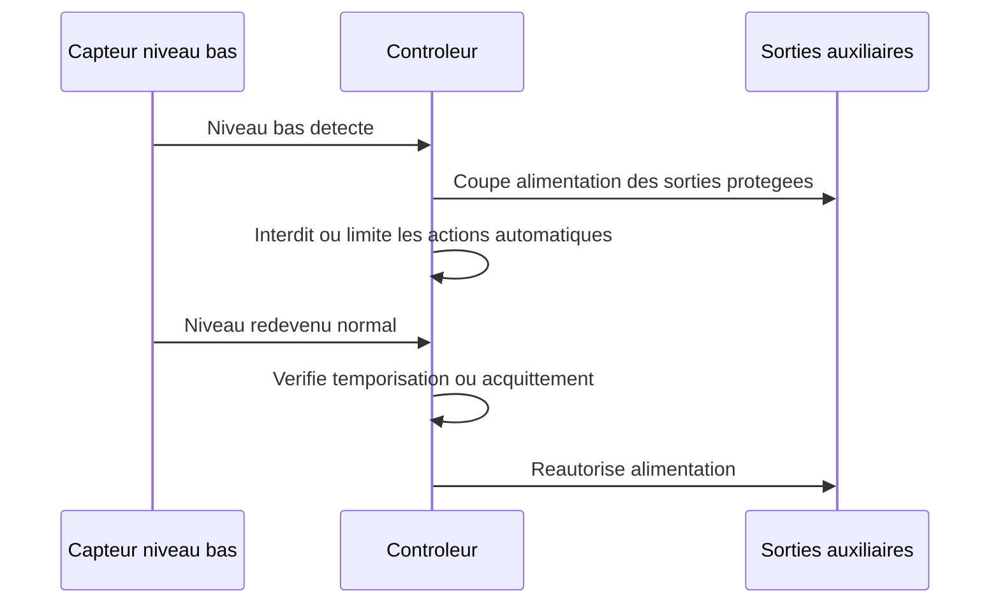

# Exigences fonctionnelles

## Tableau des exigences

| ID | Exigence | Priorite | Commentaire |
| --- | --- | --- | --- |
| F-001 | Le systeme doit detecter un besoin de lavage a partir du niveau d'eau cote propre du filtre a tambour. | Must | La logique de pilotage V1 repose sur deux niveaux cote eau propre : EP_LAVAGE et EP_CRITIQUE, mesures sur le report de niveau. |
| F-002 | Le systeme doit demarrer une pompe de rincage pendant le cycle de lavage. | Must | La sortie devra probablement piloter un relais ou contacteur. |
| F-003 | Le systeme doit commander la rotation du tambour pendant le cycle de lavage. | Must | La commande dependra du moteur retenu. |
| F-004 | Le systeme doit arreter automatiquement le cycle apres une duree configurable. | Must | Valeur initiale V1 : duree maximale 45 s, ajustable apres essais. |
| F-005 | Le systeme doit imposer un delai minimal entre deux cycles automatiques. | Must | Protection contre un capteur instable ou un filtre sature. |
| F-006 | Le systeme doit proposer un mode manuel. | Must | Le detail des commandes manuelles et des protections associees est precise par F-022 et F-023. |
| F-007 | Le systeme doit signaler les etats marche, cycle en cours et defaut. | Should | Voyants, ecran ou interface reseau selon architecture. |
| F-008 | Le systeme devrait journaliser les cycles et defauts au-dela du mini-journal persistant V1 obligatoire. | Could | Utile pour diagnostic avance mais non bloquant au prototype. Le socle persistant minimal de securite est defini par F-114 a F-116. |
| F-009 | Le systeme doit commander un seuil de niveau bas de securite distinct du seuil de lavage. | Must | Ce seuil protege l'installation en cas de manque d'eau. |
| F-010 | Le systeme doit couper la pompe principale de filtration lorsque le seuil bas est atteint. | Must | Le seuil bas V1 correspond a EP_CRITIQUE confirme. Evite de vider le bassin et protege la pompe contre la marche a sec. |
| F-011 | Le systeme doit couper la pompe decoration lorsque le seuil bas est atteint. | Must | La pompe decoration suit exactement la meme securite hydraulique que la filtration, car elle aspire au meme endroit. |
| F-012 | Le systeme doit couper l'UV lorsque le seuil bas est atteint. | Must | L'UV est autorise seulement si la filtration est autorisee et EP_CRITIQUE absent. |
| F-013 | Le systeme doit interdire toute rotation du tambour et toute activation de la pompe de rincage tant que le niveau bas persiste. | Must | La fonction de lavage du FAT doit etre completement inhibee en niveau bas. |
| F-014 | Le systeme doit couper la mise a niveau automatique du bassin lorsque le seuil bas est atteint. | Must | Sur EP_CRITIQUE, le systeme ne sait pas encore distinguer manque d'eau reel, obstruction, fuite, capteur ou anomalie hydraulique ; le remplissage automatique pourrait masquer ou aggraver le probleme. |
| F-015 | L'architecture doit laisser le bulleur de la cuve bio hors des sorties coupees par le controleur. | Must | Le bulleur sera branche directement sur le 220 V afin de preserver les bacteries de filtration biologique. |
| F-016 | L'architecture doit laisser le bulleur du bassin hors des sorties coupees par le controleur. | Must | Le bulleur sera branche directement sur le 220 V afin de maintenir l'oxygenation des poissons et de limiter la glace en hiver. |
| F-017 | Le systeme doit maintenir les sorties coupees ou inhibees tant que la condition de niveau bas persiste. | Must | Le redemarrage doit etre maitrise pour eviter les oscillations. |
| F-018 | Le systeme devrait permettre de configurer un delai ou une logique de rearmement apres retour a un niveau normal. | Should | Permet d'eviter une remise en service trop brusque apres incident. |
| F-019 | Le systeme doit proposer un mode auto normal comme mode principal d'exploitation. | Must | C'est le mode nominal apres mise en service et en exploitation courante. |
| F-020 | Le systeme doit permettre un arret total de l'automate pour maintenance ou consignation. | Must | Cet arret total doit etre explicite et distinct d'un simple defaut. |
| F-021 | En cas de coupure de courant puis de retour alimentation, le systeme doit redemarrer dans un etat operationnel et converger vers un mode exploitable sans rester bloque dans un etat d'attente indefini. | Must | Au boot, toutes les sorties doivent etre initialisees dans un etat sur, puis les securites doivent etre relues avant remise en service. Par defaut, la cible est le mode auto normal si aucune securite ne l'interdit. |
| F-022 | Le systeme doit proposer un mode manuel V1 limite au pilotage securise de la rotation du tambour, du rincage, du cycle test et du reset alarme. | Must | Les pompes filtration, decoration et UV ne sont pas pilotees comme commandes manuelles independantes en V1 ; elles restent soumises aux autorisations et securites globales. |
| F-023 | Le mode manuel doit conserver des securites minimales, notamment l'interdiction d'une marche a sec et les verrouillages critiques lies a l'ouverture du compartiment. | Must | Le mode manuel ne doit pas permettre de contourner une protection critique. |
| F-024 | Le systeme doit proposer un mode maintenance dans lequel les alarmes sont inhibees partiellement et le tambour ne peut pas demarrer automatiquement. | Must | Ce mode est destine aux interventions et au nettoyage. |
| F-025 | L'ouverture du capot ou du compartiment du FAT doit forcer ou proposer immediatement le passage en mode maintenance, interdire le lavage automatique, couper la rotation tambour et couper le rincage. | Must | Le capot concerne la zone FAT. L'UV est hors tambour et reste asservi a la filtration autorisee et a l'absence de EP_CRITIQUE. |
| F-026 | En mode maintenance, les pompes doivent pouvoir etre arretees proprement, la rotation doit etre coupee a l'ouverture du compartiment et une temporisation doit eviter un redemarrage brutal a la sortie du mode. | Must | La temporisation protege l'operateur et l'hydraulique. |
| F-027 | Le systeme doit proposer un mode degrade pour maintenir le bassin vivant lorsqu'un sous-ensemble non critique du FAT est indisponible. | Must | Le mode degrade doit etre signale et journalise. Le bypass est un mode de survie, pas un fonctionnement nominal long terme. |
| F-028 | Le mode degrade doit au minimum couvrir les cas suivants : lavage inefficace repete sans passage immediat en critique tant que le niveau critique n'est pas atteint, capteur de niveau principal indisponible avec bascule sur capteur de secours si disponible, lavages trop frequents avec alarme et maintien de service, commande UV incoherente avec coupure UV et alarme. | Should | Les reactions exactes dependront du cablage final et de la presence d'un bypass. |
| F-029 | Le systeme doit proposer un mode test distinct du mode manuel permettant de lancer un cycle complet de lavage borne avec verdict automatique. | Must | Ce mode est utile apres maintenance ou mise au point. Il valide la sequence tambour + rincage + securites, sans devenir un mode de decolmatage agressif. |
| F-030 | Le systeme doit mesurer une temperature representative de l'eau du bassin et rendre cette valeur disponible a l'automate. | Must | Mesure directe dans le bassin ou dans une zone tres representative proche du bassin ; eviter une mesure uniquement influencee par le local technique, la pompe, l'UV ou une zone stagnante. Technologie candidate V1 : sonde numerique etanche type DS18B20, sauf choix plus naturel impose par la plateforme retenue. |
| F-031 | Le systeme doit permettre de remonter au minimum des alertes de temperature eau basse, temperature eau haute et perte de mesure du capteur. | Must | Seuils initiaux configurables : eau basse < 4 deg C, eau haute > 28 deg C. La perte de sonde eau est informative en V1 et affiche A11. Ces alertes ne bloquent pas les fonctions. Le mode hiver automatique est reporte V1.1/V2. |
| F-032 | Le systeme doit mesurer la temperature ambiante du local technique et rendre cette valeur disponible a l'automate. | Must | La mesure doit representer l'air du local de filtration, pas seulement l'interieur du coffret. Technologie candidate V1 : sonde numerique simple, sauf choix plus naturel impose par la plateforme retenue. |
| F-033 | Le systeme doit permettre de remonter au minimum des alertes de temperature ambiante basse, temperature ambiante haute et perte de mesure du capteur. | Must | Seuils initiaux configurables : local bas < 2 deg C, local haut > 40 deg C. La perte de sonde local est informative en V1 et affiche A12. Ces alertes ne bloquent pas les fonctions. Les usages gel, surchauffe, condensation ou mode hiver sont reportes V1.1/V2. |
| F-034 | Le systeme doit disposer d'une IHM locale simple avec ecran texte ou petit afficheur et commandes physiques essentielles a proximite du coffret. | Must | Les voyants seuls ne sont pas retenus pour la V1, car les etats degrade, lavage inhibe, niveau critique et temperature doivent rester lisibles sans memoriser un code complexe. |
| F-035 | L'IHM locale doit permettre d'identifier au minimum les etats auto normal, manuel, maintenance, degrade, defaut, cycle en cours et alarme active. | Must | L'ecran local porte le detail ; un voyant alarme ou marche peut completer l'affichage si utile. |
| F-036 | Le systeme doit afficher localement les informations vitales de V1 : mode actuel, etat niveau, etat lavage, alarme active et temperature eau. | Must | Les autres informations peuvent etre accessibles par page, defilement ou ecran detail. |
| F-037 | Le systeme pourrait permettre une remontee a distance de l'etat general, des alarmes et des defauts. | Could | Fonction cible pour une V2 ; le MVP doit rester pleinement exploitable sans elle. |
| F-038 | Le systeme pourrait permettre d'emettre des notifications a distance lors d'evenements significatifs comme defaut critique, passage en degrade, niveau bas, alarme temperature ou reprise apres coupure. | Could | Fonction cible pour une V2 sur Wi-Fi. Les notifications doivent rester actionnables et anti-spam. |
| F-039 | Le mode auto doit declencher le lavage lorsque le niveau eau propre reste en condition de demande pendant un retard configurable. | Must | La demande de lavage doit etre robuste aux fluctuations de capteur. |
| F-040 | Une fois le lavage lance, le systeme doit maintenir rotation tambour et rincage au moins pendant une duree minimale configurable. | Must | Valeur initiale V1 : 10 s, pour eviter des cycles trop courts et inefficaces. |
| F-041 | A l'issue de la duree minimale, si le niveau est redevenu normal, le systeme doit arreter le rincage, terminer une rotation residuelle configurable puis appliquer une temporisation anti-redemarrage. | Must | Valeur initiale V1 : rotation residuelle 2 a 5 s, puis anti-redemarrage 30 a 120 s. |
| F-042 | Si le niveau n'est pas redevenu normal a l'issue de la duree minimale, le systeme doit poursuivre le lavage jusqu'a une duree maximale configurable. | Must | Protection contre les cycles interminables. |
| F-043 | Si la duree maximale est atteinte et que le niveau est toujours en demande, le systeme doit attendre une courte pause configurable avant de relancer une tentative, dans la limite d'un nombre maximum configurable. | Must | Valeur initiale V1 : pause 30 a 120 s configurable, maximum 3 tentatives. |
| F-044 | Si le nombre maximum de tentatives est atteint sans retour a un niveau normal, le systeme doit declarer un defaut lavage, inhiber le lavage automatique et maintenir une alarme jusqu'a acquittement. | Must | Valeur initiale V1 : 3 tentatives. Si EP_CRITIQUE n'est pas actif et qu'un bypass hydraulique permet de maintenir le passage vers la biofiltration, la pompe principale reste active pour preserver la filtration biologique. La coupure filtration reste reservee aux cas critiques comme EP_CRITIQUE actif ou incoherence capteurs. |
| F-045 | Le systeme doit surveiller et memoriser la frequence des lavages par heure et par jour afin de detecter un fonctionnement anormalement frequent. | Should | Reporte V1.1 avec les statistiques de lavage. |
| F-046 | Le systeme devrait executer un test journalier automatique du lavage avec diagnostic du resultat lorsque les conditions de securite et d'exploitation le permettent. | Should | Reporte V1.1. La V1 conserve seulement un TEST_LAVAGE manuel. Fenetre cible configurable, valeur par defaut 11h-15h, sans test de nuit. |
| F-047 | Le test journalier devrait verifier au minimum la mise en route du tambour, du rincage et le retour attendu des informations de niveau ou de diagnostic associees. | Should | Reporte V1.1 avec le test journalier automatique. Reussite si le cycle borne s'execute sans securite ; si EP_LAVAGE est actif au depart, reussite seulement si EP_LAVAGE revient normal. |
| F-048 | Le systeme devrait eviter qu'une meme portion du tambour reste immergee en permanence en prevoyant une indexation ou rotation periodique hors lavage. | Should | Reporte V1.1. Sans capteur position, indexation par courte rotation configurable apres certains lavages reussis ou periodiquement ; pas d'angle precis sans mesure de position. |
| F-049 | La strategie d'indexation du tambour devrait etre configurable et compatible avec les securites capot, maintenance, niveau bas et defauts critiques. | Should | Reporte V1.1. Capteur de position non retenu par defaut ; a ajouter seulement si l'indexation au temps pose probleme ou si une position reproductible devient necessaire. |
| F-050 | Le systeme devrait enregistrer des statistiques de lavage exploitables pour le diagnostic du filtre. | Should | Reporte V1.1. Les statistiques nominales n'incluent que les lavages automatiques reussis ; tests, echecs et interruptions sont comptes a part. |
| F-051 | Les statistiques de lavage devraient inclure au minimum le nombre de lavages par heure, le nombre de lavages par jour, la duree moyenne d'un lavage, la duree totale de lavage par jour, l'intervalle moyen entre lavages et l'intervalle minimum observe. | Should | Reporte V1.1. Restitution locale simple : compteurs jour, dernier lavage et nombre d'echecs. Historique detaille ou export reporte V2. |
| F-052 | Le systeme devrait permettre de suivre l'evolution de ces statistiques sur au moins 7 jours et 30 jours. | Should | Reporte V1.1 ou V2 selon la persistance retenue. |
| F-053 | Le systeme devrait calculer un indice simple d'encrassement du filtre a partir des statistiques de lavage. | Should | Reporte V1.1 ou V2. Indicateur experimental non decisionnel, utilise pour observer une tendance. |
| F-054 | L'indice d'encrassement devrait etre calcule au minimum comme : nombre de lavages par heure x duree moyenne de lavage. | Should | Reporte V1.1 ou V2. La formule doit rester stable dans le temps pour permettre les comparaisons. Pas de seuil fixe au depart ; alerte future sur derive relative apres observation. |
| F-055 | Le systeme devrait permettre d'estimer empiriquement la consommation d'eau liee au rincage du filtre. | Should | Reporte V1.1 ou V2. Estimation : debit mesure aux buses x duree de rincage cumulee. |
| F-056 | Les indicateurs de consommation d'eau devraient inclure au minimum les litres estimes par lavage, les litres estimes par jour, les litres estimes par semaine, les litres perdus vers l'evacuation et une estimation du remplissage necessaire. | Should | Reporte V1.1 ou V2. Les pertes et le besoin de remplissage restent indicatifs tant qu'il n'y a pas de compteur d'eau dedie. |
| F-057 | Le systeme devrait suivre les temps de fonctionnement cumules des principaux actionneurs. | Should | Reporte V1.1. Compteurs cumules simples ; remises a zero maintenance et seuils de rappel reportes V2. |
| F-058 | Les temps de fonctionnement devraient inclure au minimum les heures moteur tambour, les heures pompe rincage, les heures pompe decoration, les heures pompe principale et les heures UV. | Should | Reporte V1.1, sous forme de compteurs cumules par organe principal. |
| F-059 | Le systeme pourrait permettre d'emettre immediatement une notification a distance lors des evenements critiques retenus. | Could | Fonction cible pour une V2 en Wi-Fi. Liste V2 retenue : EP_CRITIQUE, capteurs incoherents, capot ouvert dangereux, A15, lavage inefficace, retour courant apres coupure et perte sonde temperature persistante. |
| F-060 | Le systeme pourrait emettre une synthese quotidienne de fonctionnement lorsque cette fonction est activee. | Could | Fonction cible pour une V2 Wi-Fi. Desactivee par defaut, configurable, avec horaire par defaut 18h00 si activee. |
| F-061 | La synthese quotidienne pourrait inclure au minimum un statut global du filtre, le nombre de lavages du jour, la duree moyenne, l'eau estimee ou mesuree consommee, le dernier defaut et la temperature d'eau. | Could | Fonction cible pour une V2 ; le contenu exact pourra evoluer selon le canal Wi-Fi retenu. |
| F-062 | La synthese quotidienne doit pouvoir etre activee ou desactivee independamment des notifications immediates si cette fonction distante est retenue. | Could | L'utilisateur doit pouvoir supprimer le resume journalier sans perdre les alertes critiques, qui restent envoyees immediatement selon leur propre politique anti-spam. |
| F-063 | Le systeme devrait permettre le pilotage automatique de la pompe decoration selon deux plages horaires maximum par jour. | Should | Reporte V1.1 ou V2. Les memes horaires s'appliquent tous les jours ; la programmation hebdomadaire est repoussee si un besoin reel apparait. |
| F-064 | Le fonctionnement programme de la pompe decoration doit pouvoir etre desactive par un simple interrupteur logiciel actif/inactif. | Must | Applicable seulement si le pilotage programme de la pompe decoration est retenu en V1.1 ou V2. Pas d'automatisme hiver au depart. |
| F-065 | La programmation et les commandes de la pompe decoration doivent rester soumises aux securites generales du systeme. | Must | Priorite : securites hydrauliques et defauts bloquants, commande manuelle locale, commande distante, puis programmation horaire. Aucune commande ne doit forcer la pompe decoration contre EP_CRITIQUE ou une securite superieure. |
| F-066 | Le systeme doit formuler ses alarmes et defauts a partir des consequences observables et des incoherences mesurables, sans affirmer une panne d'organe non instrumentee directement. | Must | Par exemple, preferer lavage inefficace a tambour bloque ou pompe HS si aucun retour d'etat direct n'existe. |
| F-067 | La nomenclature de reference cote eau propre doit distinguer au minimum un capteur EP_LAVAGE pour la demande de lavage et un capteur EP_CRITIQUE pour le danger pompe et l'arret de securite. | Must | Ces deux entrees constituent le coeur de la logique hydraulique observable en V1. |
| F-068 | Le systeme doit detecter comme defaut critique toute combinaison incoherente des capteurs eau propre, notamment EP_CRITIQUE actif alors que EP_LAVAGE n'est pas actif si l'ordre physique des capteurs l'interdit. | Must | Cette verification protege contre un capteur bloque ou un cablage incoherent. |
| F-069 | Au redemarrage, si EP_LAVAGE ou EP_CRITIQUE sont actifs, le systeme ne doit pas relancer directement les sorties sans verification de la situation hydraulique et sans appliquer la strategie de reprise retenue. | Must | EP_LAVAGE actif et EP_CRITIQUE inactif autorise une reprise degradee avec filtration et UV si la filtration est autorisee, puis lavage immediat. EP_CRITIQUE actif impose l'etat sur bloque. |
| F-070 | Le systeme devrait detecter une absence anormale de lavage lorsque la filtration est commandee mais qu'aucun lavage n'est observe pendant une duree inhabituelle au regard de la saison ou de l'historique. | Should | Reporte V1.1, apres observation du comportement normal du bassin. |
| F-071 | Le systeme doit couper l'UV et lever une alarme de commande incoherente si l'UV est commande alors que la filtration n'est pas autorisee ou qu'un niveau critique eau propre est present. | Must | En V1, l'UV est asservi a la commande de filtration autorisee et non a une mesure directe de debit. EP_LAVAGE seul ne coupe pas l'UV si la filtration reste autorisee et que le bypass hydraulique maintient le passage d'eau. |
| F-072 | Le systeme devrait surveiller un temps anormal de commande continue des sorties principales et alerter l'utilisateur en cas d'incoherence durable. | Should | Reporte V1.1 sauf verrouillage directement necessaire a une securite V1. |
| F-073 | Le systeme devrait surveiller la frequence des redemarrages de l'automate et signaler des coupures secteur anormalement repetitives. | Should | Reporte V1.1. |
| F-074 | Les statistiques internes devraient inclure au minimum le temps de retour de EP_LAVAGE a l'etat normal, le nombre de tentatives par lavage, le nombre d'activations de EP_CRITIQUE, les temperatures min/max/moyenne, le nombre d'ouvertures capot et la duree capot ouvert. | Should | Reporte V1.1 avec les statistiques avancees. |
| F-075 | Le systeme doit bloquer le retour automatique au nominal pour les alarmes V1 suivantes : EP_CRITIQUE, capteurs niveau incoherents, capot ouvert pendant action dangereuse et defaut lavage maintenu apres tentatives max. | Must | Les alertes temperature ou lavages frequents peuvent informer sans bloquer si aucune securite critique n'est presente. |
| F-076 | Le systeme doit refuser l'acquittement d'une alarme si sa cause est toujours active et afficher clairement la cause du refus. | Must | Exemple attendu : reset refuse tant que EP_CRITIQUE reste actif. Le reset ne doit pas simplement masquer une condition dangereuse. |
| F-077 | Le capot ouvert doit avoir priorite sur le selecteur AUTO / MAINTENANCE et forcer l'etat maintenance ou securite meme si le selecteur est sur AUTO. | Must | Le capot represente une condition terrain plus forte que l'intention operateur. |
| F-078 | Les commandes manuelles V1 MANU_TAMBOUR et MANU_RINCAGE doivent etre de type maintenu appuye : le relachement du bouton coupe la commande associee. | Must | Evite les oublis et les mouvements inattendus pendant une intervention. |
| F-079 | Le bouton TEST_LAVAGE doit lancer un cycle complet autonome apres appui bref en AUTO ou MAINTENANCE si les preconditions sont OK, avec arret immediat si capot ouvert, EP_CRITIQUE ou defaut critique apparait. | Must | Le test doit valider une sequence reelle tout en restant soumis aux securites prioritaires. Le mode MAINTENANCE n'est pas une cause de refus si les securites sont OK. |
| F-080 | Le signal EP_LAVAGE doit etre filtre par une temporisation configurable avant de lancer un lavage automatique. | Must | Plage initiale cible : 5 a 15 s, afin d'eviter les cycles dus aux vagues, remous ou variations passageres. |
| F-081 | Le signal EP_CRITIQUE doit etre confirme par une temporisation anti-rebond tres courte avant de declencher la mise en securite. | Must | Plage initiale cible : 0,5 a 2 s. Le seuil critique ne doit pas etre retarde par une temporisation longue. |
| F-082 | Apres activation de EP_CRITIQUE, le redemarrage automatique doit etre bloque jusqu'au retour stable du niveau normal puis acquittement local valide. | Must | L'acquittement distant est reserve a une V2. EP_LAVAGE seul n'exige pas d'acquittement si le lavage reussit ; seule la temporisation anti-redemarrage s'applique. |
| F-083 | Apres retour normal et acquittement suite a EP_CRITIQUE, le systeme doit relancer la filtration avant de reautoriser l'UV apres une courte temporisation de stabilisation. | Must | Evite d'allumer l'UV pendant une transition hydraulique incertaine. La duree exacte est un parametre a calibrer. |
| F-084 | Le systeme doit traiter EP_CRITIQUE actif alors que EP_LAVAGE est inactif comme une incoherence critique des capteurs niveau. | Must | Si l'ordre physique des capteurs rend cette combinaison impossible, le systeme doit couper filtration, decoration, UV, mise a niveau, tambour et rincage, puis attendre retour coherent et acquittement. |
| F-085 | En cas de defaut lavage maintenu apres tentatives max avec EP_LAVAGE toujours actif et EP_CRITIQUE inactif, l'acquittement doit etre refuse tant que EP_LAVAGE reste actif. | Must | Filtration et UV peuvent rester maintenus via bypass, mais le reset ne doit pas masquer une toile encore colmatee ou un niveau non revenu. |
| F-086 | Le systeme doit appliquer une strategie prudente en cas de capteur niveau absent ou non fiable. | Must | Si la confiance dans EP_CRITIQUE est perdue, le defaut est bloquant hydraulique. Si le doute concerne seulement EP_LAVAGE et que EP_CRITIQUE est sain, les lavages automatiques sont inhibes mais la filtration peut etre maintenue. |
| F-087 | Si EP_LAVAGE redevient actif pendant la temporisation anti-redemarrage, le systeme doit attendre la fin de cette temporisation puis relire EP_LAVAGE avec son retard configure avant de lancer un nouveau lavage. | Must | Evite une boucle immediate tout en traitant un vrai colmatage persistant apres stabilisation. |
| F-088 | L'IHM locale doit appliquer une priorite d'affichage des alarmes V1. | Must | Priorite : EP_CRITIQUE ou incoherence capteurs, capot ouvert pendant action dangereuse, defaut lavage maintenu, capot ouvert trop longtemps A15, alertes temperature, puis infos de fonctionnement. Une alarme plus prioritaire masque A15 a l'ecran sans l'effacer tant que le capot reste ouvert trop longtemps. |
| F-089 | En cas de reset refuse, l'IHM locale doit afficher une cause courte et explicite. | Must | Exemples attendus : RESET REFUSE - EP_CRITIQUE ACTIF, RESET REFUSE - EP_LAVAGE ACTIF, RESET REFUSE - CAPTEURS INCOHERENTS. |
| F-090 | L'IHM ne doit pas presenter le bypass passif comme un etat mesure en V1. | Must | En defaut lavage sans EP_CRITIQUE, afficher une formulation prudente du type MODE DEGRADE - BYPASS SUPPOSE, car le bypass n'est pas instrumente. |
| F-091 | Les alarmes et defauts V1 affiches localement doivent utiliser un format code court plus message texte. | Must | Format cible : `Axx - MESSAGE COURT`, par exemple `A01 - NIVEAU CRITIQUE`. Le code aide au diagnostic et le texte aide l'utilisateur. |
| F-092 | L'IHM locale V1 doit prevoir au minimum deux voyants physiques complementaires : marche et alarme. | Must | L'ecran porte le detail, mais un voyant marche vert et un voyant alarme rouge donnent un diagnostic immediat. Un voyant lavage jaune ou ambre reste optionnel Should. |
| F-093 | Le bouton TEST_LAVAGE doit lancer un seul cycle complet borne, meme si EP_LAVAGE est actif au debut du test. | Must | Le test ne doit pas appliquer les relances multiples du lavage automatique et ne doit pas servir de mode de decolmatage agressif. |
| F-094 | Si TEST_LAVAGE est lance alors que EP_LAVAGE est inactif, le verdict doit confirmer l'execution de la sequence sans pretendre prouver l'efficacite hydraulique. | Must | Verdict cible : `TEST OK - CYCLE EXECUTE` si aucune securite critique n'apparait. |
| F-095 | Si TEST_LAVAGE est lance alors que EP_LAVAGE est actif, le verdict doit dependre du retour de EP_LAVAGE apres le cycle borne. | Must | Verdict cible : `TEST OK - NIVEAU OK` si EP_LAVAGE redevient normal ; `TEST ECHEC - EP_LAVAGE ACTIF` ou `TEST ECHEC - LAVAGE INEFFICACE` sinon. Le test seul ne declare pas un defaut lavage maintenu, sauf securite critique declenchee. |
| F-096 | TEST_LAVAGE doit etre autorise en AUTO et en MAINTENANCE si le capot est ferme, EP_CRITIQUE absent, les capteurs de niveau coherents et aucun defaut critique bloquant actif. | Must | Le test reste un cycle autonome local, utilisable apres intervention sans devoir repasser en AUTO. |
| F-097 | Une demande TEST_LAVAGE avec capot ouvert doit etre refusee immediatement avec un message explicite. | Must | Message cible : `A13 - TEST REFUSE CAPOT`. Aucune rotation tambour ni rincage ne doit demarrer. |
| F-098 | Une demande TEST_LAVAGE avec EP_CRITIQUE actif, capteurs de niveau incoherents ou defaut critique bloquant doit etre refusee immediatement avec un message explicite. | Must | Message cible : `A14 - TEST REFUSE SECURITE`. |
| F-099 | Les commandes manuelles MANU_TAMBOUR et MANU_RINCAGE doivent etre refusees si le capot FAT est ouvert. | Must | Refus sans mouvement ni rincage, avec message local simple du type `COMMANDE REFUSEE - CAPOT`. |
| F-100 | Une commande manuelle refusee avant activation d'une sortie ne doit pas creer d'alarme bloquante a acquitter. | Must | L'alarme bloquante reste reservee au cas ou le capot s'ouvre pendant une action dangereuse deja en cours. |
| F-101 | Le capot FAT V1 doit etre un capot transparent permettant de voir le tambour tourner sans ouvrir le FAT. | Must | Le capot et le couvercle transparent designent la meme piece physique, pas deux organes separes. |
| F-102 | Le contact CAPOT_OUVERT doit etre cable en normalement ferme, ferme lorsque le capot est ferme. | Must | Une coupure de fil, un connecteur debranche ou une perte de contact doit etre interprete comme capot ouvert. |
| F-103 | Le signal CAPOT_OUVERT doit utiliser un anti-rebond court a l'ouverture et une validation plus lente a la fermeture avant reautorisation. | Must | Cibles V1 : ouverture confirmee en 100 a 500 ms ; fermeture stable 1 a 2 s avant reprise ou autorisation. |
| F-104 | Le systeme doit signaler localement un capot reste ouvert trop longtemps. | Must | Alerte V1 `A15 - CAPOT OUVERT LONG`, declenchee apres temporisation configurable. Valeur initiale : 10 minutes. Cette alerte rappelle que le lavage tambour est indisponible tant que le capot reste ouvert. |
| F-105 | Tant que le capot est ouvert hors action dangereuse, l'IHM doit afficher un etat informatif permanent `MAINTENANCE - CAPOT OUVERT`. | Must | Cet etat ne demande pas d'acquittement. Il distingue une intervention normale d'une alarme capot dangereux. |
| F-106 | Apres fermeture stable du capot, le systeme doit revenir automatiquement au mode demande par le selecteur si aucune alarme bloquante capot dangereux n'a ete creee. | Must | Si une alarme capot dangereux a ete creee, la reprise exige fermeture stable puis acquittement valide. |
| F-107 | Lorsque `A15 - CAPOT OUVERT LONG` est actif, le voyant rouge VOYANT_ALARME doit etre allume fixe. | Must | L'ecran porte le detail, mais le voyant rouge rend l'oubli visible localement sans regarder l'ecran. |
| F-108 | `A15 - CAPOT OUVERT LONG` doit disparaitre automatiquement apres fermeture stable du capot. | Must | Aucun acquittement n'est requis pour A15. L'acquittement reste reserve a l'ouverture capot pendant action dangereuse. |
| F-109 | Le systeme doit conserver une trace minimale persistante et non bloquante de `A15 - CAPOT OUVERT LONG`. | Must | La trace est ecrite quand l'evenement A15 survient et doit rester presente apres coupure d'alimentation. Trace V1 minimale : compteur persistant plus dernier evenement si simple a implementer ; si une horloge fiable existe facilement, le dernier evenement est horodate. Un historique long n'est pas requis en V1. Cette trace aide a comprendre une periode sans lavage, sans bloquer le fonctionnement. |
| F-110 | Le voyant rouge VOYANT_ALARME ne doit pas clignoter pour `A15 - CAPOT OUVERT LONG` en V1. | Must | Le clignotement est reserve a une evolution eventuelle V1.1 si une hierarchie visuelle plus fine devient necessaire. |
| F-111 | Apres disparition de `A15 - CAPOT OUVERT LONG`, le voyant rouge ne doit pas rester allume artificiellement pour memoriser l'alerte. | Must | Le voyant rouge suit les alarmes actives. La memorisation est portee par la trace minimale A15. |
| F-112 | Le choix de plateforme V1 doit permettre une heure fiable en V2 sans remplacement de la plateforme principale. | Must | L'horodatage fiable n'est pas obligatoire dans le MVP, mais la plateforme retenue doit permettre l'ajout ou l'usage d'une horloge fiable : RTC, temps local conserve, module temps, synchronisation reseau ou equivalent. La solution V2 ne doit pas dependre exclusivement d'Internet. |
| F-113 | Apres coupure d'alimentation, si la condition capot ouvert trop longtemps est toujours presente ou etait deja active avant coupure et que le capot est encore ouvert au redemarrage, le systeme doit redetecter et reafficher `A15 - CAPOT OUVERT LONG`. | Must | Le log persistant prouve l'evenement deja survenu ; l'etat courant est recalcule au redemarrage a partir du capot et de l'etat A15 non resolu. Si A15 n'etait pas encore actif avant coupure, la temporisation repart au redemarrage tant que le capot reste ouvert. |
| F-114 | Le mini-journal persistant V1 doit conserver les evenements de diagnostic indispensables. | Must | Evenements minimum : `A15 - CAPOT OUVERT LONG`, activation `EP_CRITIQUE`, `A03 - CAPOT OUVERT DANGER`, `A04 - LAVAGE INEFFICACE` et redemarrage apres coupure. Les alertes temperature ne sont pas persistantes en MVP. |
| F-115 | Le mini-journal persistant V1 doit rester volontairement court. | Must | Format minimal : compteurs persistants par code d'evenement plus dernier evenement global. Une memoire circulaire de 8 ou 16 evenements est acceptable seulement si la plateforme le rend simple. Un historique long est hors MVP. |
| F-116 | Les acquittements reussis des alarmes bloquantes doivent etre traces dans le mini-journal persistant V1. | Must | Les refus repetitifs d'acquittement ne sont pas journalises un par un en V1 ; le dernier refus reste affiche localement avec sa cause. |
| F-117 | L'UV doit etre implante hors tambour, apres la pompe principale sur la ligne de filtration. | Must | Il reste asservi a la filtration autorisee et a l'absence de EP_CRITIQUE. Un defaut FAT non critique ne coupe pas l'UV si la filtration reste autorisee. |
| F-118 | La cote finale du support FAT doit etre definie par mesure terrain avant fabrication. | Must | La cote ne doit pas etre inventee en specification. La mesure doit aligner le trop-plein physique du FAT avec le niveau hydraulique cible du bassin afin d'eviter un mauvais regime gravitaire. |
| F-119 | La geometrie des ouvertures du tambour doit etre validee par calcul avant decoupe ou percage. | Must | Objectif V1 : obtenir environ 0,20 a 0,23 m2 de surface filtrante utile sous toile inox 74 microns. Le dessin final des ouvertures est une etape mecanique dediee. |
| F-120 | Les auto-diagnostics indirects obligatoires V1 doivent etre limites aux conditions observables et securites retenues. | Must | Minimum V1 : EP_CRITIQUE, incoherence EP_CRITIQUE actif avec EP_LAVAGE inactif, lavage inefficace apres 3 tentatives, capot ouvert dangereux, capot ouvert trop longtemps A15, commande UV incoherente, perte sonde temperature eau/local. |
| F-121 | Le debit de rincage de reference V1 doit etre mesure aux buses apres montage reel. | Must | La courbe pompe peut servir d'estimation provisoire, mais la valeur de reference pour calculs ou estimations doit venir du montage reel : pompe, rampe, buses et pertes de charge. |
| F-122 | La V1 ne doit pas ajouter de pressostat, debitmetre ou retour courant pour confirmer le rincage. | Must | Le diagnostic reste indirect : en cas de non-retour de EP_LAVAGE apres lavage, afficher `A04 - LAVAGE INEFFICACE`. Les capteurs dedies de rincage sont reportes V1.1/V2 si les essais montrent trop d'ambiguite. |
| F-123 | La V1 ne doit pas ajouter de capteurs dedies de diagnostic direct pour rotation tambour, courant mesure, fuite local ou niveau eau sale. | Must | Les protections materielles necessaires restent obligatoires. Un simple retour defaut fourni nativement par un module de protection peut etre exploite sans transformer la V1 en diagnostic direct detaille. |
| F-124 | Les fonctions de parking du moteur d'essuie-glace ne doivent pas etre utilisees comme fonction logicielle V1. | Must | Sauf contrainte de brochage simple, elles sont isolees ou ignorees proprement. Leur usage pour positionnement ou indexation tambour est reporte V1.1. |
| F-125 | Le mode hiver automatique est hors V1. | Must | La V1 affiche seulement les alertes temperature eau/local et pertes de sondes. Les adaptations automatiques de circulation, temporisations, protection antigel ou priorite aeration sont reportees V1.1/V2 apres observation reelle. |
| F-126 | Le choix materiel MVP doit rester compatible avec une connectivite Wi-Fi V2 sans remplacement de la plateforme principale. | Must | La connectivite active reste hors MVP, mais le materiel retenu doit permettre Wi-Fi natif ou ajout d'un module Wi-Fi integre proprement. Ethernet n'est pas requis, BLE seul est insuffisant et SMS n'est pas retenu par defaut. |
| F-127 | Les notifications V2 doivent appliquer une politique anti-spam. | Should | Envoi a l'apparition, rappel periodique rare si l'etat reste actif, et notification de retour a la normale pour les alarmes importantes. |
| F-128 | La V2 distante doit permettre une consultation d'etat simple en plus des notifications. | Should | Minimum : etat courant, derniere alarme, dernier lavage, temperature eau/local et dernier redemarrage. L'historique detaille est reporte V2.1. |
| F-129 | Le test journalier automatique V1.1 doit etre lance dans une fenetre configurable et reportable. | Should | Fenetre par defaut 11h-15h. Report automatique si securite active, capot ouvert, EP_CRITIQUE, lavage deja en cours ou alarme bloquante. |
| F-130 | Le test journalier automatique V1.1 doit produire un verdict explicite. | Should | `TEST JOURNALIER OK` si le cycle borne s'execute sans securite ; si EP_LAVAGE est actif au depart, OK seulement si EP_LAVAGE revient normal. Echec sur securite, timeout, capot ouvert, EP_CRITIQUE ou EP_LAVAGE toujours actif. |
| F-131 | Les statistiques de lavage V1.1 doivent separer lavages nominaux, tests, echecs et interruptions. | Should | Les moyennes nominales ne doivent pas etre polluees par les tests journaliers, les tentatives echouees ou les interruptions. |
| F-132 | La restitution V1.1 des statistiques doit rester locale et simple. | Should | Afficher au minimum compteurs jour, dernier lavage et nombre d'echecs. Historique detaille et export sont reportes V2. |
| F-133 | L'indice d'encrassement V1.1 doit rester un indicateur d'observation. | Should | Il ne declenche aucune action automatique. Les alertes futures reposent sur une derive relative apres observation, par exemple doublement par rapport a la mediane recente ou hausse continue sur plusieurs jours. |
| F-134 | Les compteurs horaires V1.1 doivent rester simples. | Should | Compteur cumule par organe principal. Les remises a zero maintenance et seuils de rappel sont reportes V2. |
| F-135 | La synthese quotidienne V2 doit etre desactivee par defaut et configurable. | Should | Si elle est activee, l'horaire par defaut est 18h00, le canal est le meme que les notifications Wi-Fi V2, et les notifications immediates restent independantes. |
| F-136 | L'IHM distante ne doit pas afficher "bassin niveau bas" sans capteur bassin distinct. | Must | En V1/V2, EP_CRITIQUE correspond a un niveau FAT critique cote eau propre ; le libelle distant attendu est `NIVEAU FAT CRITIQUE`. |
| F-137 | La programmation pompe decoration V1.1/V2 doit rester limitee a deux plages horaires maximum par jour. | Should | Les memes plages s'appliquent tous les jours ; la programmation hebdomadaire est reportee tant qu'aucun besoin concret n'est demontre. |
| F-138 | La pompe decoration programmee doit disposer d'un interrupteur logiciel actif/inactif. | Should | Cet interrupteur couvre les longues periodes d'arret, y compris l'hiver, sans automatisme saisonnier au depart. |
| F-139 | Les commandes pompe decoration doivent respecter un ordre de priorite unique. | Must | Ordre retenu : securites hydrauliques et defauts bloquants, commande manuelle locale, commande distante, puis programmation horaire. |

## Reperes de niveau a definir

Les quatre reperes suivants doivent etre definis explicitement pour finaliser la logique hydraulique et de pilotage :

| Repere | Zone de mesure | Role attendu |
| --- | --- | --- |
| Niveau normal cote sale | Compartiment eau sale | Reference hydraulique nominale en fonctionnement normal |
| Niveau normal cote propre | Compartiment eau propre ou report de niveau | Reference hydraulique nominale en fonctionnement normal |
| Niveau de declenchement du lavage | Cote propre sur le report de niveau | Seuil de lancement d'un cycle de lavage |
| Niveau bas de securite | Cote propre ou report de niveau | Seuil de mise en securite de l'installation |

La logique de lavage V1 ne repose pas sur une comparaison eau sale / eau propre. Elle utilise une cote simple cote eau propre avec deux niveaux fonctionnels : EP_LAVAGE pour lancer ou verifier un lavage, et EP_CRITIQUE pour la mise en securite hydraulique.

Ces reperes doivent ensuite etre traduits en cotes physiques, en nombre de capteurs et en logique logicielle.

## Capteurs eau propre de reference

Dans l'hypothese actuelle, les deux capteurs cote eau propre sont nommes comme suit :

| Capteur | Role |
| --- | --- |
| EP_LAVAGE | Niveau eau propre abaisse, demande de lavage |
| EP_CRITIQUE | Niveau eau propre tres bas, danger pompe et arret de securite |

Ces deux entrees constituent le coeur de la logique observable du FAT en V1.

La V1 retient deux capteurs de niveau seulement. Le support mecanique doit si possible laisser une reserve pour ajouter un troisieme capteur plus tard si les essais montrent un besoin de redondance, d'hysteresis physique ou de diagnostic supplementaire.

## Principe de diagnostic et de formulation des alarmes

En l'absence de retour direct de rotation, de mesure de courant, de pressostat de rincage, de detection de fuite local, de niveau haut cote eau sale ou de retour marche reel des charges, l'automate ne doit pas pretendre diagnostiquer directement certaines pannes.

La philosophie retenue est donc :

- diagnostiquer d'abord les consequences hydrauliques observables cote eau propre ;
- nommer les alarmes par leur effet constate et non par une cause supposee ;
- guider l'utilisateur vers une liste de verifications probables plutot que vers une conclusion trop affirmative.

Exemples de formulations a privilegier :

- niveau eau propre anormal ;
- lavage inefficace ;
- risque pompe a sec ;
- cycle de lavage incoherent ;
- temperature anormale ;
- capot ouvert ;
- commande incoherente.

Exemples de formulations a eviter en V1 sans capteur supplementaire :

- tambour bloque ;
- pompe de rincage HS ;
- pompe filtration HS ;
- UV sans debit reel ;
- fuite local filtration ;
- niveau haut eau sale.

Les auto-diagnostics indirects obligatoires en V1 sont volontairement bornes :

- EP_CRITIQUE confirme ;
- incoherence EP_CRITIQUE actif avec EP_LAVAGE inactif ;
- lavage inefficace apres 3 tentatives ;
- capot ouvert pendant une action dangereuse ;
- capot ouvert trop longtemps `A15` ;
- commande UV incoherente avec la filtration autorisee ou EP_CRITIQUE ;
- perte de sonde temperature eau ou local.

Les diagnostics suivants sont reportes V1.1 ou V2 : absence anormale de lavage, lavage trop frequent, moteur tambour bloque, pompe de rincage HS et pression de rincage absente.

La V1 reste aussi en diagnostic indirect pour rotation tambour, courant mesure, fuite local et niveau eau sale. Les protections materielles obligatoires, comme la protection surintensite ou blocage moteur, restent hors de cette exclusion. Si un module de protection retenu fournit naturellement un contact defaut simple, il peut etre exploite comme information complementaire sans ajouter de capteur dedie.

## Taxonomie minimale des messages V1

Les messages V1 affiches localement doivent combiner un code court et un texte lisible. Les libelles sont volontairement bases sur l'effet observe et non sur une panne supposee.

| Code | Message V1 | Condition principale | Priorite affichage |
| --- | --- | --- | --- |
| A01 | NIVEAU CRITIQUE | EP_CRITIQUE confirme | 1 |
| A02 | CAPTEURS NIVEAU INCOHERENTS | Combinaison impossible EP_LAVAGE / EP_CRITIQUE | 1 |
| A03 | CAPOT OUVERT DANGER | Capot ouvert pendant action dangereuse ou demande d'action dangereuse | 2 |
| A04 | LAVAGE INEFFICACE | EP_LAVAGE persistant apres tentatives max sans EP_CRITIQUE | 3 |
| A05 | RESET REFUSE | Acquittement demande alors que la cause reste active | Selon cause |
| A06 | TEMP EAU BASSE | Temperature eau sous seuil informatif | 4 |
| A07 | TEMP EAU HAUTE | Temperature eau au-dessus seuil informatif | 4 |
| A08 | TEMP LOCAL BASSE | Temperature local sous seuil informatif | 4 |
| A09 | TEMP LOCAL HAUTE | Temperature local au-dessus seuil informatif | 4 |
| A10 | MODE DEGRADE - BYPASS SUPPOSE | Lavage inefficace sans EP_CRITIQUE avec filtration maintenue | 3 |
| A11 | SONDE EAU ABSENTE | Perte de mesure temperature eau | 4 |
| A12 | SONDE LOCAL ABSENTE | Perte de mesure temperature local | 4 |
| A13 | TEST REFUSE CAPOT | TEST_LAVAGE demande avec capot ouvert | 2 |
| A14 | TEST REFUSE SECURITE | TEST_LAVAGE demande avec EP_CRITIQUE, capteurs incoherents ou defaut critique | 1 |
| A15 | CAPOT OUVERT LONG | Capot reste ouvert au-dela de la temporisation configuree, valeur initiale 10 min | 3 |

Les variantes de reset refuse doivent afficher une cause courte quand l'ecran le permet, par exemple `A05 - RESET REFUSE EP_CRITIQUE`, `A05 - RESET REFUSE EP_LAVAGE` ou `A05 - RESET REFUSE CAPTEURS`.

## Modes de fonctionnement

| Mode | Usage | Comportement attendu |
| --- | --- | --- |
| Auto normal | Exploitation courante | Surveillance niveaux, lavage automatique, gestion des alarmes et temporisations |
| Manuel | Tests ponctuels et depannage | Pilotage independant des sorties avec securites minimales maintenues |
| Maintenance | Intervention humaine sur le FAT | Pas de demarrage automatique du tambour, rincage et rotation inhibes sauf commande maintenue autorisee, UV maintenu si filtration autorisee |
| Degrade | Maintien de vie du bassin malgre un sous-ensemble HS | Fonctionnement restreint mais stable avec alarme active |
| Test | Verification apres intervention | Cycle complet automatise avec verdict valide ou defaut |
| Arret total | Consignation ou maintenance lourde | Sorties arretees selon procedure maitrisee |

L'arret total est une fonction d'exploitation explicite, mais il peut etre realise hors de la machine a etats logicielle par une procedure de consignation ou de coupure electrique maitrisee.

## Mesure de temperature bassin

La fonction temperature doit au minimum couvrir :

- acquisition reguliere de la temperature d'eau du bassin ;
- disponibilite de la valeur pour diagnostic local et alertes ;
- detection d'une perte de mesure ou d'une valeur incoherente ;
- possibilite d'utiliser plus tard cette mesure dans un mode hiver ou une supervision.

En V1, la temperature eau est une alerte informative. Elle ne bloque pas le lavage, la filtration, l'UV ou les sorties auxiliaires. Les seuils initiaux configurables sont : eau basse < 4 deg C et eau haute > 28 deg C. Une perte de mesure est affichee separement via `A11 - SONDE EAU ABSENTE`.

## Mesure de temperature ambiante local

La fonction temperature ambiante doit au minimum couvrir :

- acquisition reguliere de la temperature du local technique ou du volume representatif autour de l'automate ;
- disponibilite de la valeur pour diagnostic local et alertes ;
- detection d'une perte de mesure ou d'une valeur incoherente ;
- possibilite d'utiliser plus tard cette mesure pour surveiller le risque de gel, de surchauffe ou de condensation.

En V1, la temperature ambiante est une alerte informative. Elle ne declenche pas automatiquement de mode hiver ni de coupure d'equipement. Les seuils initiaux configurables sont : local bas < 2 deg C et local haut > 40 deg C. Une perte de mesure est affichee separement via `A12 - SONDE LOCAL ABSENTE`.

## IHM locale et signalisation

L'IHM locale doit au minimum couvrir :

- remontee visuelle claire de l'etat global du systeme ;
- distinction des modes principaux et des etats d'alarme ;
- identification locale d'un cycle de lavage en cours ;
- affichage simple du mode actuel, de l'etat niveau, de l'etat lavage, de l'alarme active et de la temperature eau ;
- bouton physique dedie au reset alarme, accepte seulement si les conditions de retour au service sont satisfaites ;
- possibilite de definir un code couleur et un nombre de voyants coherents ;
- ecran texte ou petit afficheur retenu en V1 pour eviter une interpretation uniquement par codes lumineux.

Les voyants physiques V1 complementaires a l'ecran sont :

- `MARCHE`, obligatoire, vert : controleur alimente / systeme operationnel ou auto OK selon cablage retenu ;
- `ALARME`, obligatoire, rouge : alarme active ou defaut ;
- `LAVAGE`, optionnel, jaune ou ambre : cycle lavage, degrade ou maintenance si le cablage reste simple.

Le code couleur recommande est vert pour marche / auto OK, rouge pour alarme ou defaut, jaune ou ambre pour lavage, degrade ou maintenance si un voyant additionnel est retenu. `A15 - CAPOT OUVERT LONG` allume le voyant rouge `VOYANT_ALARME` fixe, sans clignotement en V1. A la fermeture stable du capot, `A15` disparait et le voyant rouge suit immediatement l'etat des alarmes actives restantes.

Si plusieurs alarmes ou informations se concurrencent sur l'ecran, la priorite d'affichage V1 est :

1. EP_CRITIQUE ou capteurs niveau incoherents ;
2. capot ouvert pendant action dangereuse ;
3. defaut lavage maintenu ;
4. capot ouvert trop longtemps (`A15`) ;
5. alertes temperature ;
6. infos de fonctionnement.

Un reset refuse doit afficher une cause courte et explicite, par exemple `RESET REFUSE - EP_CRITIQUE ACTIF`, `RESET REFUSE - EP_LAVAGE ACTIF` ou `RESET REFUSE - CAPTEURS INCOHERENTS`.

Le bypass passif n'etant pas instrumente en V1, l'IHM ne doit pas afficher `BYPASS ACTIF` comme une mesure. En cas de lavage inefficace sans EP_CRITIQUE avec maintien filtration, la formulation cible est `MODE DEGRADE - BYPASS SUPPOSE`.

## Contenu utile de l'interface locale

Meme si l'IHM reste simple, les informations suivantes sont considerees comme particulierement utiles a afficher localement :

- mode actuel ;
- etat lavage, repos ou defaut ;
- niveau eau propre : OK, bas ou critique ;
- heure du dernier lavage ;
- nombre de lavages aujourd'hui ;
- defaut actif ;
- temperature eau ;
- temperature local ;
- etat pompe principale ;
- etat pompe decoration ;
- etat UV.

Si l'IHM retenue ne permet pas d'afficher tout cela en meme temps, elle doit au minimum donner acces a ces informations par pages, defilement ou codes clairement documentes.

## Remontee d'etat a distance

La fonction de notification a distance est hors MVP et doit etre etudiee pour une V2 afin de couvrir :

- consultation ou reception de l'etat global du systeme ;
- remontee des alarmes et defauts importants ;
- canal cible adapte au site : Wi-Fi ;
- maitrise des notifications repetitives pour eviter le spam d'alarmes ;
- comportement degrade acceptable en cas de perte de connectivite.

Le materiel MVP doit etre choisi pour permettre cette V2 Wi-Fi sans remplacer la plateforme principale. Ethernet n'est pas requis sur le site, BLE seul n'a pas la portee necessaire et SMS n'est pas retenu par defaut a cause du cout.

### Notifications immediates candidates pour une V2

Une premiere liste simple et utile de notifications immediates comprend :

- `EP_CRITIQUE` ;
- capteurs niveau incoherents ;
- capot ouvert en situation dangereuse ;
- capot ouvert trop longtemps (`A15`) ;
- lavage inefficace ;
- retour courant apres coupure ;
- perte sonde temperature persistante.

La politique anti-spam V2 cible un envoi a l'apparition, un rappel periodique rare si l'etat reste actif, et un retour a la normale pour les alarmes importantes.

La consultation d'etat distante V2 doit rester simple : etat courant, derniere alarme, dernier lavage, temperature eau/local et dernier redemarrage. L'historique detaille est reporte V2.1.

### Synthese quotidienne candidate pour une V2

La supervision distante peut aussi envoyer une synthese quotidienne lorsque cette fonction est activee. Cette fonction V2 est desactivee par defaut. Si elle est activee, l'horaire par defaut est 18h00 et le canal est le meme que celui des notifications Wi-Fi V2.

Exemple de contenu utile :

- statut global : filtre OK ou etat en defaut ;
- nombre de lavages aujourd'hui ;
- duree moyenne d'un lavage ;
- eau estimee ou mesuree consommee ;
- dernier defaut ;
- temperature eau.

Cette synthese doit pouvoir etre desactivee sans desactiver les notifications immediates. Les alertes critiques conservent donc leur envoi immediat, leur anti-spam et leur retour a la normale, meme si le resume journalier est coupe.

La supervision distante ne doit pas afficher `BASSIN NIVEAU BAS` sans capteur bassin distinct. Avec l'instrumentation retenue, `EP_CRITIQUE` doit etre presente comme `NIVEAU FAT CRITIQUE`.

## Pilotage horaire de la pompe decoration V1.1 ou V2

Cette fonction est hors V1. La pompe decoration peut utilement etre geree plus tard par une petite logique de programmation, par exemple pour arreter la fontaine la nuit ou la desactiver l'hiver.

La fonction devrait au minimum couvrir :

- activation ou desactivation globale de la pompe decoration par interrupteur logiciel actif/inactif ;
- deux plages horaires maximum par jour, identiques tous les jours ;
- etat visible localement de la pompe decoration : active, arretee, inhibee ou hors plage ;
- maintien des securites generales, en particulier niveau bas et defaut critique ;
- application des memes securites hydrauliques que la pompe principale, la pompe decoration aspirant au meme endroit ;
- absence d'automatisme hiver au depart ; l'arret saisonnier passe par l'interrupteur logiciel.

L'ordre de priorite retenu est : securites hydrauliques et defauts bloquants, commande manuelle locale, commande distante, puis programmation horaire.

## Test journalier et diagnostic V1.1

Le test journalier automatique est reporte en V1.1. La V1 conserve un TEST_LAVAGE manuel. Il doit etre lance dans une fenetre configurable, valeur par defaut 11h-15h, sans lancement de nuit. Le test est reporte automatiquement si une securite active, capot ouvert, EP_CRITIQUE, lavage deja en cours ou alarme bloquante rend le moment inapproprie.

Lorsque le test journalier sera retenu, il devra au minimum couvrir :

- verification que le systeme n'est ni en maintenance, ni en niveau bas, ni en defaut critique avant lancement ;
- lancement d'un cycle de test limite et maitrise ;
- verification du fonctionnement tambour, rincage et retour d'information associe ;
- production d'un verdict clair : `TEST JOURNALIER OK` ou `TEST JOURNALIER ECHEC` ;
- journalisation du resultat et possibilite de notifier un echec.

Le verdict est OK si tambour et rincage sont commandes pendant un cycle borne sans securite. Si EP_LAVAGE est actif au depart, le verdict OK exige que EP_LAVAGE revienne normal. Le verdict est ECHEC si une securite apparait, si le timeout est atteint, si le capot s'ouvre, si EP_CRITIQUE apparait ou si EP_LAVAGE reste actif apres le cycle.

## Validation des exigences

La validation V1 ne doit pas reposer uniquement sur quelques scenarios critiques. Un plan de tests dedie doit tracer chaque exigence fonctionnelle et de securite vers au moins un test, une inspection ou une justification explicite.

Chaque exigence `Must` doit avoir un critere d'acceptation verifiable avant installation reelle. Les exigences `Should` et `Could` doivent etre soit testees, soit explicitement reportees, soit marquees non retenues pour l'iteration concernee.

La matrice de validation est le support de tracabilite principal. Les essais complexes peuvent avoir des fiches de test separees, referencees depuis la matrice. Les comportements de securite doivent etre valides par test physique ou sur banc ; les exigences documentaires, mecaniques non automatisees ou d'architecture peuvent etre validees par inspection ou revue documentaire.

## Alarmes cibles adaptees a la V1

### Alarmes critiques

| Code | Alarme | Detection observable | Action cible |
| --- | --- | --- | --- |
| C01 | Niveau eau propre critique | EP_CRITIQUE actif au-dela de la temporisation de confirmation | Arret filtration, arret UV, alarme critique |
| C02 | Lavage indisponible avec niveau critique | EP_LAVAGE reste actif apres le nombre maximum de tentatives puis EP_CRITIQUE finit par s'activer | Arret filtration, arret UV, alarme critique |
| C03 | Capteurs niveau incoherents | Combinaison physiquement impossible entre EP_LAVAGE et EP_CRITIQUE, notamment EP_CRITIQUE actif alors que EP_LAVAGE est inactif | Arret filtration, decoration, UV, mise a niveau, tambour et rincage ; alarme bloquante jusqu'a etat coherent puis acquittement |
| C04 | Demarrage avec niveau eau propre bas | EP_LAVAGE ou EP_CRITIQUE actifs au demarrage | Si EP_LAVAGE seul : filtration et UV autorises si conditions OK, lavage immediat, alarme si echec. Si EP_CRITIQUE : etat sur bloque et acquittement apres retour normal. |
| C05 | Capot ouvert avec cycle dangereux | Capot ouvert pendant lavage, ou capot ouvert alors qu'un cycle automatique voudrait demarrer | Arret tambour et rincage, interdiction lavage auto, alarme. UV maintenu si filtration autorisee et EP_CRITIQUE absent |

### Alarmes majeures

| Code | Alarme | Detection observable | Action cible |
| --- | --- | --- | --- |
| M01 | Niveau eau propre bas persistant | EP_LAVAGE actif trop longtemps sans atteindre EP_CRITIQUE | Lavage renforce ou relances, alarme majeure |
| M02 | Lavages trop frequents | Trop de passages de EP_LAVAGE ou trop de cycles sur une periode | Alerte encrassement, maintien fonctionnement si securite OK |
| M03 | Lavage trop long | Retour a niveau normal trop lent par rapport au nominal | Alerte nettoyage inefficace |
| M04 | Absence anormale de lavage | Filtration commandee mais aucun lavage observe pendant une duree inhabituelle | Demande de verification debit, pompe ou capteur |
| M05 | Commande UV incoherente | UV commande alors que filtration non autorisee ou niveau critique actif | Couper UV, alarme |
| M06 | Temperature eau haute | Temperature bassin au-dessus du seuil d'alerte | Alerte, verifier oxygenation |
| M07 | Temperature eau basse | Temperature bassin sous le seuil d'alerte | Alerte informative en V1 ; mode hiver reporte |
| M08 | Temperature local basse | Temperature air local proche du gel | Alerte protection rincage/local |
| M09 | Temperature local haute | Temperature air local trop elevee | Alerte electronique/local |

### Alarmes mineures

| Code | Alarme | Detection observable | Action cible |
| --- | --- | --- | --- |
| m01 | Capot ouvert | Contact capot ouvert hors situation critique | Afficher `MAINTENANCE - CAPOT OUVERT`, sans acquittement requis |
| m02 | Entretien a prevoir | Derive des statistiques, compteurs ou historique de lavage | Message entretien sans arret automatique |
| m03 | Redemarrages frequents | Nombre de boots anormal sur une periode | Alerte alimentation ou reboots parasites |
| m04 | Sortie commandee trop longtemps | Duree anormale de commande d'une sortie | Alerte incoherence ou oubli |
| m05 | Historique lavage inhabituel | Evolution brutale par rapport a la moyenne recente | Alerte preventive |
| m06 | Capot ouvert trop longtemps | Capot ouvert au-dela de la temporisation configuree, valeur initiale 10 min | `A15 - CAPOT OUVERT LONG`, rappel exploitation |

## Mini-journal persistant V1

La V1 distingue le mini-journal persistant obligatoire de la journalisation avancee reportee. Le mini-journal sert uniquement au diagnostic apres coupure ou incident : il doit permettre de savoir qu'un evenement important a eu lieu, sans imposer un historique long.

Les evenements persistants minimum sont :

- `A15 - CAPOT OUVERT LONG` ;
- activation `EP_CRITIQUE` ;
- `A03 - CAPOT OUVERT DANGER` ;
- `A04 - LAVAGE INEFFICACE` ;
- redemarrage apres coupure ;
- acquittement reussi d'une alarme bloquante.

Le format minimal est : compteurs persistants par code d'evenement plus dernier evenement global. Une memoire circulaire courte de 8 ou 16 evenements est acceptable si la plateforme le rend simple. Les alertes temperature, les refus repetitifs d'acquittement et l'historique detaille des cycles restent hors mini-journal obligatoire en MVP.

## Repartition de l'immersion du tambour V1.1

Cette fonction est reportee en V1.1. Pour eviter qu'une meme zone du tambour reste constamment immergee, la logique devrait prevoir :

- une courte rotation d'indexation apres certains lavages reussis ou periodiquement ;
- une duree configurable de rotation tant qu'aucun capteur de position n'existe ;
- une inhibition automatique en maintenance, capot ouvert, niveau bas ou defaut critique ;
- une trace de l'action dans la journalisation si cette fonction est retenue.

Sans capteur de position, l'indexation reste une action au temps et ne doit pas pretendre atteindre un angle precis. Un capteur de position tambour n'est pas retenu par defaut en V1.1 ; il devient utile seulement si l'indexation au temps pose probleme ou si un arret a position reproductible devient necessaire.

## Statistiques de lavage V1.1

Les statistiques de lavage sont reportees en V1.1. Les plus utiles a etudier apres observation du FAT reel sont :

- nombre de lavages par heure ;
- nombre de lavages par jour ;
- duree moyenne d'un lavage ;
- duree totale de lavage par jour ;
- temps necessaire pour que EP_LAVAGE repasse a l'etat normal ;
- nombre de tentatives par lavage ;
- intervalle moyen entre lavages ;
- intervalle minimum entre lavages ;
- evolution sur 7 jours ;
- evolution sur 30 jours.

Les statistiques nominales ne doivent inclure que les lavages automatiques reussis. Les tests journaliers, tentatives echouees et lavages interrompus sont comptes dans des categories separees afin de conserver des moyennes lisibles.

La restitution V1.1 reste locale et simple : compteurs du jour, dernier lavage et nombre d'echecs. L'historique detaille, l'export ou les vues longues sont reportes V2 avec l'interface distante.

## Indice d'encrassement V1.1 ou V2

L'indice d'encrassement est reporte en V1.1 ou V2. Un indicateur simple candidat est :

`Indice encrassement = nombre de lavages par heure x duree moyenne lavage`

Cette formule est retenue comme indicateur experimental stable. Elle ne doit pas declencher d'action automatique. Les alertes eventuelles seront definies apres observation, sur derive relative, par exemple indice multiplie par 2 par rapport a la mediane recente ou hausse continue sur plusieurs jours.

Si cet indice monte, cela peut indiquer par exemple :

- une eau plus chargee ;
- une toile qui se colmate plus vite ;
- un rincage qui devient moins efficace ;
- un debit qui augmente ;
- un effet saisonnier.

## Consommation d'eau V1.1 ou V2

Les indicateurs de consommation d'eau sont reportes en V1.1 ou V2. Les plus utiles a etudier sont :

- litres estimes par lavage ;
- litres estimes par jour ;
- litres estimes par semaine ;
- litres estimes perdus vers evacuation ;
- estimation du remplissage necessaire.

La fonction est realisee par estimation empirique : `volume estime = debit mesure aux buses x duree de rincage cumulee`. Les pertes vers evacuation sont estimees, pas mesurees. Le besoin de remplissage reste indicatif tant qu'il n'y a pas de compteur d'eau dedie.

Les donnees de consommation doivent aider a comprendre :

- le cout hydraulique reel du filtre ;
- la coherence entre frequence de lavage et consommation ;
- l'effet d'un colmatage ou d'un rincage inefficace ;
- le besoin de remplissage ou d'appoint sur la duree.

## Temps de fonctionnement V1.1

Les compteurs de fonctionnement detailles sont reportes en V1.1, sauf compteur simple ajoute sans risque en V1. En V1.1, la cible reste un compteur cumule simple par organe principal. Les remises a zero maintenance et seuils de rappel sont reportes V2 pour ne pas complexifier l'IHM locale. Les plus utiles a etudier sont :

- heures moteur tambour ;
- heures pompe rincage ;
- heures pompe decoration ;
- heures pompe principale ;
- heures UV.

Ces compteurs doivent aider a comprendre :

- l'usure relative des organes ;
- les besoins de maintenance preventive ;
- la coherence entre temps de marche et comportement hydraulique ;
- l'impact des modes et des saisons sur l'exploitation.

Ces statistiques doivent servir a comprendre :

- l'encrassement reel du filtre ;
- l'evolution du bassin dans le temps ;
- la presence d'une derive hydraulique ou mecanique ;
- l'effet d'un reglage ou d'une intervention.

Les historiques suivants sont egalement particulierement utiles dans une architecture a capteurs limites :

- nombre d'activations de EP_CRITIQUE ;
- temperatures eau min, max et moyenne ;
- temperatures local min, max et moyenne ;
- nombre d'ouvertures capot ;
- duree cumulee capot ouvert.

## Pilotage manuel independant

Les commandes suivantes doivent etre disponibles individuellement en mode manuel :

- Rotation du tambour.
- Pompe de rincage.
- Cycle test lavage.
- Reset alarme.

Les commandes manuelles `MANU_TAMBOUR` et `MANU_RINCAGE` sont des commandes maintenues appuyees : la sortie associee retombe des que le bouton est relache.

Les interverrouillages minimaux attendus sont les suivants :

- Interdire la pompe de rincage si le niveau d'eau requis n'est pas present.
- Interdire la rotation du tambour si le compartiment ou le capot de securite est ouvert.
- Interdire le rincage manuel si le compartiment ou le capot de securite est ouvert.
- Couper ou refuser l'UV en cas de condition hydraulique incompatible.
- Refuser toute commande manuelle qui contournerait un defaut critique actif.

Si `MANU_TAMBOUR` ou `MANU_RINCAGE` est demande capot ouvert, la commande est refusee avant activation de sortie avec un message local simple, par exemple `COMMANDE REFUSEE - CAPOT`. Ce refus seul ne cree pas d'alarme bloquante a acquitter. Si le capot s'ouvre pendant qu'une action dangereuse est deja active, le systeme coupe immediatement tambour et rincage et applique l'alarme bloquante capot dangereux prevue.

## Sorties a couper et a maintenir sur niveau bas

### Sorties a couper ou inhiber

- Pompe principale de filtration.
- Pompe decoration.
- UV.
- Rotation du tambour.
- Pompe de rincage.
- Mise a niveau automatique du bassin.

### Equipements hors sorties controlees

- Bulleur de la cuve bio, branche directement sur le 220 V.
- Bulleur du bassin, branche directement sur le 220 V.

## Logique cible de lavage automatique

La logique de reference retenue est la suivante :

1. Si EP_LAVAGE reste actif pendant le retard configure, cible initiale 5 a 15 s, lancer un lavage.
2. Pendant le lavage, activer simultanement le moteur tambour et le rincage.
3. Maintenir cet etat au moins pendant la duree lavage mini.
4. A la fin de la duree mini :
5. Si EP_LAVAGE est redevenu inactif, arreter le rincage, conserver la rotation pendant un temps residuel configurable de 2 a 5 s, puis arreter le tambour et lancer la temporisation anti-redemarrage de 30 a 120 s.
6. Si EP_LAVAGE redevient actif pendant l'anti-redemarrage, attendre la fin de cette temporisation, puis appliquer a nouveau le retard EP_LAVAGE configure avant de relancer un lavage.
7. Sinon, poursuivre le lavage jusqu'a la duree lavage maxi.
8. Si la duree maxi est atteinte et que le niveau reste en demande, attendre une courte pause puis relancer une tentative.
9. Si le nombre maximum de tentatives est atteint, declarer un defaut lavage, inhiber le lavage automatique et maintenir l'alarme. Si EP_LAVAGE reste actif, refuser l'acquittement. Si EP_CRITIQUE n'est pas actif et qu'un bypass hydraulique assure le passage vers la biofiltration, maintenir la pompe principale active et l'UV si la filtration est autorisee.

En parallele, si EP_CRITIQUE devient actif pendant cette logique et reste actif apres anti-rebond tres court, cible initiale 0,5 a 2 s, le systeme doit basculer vers la mise en securite critique.

Le seuil EP_LAVAGE sera cale aux essais : il doit se declencher assez tot pour laver avant un fonctionnement significatif sur bypass, mais assez bas pour eviter des cycles intempestifs dus aux fluctuations de niveau.

## Parametres reglables a prevoir

| Parametre | Plage ou exemple cible | Role |
| --- | --- | --- |
| Duree lavage mini | 10 s | Assurer un lavage utile meme si le niveau remonte vite |
| Duree lavage maxi | 45 s | Limiter la marche continue de rincage et tambour |
| Temps rotation apres rincage | 2 a 5 s | Finir l'evacuation apres coupure rincage |
| Tempo anti-redemarrage | 30 a 120 s | Eviter les relances immediates |
| Nombre max tentatives | 3 | Declarer un defaut lavage apres echec repete |
| Pause entre tentatives | 30 a 120 s | Laisser le systeme se stabiliser avant nouvel essai |
| Seuil lavages par heure | 10 a 30 selon bassin | Detecter un encrassement ou dysfonctionnement |
| Seuil lavages par jour | a definir apres observation | Suivre le comportement global de l'installation |
| Retard EP_LAVAGE | 5 a 15 s | Filtrer les fluctuations breves avant lancement lavage |
| Confirmation EP_CRITIQUE | 0,5 a 2 s | Anti-rebond tres court avant mise en securite critique |
| Temps confirmation defaut non critique | 10 a 30 s | Eviter un defaut intempestif selon la cause |
| Tempo redemarrage pompe | 30 a 120 s | Maitriser la reprise apres defaut ou incident |
| Taille historique statistiques | V1.1 ou V2 | Permettre le suivi de tendance |
| Regle de calcul indice encrassement | V1.1 ou V2 | Garder un indicateur stable et interpretable |
| Debit de rincage de reference | a mesurer ; maximum pompe 60 L/min seulement a faible hauteur | Base de calcul si la consommation n'est pas mesuree directement |
| Regle de calcul consommation eau | V1.1 ou V2 | Garder des chiffres comparables et correctement etiquetes |
| Granularite compteurs horaires | V1.1 | Fixer la precision des temps cumules |
| Heure ou fenetre test journalier | V1.1 | Choisir un moment compatible avec l'exploitation |
| Timeout test journalier | V1.1 | Limiter la duree du test automatique |
| Pas d'indexation tambour | V1.1 | Eviter qu'une meme zone reste immergee |
| Frequence indexation tambour | V1.1 | Repartir l'immersion dans le temps |
| Activation synthese quotidienne | V2, desactivee par defaut | Permettre de supprimer le resume journalier si non souhaite |
| Heure synthese quotidienne | V2, defaut 18h00 si activee | Envoyer le resume a un moment utile et stable |
| Liste notifications immediates | a definir | Figer les evenements qui doivent partir sans delai |
| Temporisation anti-repetition notifications | a definir | Eviter le spam en cas de defaut persistant |
| Activation programme pompe decoration | V1.1 ou V2, interrupteur actif/inactif | Permettre de couper simplement la fonction deco sur une longue periode |
| Tranches horaires pompe decoration | V1.1 ou V2, deux plages maximum par jour identiques tous les jours | Determiner les plages de fonctionnement autorisees |
| Strategie hiver pompe decoration | V1.1 ou V2, pas d'automatisme au depart | Desactiver totalement via l'interrupteur logiciel |

## Sequence nominale de lavage

## Sequence de test lavage

Le cycle de test lavage est autonome apres appui bref en AUTO ou MAINTENANCE lorsque les preconditions sont satisfaites : capot ferme, EP_CRITIQUE absent, capteurs de niveau coherents et aucun defaut critique bloquant actif. Il reste interruptible a tout instant par les securites prioritaires : capot ouvert, EP_CRITIQUE ou defaut critique.

`TEST_LAVAGE` lance un seul cycle complet borne. Il n'applique pas les relances multiples du lavage automatique. Si EP_LAVAGE n'est pas actif au depart, le test valide surtout la sequence de commande et les securites ; le verdict cible est `TEST OK - CYCLE EXECUTE`. Si EP_LAVAGE est actif au depart, le test peut verifier le retour niveau : `TEST OK - NIVEAU OK` si EP_LAVAGE revient normal, sinon `TEST ECHEC - EP_LAVAGE ACTIF` ou `TEST ECHEC - LAVAGE INEFFICACE`. Le test seul ne declare pas un defaut lavage maintenu, sauf apparition d'une securite critique.

Une demande de test avec capot ouvert est refusee sans mouvement avec `A13 - TEST REFUSE CAPOT`. Une demande de test avec EP_CRITIQUE actif, capteurs de niveau incoherents ou defaut critique bloquant est refusee avec `A14 - TEST REFUSE SECURITE`.

## Sequence de securite niveau bas

## Politique de reprise apres coupure d'alimentation

Au retour alimentation, la logique doit :

- relire l'etat des capteurs et des demandes operateur ;
- reappliquer les verrouillages critiques avant toute remise en marche ;
- initialiser toutes les sorties dans un etat sur, puis autoriser les sorties seulement apres lecture stable des securites ;
- revenir par defaut en mode auto normal apres auto-test court si aucune condition de securite ne l'interdit ;
- entrer en maintenance si un capot est detecte ouvert au demarrage ;
- si `EP_LAVAGE` est actif et `EP_CRITIQUE` inactif, autoriser une reprise degradee avec filtration active et UV actif si la filtration est autorisee, puis lancer immediatement un lavage si le capot est ferme et les preconditions OK ;
- si le lavage de reprise ne ramene pas `EP_LAVAGE` a l'etat normal, inhiber les lavages automatiques suivants, maintenir l'alarme et conserver filtration + UV tant que `EP_CRITIQUE` reste inactif et que le bypass passif assure le passage vers la biofiltration ;
- si `EP_CRITIQUE` est actif au demarrage, rester en etat sur bloque avec filtration, decoration, UV, lavage et mise a niveau coupes ; le redemarrage exige le retour niveau normal puis un acquittement valide ;
- conserver les traces persistantes deja ecrites, notamment les evenements `A15`, et reevaluer l'etat courant du capot apres lecture stable ;
- si un `A15` etait actif avant coupure et que le capot est encore ouvert au redemarrage, reafficher `A15 - CAPOT OUVERT LONG` ; si le capot est ouvert mais qu'A15 n'etait pas actif, afficher `MAINTENANCE - CAPOT OUVERT` puis relancer la temporisation A15 ;
- entrer en degrade ou en defaut si les auto-diagnostics detectent une anomalie incompatible avec le mode auto.
