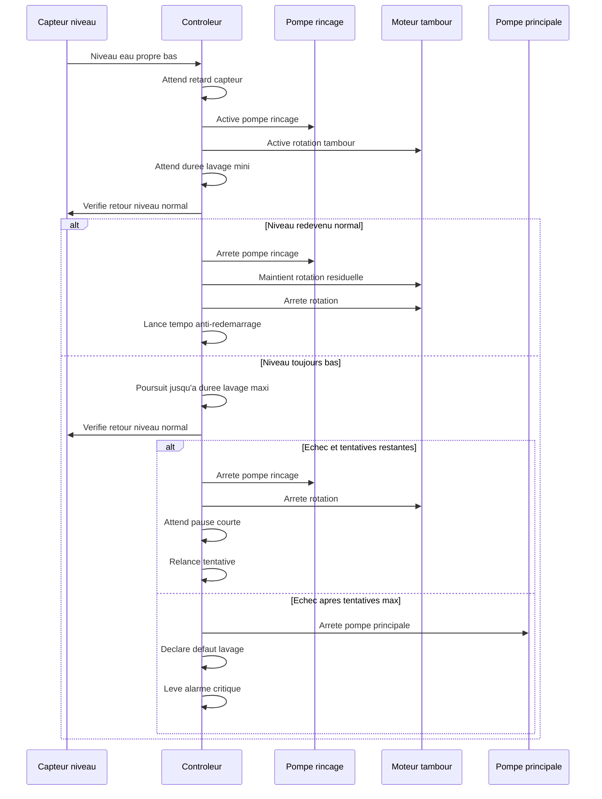
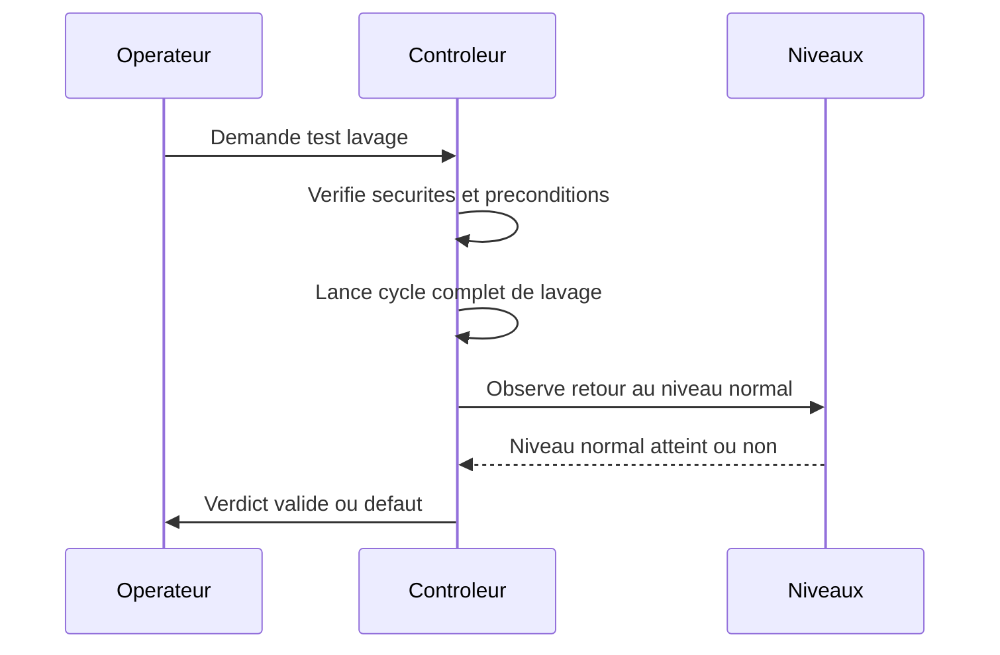
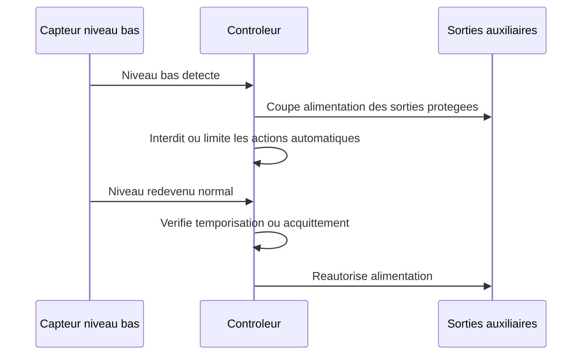

# Exigences fonctionnelles

## Tableau des exigences

| ID | Exigence | Priorite | Commentaire |
| --- | --- | --- | --- |
| F-001 | Le systeme doit detecter un besoin de lavage a partir du niveau d'eau dans le filtre a tambour. | Must | Les capteurs de niveau retenus sont des CR18-8DN ; leur nombre exact, leur position et la logique finale restent a figer. |
| F-002 | Le systeme doit demarrer une pompe de rincage pendant le cycle de lavage. | Must | La sortie devra probablement piloter un relais ou contacteur. |
| F-003 | Le systeme doit commander la rotation du tambour pendant le cycle de lavage. | Must | La commande dependra du moteur retenu. |
| F-004 | Le systeme doit arreter automatiquement le cycle apres une duree configurable. | Must | Valeur a definir lors des essais. |
| F-005 | Le systeme doit imposer un delai minimal entre deux cycles automatiques. | Must | Protection contre un capteur instable ou un filtre sature. |
| F-006 | Le systeme doit proposer un mode manuel de lavage. | Should | Le mode manuel doit conserver les protections essentielles. |
| F-007 | Le systeme doit signaler les etats marche, cycle en cours et defaut. | Should | Voyants, ecran ou interface reseau selon architecture. |
| F-008 | Le systeme devrait journaliser les cycles et defauts. | Could | Utile pour diagnostic mais non bloquant au prototype. |
| F-009 | Le systeme doit commander un seuil de niveau bas de securite distinct du seuil de lavage. | Must | Ce seuil protege l'installation en cas de manque d'eau. |
| F-010 | Le systeme doit couper la pompe principale de filtration lorsque le seuil bas est atteint. | Must | Evite de vider le bassin et protege la pompe contre la marche a sec. |
| F-011 | Le systeme doit couper la pompe decoration lorsque le seuil bas est atteint. | Must | Evite de vider le bassin et protege la pompe contre la marche a sec. |
| F-012 | Le systeme doit couper l'UV lorsque le seuil bas est atteint. | Must | Evite un fonctionnement hors d'eau et sans refroidissement correct. |
| F-013 | Le systeme doit interdire toute rotation du tambour et toute activation de la pompe de rincage tant que le niveau bas persiste. | Must | La fonction de lavage du FAT doit etre completement inhibee en niveau bas. |
| F-014 | Le systeme doit couper la mise a niveau automatique du bassin lorsque le seuil bas est atteint. | Must | Evite de remplir indefiniment le bassin en cas de fuite. |
| F-015 | Le systeme doit maintenir alimente le bulleur de la cuve bio meme lorsque le seuil bas est atteint. | Must | Permet de preserver les bacteries de filtration biologique. |
| F-016 | Le systeme doit maintenir alimente le bulleur du bassin meme lorsque le seuil bas est atteint. | Must | Permet de maintenir l'oxygenation des poissons et de limiter la glace en hiver. |
| F-017 | Le systeme doit maintenir les sorties coupees ou inhibees tant que la condition de niveau bas persiste. | Must | Le redemarrage doit etre maitrise pour eviter les oscillations. |
| F-018 | Le systeme devrait permettre de configurer un delai ou une logique de rearmement apres retour a un niveau normal. | Should | Permet d'eviter une remise en service trop brusque apres incident. |
| F-019 | Le systeme doit proposer un mode auto normal comme mode principal d'exploitation. | Must | C'est le mode nominal apres mise en service et en exploitation courante. |
| F-020 | Le systeme doit permettre un arret total de l'automate pour maintenance ou consignation. | Must | Cet arret total doit etre explicite et distinct d'un simple defaut. |
| F-021 | En cas de coupure de courant puis de retour alimentation, le systeme doit redemarrer dans un etat operationnel et converger vers un mode exploitable sans rester bloque dans un etat d'attente indefini. | Must | Par defaut, la cible est le mode auto normal si aucune securite ne l'interdit. |
| F-022 | Le systeme doit proposer un mode manuel permettant le pilotage independant de la rotation du tambour, du rincage, de la pompe bassin, de la pompe decoration, de l'UV et du reset alarme. | Must | Chaque commande manuelle doit etre explicite et visible par l'operateur. |
| F-023 | Le mode manuel doit conserver des securites minimales, notamment l'interdiction d'une marche a sec et les verrouillages critiques lies a l'ouverture du compartiment. | Must | Le mode manuel ne doit pas permettre de contourner une protection critique. |
| F-024 | Le systeme doit proposer un mode maintenance dans lequel les alarmes sont inhibees partiellement et le tambour ne peut pas demarrer automatiquement. | Must | Ce mode est destine aux interventions et au nettoyage. |
| F-025 | L'ouverture du capot ou du compartiment du FAT doit forcer ou proposer immediatement le passage en mode maintenance, couper l'UV et interdire le lavage automatique. | Must | Ce comportement limite les risques pendant une intervention. |
| F-026 | En mode maintenance, les pompes doivent pouvoir etre arretees proprement, la rotation doit etre coupee a l'ouverture du compartiment et une temporisation doit eviter un redemarrage brutal a la sortie du mode. | Must | La temporisation protege l'operateur et l'hydraulique. |
| F-027 | Le systeme doit proposer un mode degrade pour maintenir le bassin vivant lorsqu'un sous-ensemble non critique du FAT est indisponible. | Must | Le mode degrade doit etre signale et journalise. |
| F-028 | Le mode degrade doit au minimum couvrir les cas suivants : lavage inefficace repete sans passage immediat en critique tant que le niveau critique n'est pas atteint, capteur de niveau principal indisponible avec bascule sur capteur de secours si disponible, lavages trop frequents avec alarme et maintien de service, commande UV incoherente avec coupure UV et alarme. | Should | Les reactions exactes dependront du cablage final et de la presence d'un bypass. |
| F-029 | Le systeme doit proposer un mode test distinct du mode manuel permettant de lancer un cycle complet de lavage avec validation automatique du retour a un niveau normal ou declaration d'un defaut. | Must | Ce mode est utile apres maintenance ou mise au point. |
| F-030 | Le systeme doit mesurer la temperature de l'eau du bassin et rendre cette valeur disponible a l'automate. | Must | La localisation et la technologie du capteur restent a definir. |
| F-031 | Le systeme doit permettre de remonter au minimum des alertes de temperature basse, temperature haute et perte de mesure du capteur. | Should | Les seuils exacts et l'usage par le mode hiver restent a definir. |
| F-032 | Le systeme doit mesurer la temperature ambiante du local technique ou du coffret et rendre cette valeur disponible a l'automate. | Should | L'emplacement exact doit privilegier une mesure representative et maintenable. |
| F-033 | Le systeme doit permettre de remonter au minimum des alertes de temperature ambiante basse, temperature ambiante haute et perte de mesure du capteur. | Should | Les seuils exacts et les usages de cette mesure restent a definir. |
| F-034 | Le systeme doit disposer d'une IHM locale permettant de remonter le statut de fonctionnement a proximite du coffret. | Must | Le choix exact entre voyants, ecran, buzzer ou combinaison reste a definir. |
| F-035 | L'IHM locale doit permettre d'identifier au minimum les etats auto normal, manuel, maintenance, degrade, defaut, cycle en cours et alarme active. | Must | La forme d'affichage peut etre lumineuse, textuelle ou mixte. |
| F-036 | Le systeme devrait permettre d'afficher localement au moins certaines mesures utiles comme temperatures, etat des capteurs ou cause de defaut si un ecran est retenu. | Should | Cette exigence depend du niveau d'IHM retenu. |
| F-037 | Le systeme devrait permettre une remontee a distance de l'etat general, des alarmes et des defauts. | Should | Le canal exact reste a definir : application mobile, Wi-Fi, BLE, mail, SMS ou autre. |
| F-038 | Le systeme devrait permettre d'emettre des notifications a distance lors d'evenements significatifs comme defaut critique, passage en degrade, niveau bas, alarme temperature ou reprise apres coupure. | Should | La liste exacte des evenements et les regles d'envoi restent a definir. |
| F-039 | Le mode auto doit declencher le lavage lorsque le niveau eau propre reste en condition de demande pendant un retard configurable. | Must | La demande de lavage doit etre robuste aux fluctuations de capteur. |
| F-040 | Une fois le lavage lance, le systeme doit maintenir rotation tambour et rincage au moins pendant une duree minimale configurable. | Must | Evite des cycles trop courts et inefficaces. |
| F-041 | A l'issue de la duree minimale, si le niveau est redevenu normal, le systeme doit arreter le rincage, terminer eventuellement la rotation residuelle puis appliquer une temporisation anti-redemarrage. | Must | La rotation residuelle aide a evacuer le dernier film d'eau et les debris. |
| F-042 | Si le niveau n'est pas redevenu normal a l'issue de la duree minimale, le systeme doit poursuivre le lavage jusqu'a une duree maximale configurable. | Must | Protection contre les cycles interminables. |
| F-043 | Si la duree maximale est atteinte et que le niveau est toujours en demande, le systeme doit attendre une courte pause configurable avant de relancer une tentative, dans la limite d'un nombre maximum configurable. | Must | Permet plusieurs essais sans fonctionnement continu destructif. |
| F-044 | Si le nombre maximum de tentatives est atteint sans retour a un niveau normal, le systeme doit declarer un defaut lavage, arreter la pompe principale et lever une alarme critique. | Must | Ce cas doit etre traite comme un incident majeur de filtration. |
| F-045 | Le systeme doit surveiller et memoriser la frequence des lavages par heure et par jour afin de detecter un fonctionnement anormalement frequent. | Should | Les seuils exacts seront ajustes apres observation du bassin. |
| F-046 | Le systeme devrait executer un test journalier automatique du lavage avec diagnostic du resultat lorsque les conditions de securite et d'exploitation le permettent. | Should | Ce test ne doit pas se lancer en maintenance, en niveau bas ou en defaut critique. |
| F-047 | Le test journalier devrait verifier au minimum la mise en route du tambour, du rincage et le retour attendu des informations de niveau ou de diagnostic associees. | Should | Le resultat doit etre journalise et pouvoir lever une alerte si le test echoue. |
| F-048 | Le systeme devrait eviter qu'une meme portion du tambour reste immergee en permanence en prevoyant une indexation ou rotation periodique hors lavage. | Should | Objectif : repartir l'immersion, le colmatage et le vieillissement mecanique. |
| F-049 | La strategie d'indexation du tambour devrait etre configurable et compatible avec les securites capot, maintenance, niveau bas et defauts critiques. | Should | La logique exacte dependra de la presence ou non d'un capteur de position. |
| F-050 | Le systeme devrait enregistrer des statistiques de lavage exploitables pour le diagnostic du filtre. | Should | Ces statistiques sont considerees comme un indicateur majeur de l'etat du FAT. |
| F-051 | Les statistiques de lavage devraient inclure au minimum le nombre de lavages par heure, le nombre de lavages par jour, la duree moyenne d'un lavage, la duree totale de lavage par jour, l'intervalle moyen entre lavages et l'intervalle minimum observe. | Should | Ces valeurs doivent etre calculees a partir des cycles reels et des tentatives pertinentes. |
| F-052 | Le systeme devrait permettre de suivre l'evolution de ces statistiques sur au moins 7 jours et 30 jours. | Should | L'objectif est d'observer les derives lentes du comportement du filtre. |
| F-053 | Le systeme devrait calculer un indice simple d'encrassement du filtre a partir des statistiques de lavage. | Should | Cet indice aide a suivre l'evolution globale de la charge et de l'efficacite du nettoyage. |
| F-054 | L'indice d'encrassement devrait etre calcule au minimum comme : nombre de lavages par heure x duree moyenne de lavage. | Should | La formule pourra etre enrichie plus tard si des mesures supplementaires sont disponibles. |
| F-055 | Le systeme devrait permettre d'estimer ou de mesurer la consommation d'eau liee au rincage du filtre. | Should | Cette fonction peut reposer sur un compteur d'eau ou sur une estimation a partir du debit de rincage. |
| F-056 | Les indicateurs de consommation d'eau devraient inclure au minimum les litres par lavage, les litres par jour, les litres par semaine, les litres perdus vers l'evacuation et une estimation du remplissage necessaire. | Should | Les valeurs doivent indiquer clairement si elles sont mesurees ou estimees. |
| F-057 | Le systeme devrait suivre les temps de fonctionnement cumules des principaux actionneurs. | Should | Ces compteurs sont utiles pour la maintenance preventive et l'analyse d'usure. |
| F-058 | Les temps de fonctionnement devraient inclure au minimum les heures moteur tambour, les heures pompe rincage, les heures pompe decoration, les heures pompe principale et les heures UV. | Should | Les compteurs doivent pouvoir etre consultes localement ou a distance selon l'IHM retenue. |
| F-059 | Le systeme devrait permettre d'emettre immediatement une notification a distance lors des evenements critiques retenus. | Should | La liste minimale candidate comprend niveau eau propre critique, lavage inefficace critique, risque pompe a sec, capteurs incoherents, capot ouvert en situation dangereuse, coupure courant et retour courant. |
| F-060 | Le systeme devrait pouvoir emettre une synthese quotidienne de fonctionnement lorsque cette fonction est activee. | Should | Cette synthese est utile pour suivre le filtre sans supervision permanente. |
| F-061 | La synthese quotidienne devrait inclure au minimum un statut global du filtre, le nombre de lavages du jour, la duree moyenne, l'eau estimee ou mesuree consommee, le dernier defaut et la temperature d'eau. | Should | Le contenu exact pourra evoluer selon le canal retenu. |
| F-062 | La synthese quotidienne doit pouvoir etre activee ou desactivee independamment des notifications immediates. | Must | L'utilisateur doit pouvoir supprimer le resume journalier sans perdre les alertes critiques. |
| F-063 | Le systeme devrait permettre le pilotage automatique de la pompe decoration selon une ou plusieurs tranches horaires configurables. | Should | Permet par exemple de couper la fontaine la nuit. |
| F-064 | Le fonctionnement programme de la pompe decoration doit pouvoir etre desactive simplement, sans supprimer la possibilite de commande manuelle si elle reste autorisee. | Must | Cette desactivation doit couvrir par exemple l'hiver ou une longue absence. |
| F-065 | La programmation de la pompe decoration doit rester soumise aux securites generales du systeme, notamment niveau bas, defaut critique et eventuelles inhibitions saisonnieres retenues. | Must | Une tranche horaire ne doit jamais contourner une protection. |
| F-066 | Le systeme doit formuler ses alarmes et defauts a partir des consequences observables et des incoherences mesurables, sans affirmer une panne d'organe non instrumentee directement. | Must | Par exemple, preferer lavage inefficace a tambour bloque ou pompe HS si aucun retour d'etat direct n'existe. |
| F-067 | La nomenclature de reference cote eau propre doit distinguer au minimum un capteur EP_BAS pour la demande de lavage et un capteur EP_CRITIQUE pour le danger pompe et l'arret de securite. | Must | Ces deux entrees constituent le coeur de la logique hydraulique observable en V1. |
| F-068 | Le systeme doit detecter comme defaut critique toute combinaison incoherente des capteurs eau propre, notamment EP_CRITIQUE actif alors que EP_BAS n'est pas actif si l'ordre physique des capteurs l'interdit. | Must | Cette verification protege contre un capteur bloque ou un cablage incoherent. |
| F-069 | Au redemarrage, si EP_BAS ou EP_CRITIQUE sont actifs, le systeme ne doit pas relancer directement la filtration et l'UV sans verification de la situation hydraulique et sans appliquer la strategie de reprise retenue. | Must | Un lavage peut etre tente si les conditions le permettent, sinon le systeme doit rester en securite. |
| F-070 | Le systeme devrait detecter une absence anormale de lavage lorsque la filtration est commandee mais qu'aucun lavage n'est observe pendant une duree inhabituelle au regard de la saison ou de l'historique. | Should | Ce diagnostic reste indirect et doit etre formule comme une verification de debit, pompe ou capteur. |
| F-071 | Le systeme doit couper l'UV et lever une alarme de commande incoherente si l'UV est commande alors que la filtration n'est pas autorisee ou qu'un niveau critique eau propre est present. | Must | En V1, l'UV est asservi a la commande de filtration autorisee et non a une mesure directe de debit. |
| F-072 | Le systeme devrait surveiller un temps anormal de commande continue des sorties principales et alerter l'utilisateur en cas d'incoherence durable. | Should | Cette surveillance vise surtout a detecter une derive d'automatisme ou un oubli d'exploitation. |
| F-073 | Le systeme devrait surveiller la frequence des redemarrages de l'automate et signaler des coupures secteur anormalement repetitives. | Should | Utile pour detecter une alimentation instable ou des reboots parasites. |
| F-074 | Les statistiques internes devraient inclure au minimum le temps de retour de EP_BAS a l'etat normal, le nombre de tentatives par lavage, le nombre d'activations de EP_CRITIQUE, les temperatures min/max/moyenne, le nombre d'ouvertures capot et la duree capot ouvert. | Should | Ces donnees compensent le faible nombre de capteurs directs par une meilleure lecture des derives. |

## Reperes de niveau a definir

Les quatre reperes suivants doivent etre definis explicitement pour finaliser la logique hydraulique et de pilotage :

| Repere | Zone de mesure | Role attendu |
| --- | --- | --- |
| Niveau normal cote sale | Compartiment eau sale | Reference hydraulique nominale en fonctionnement normal |
| Niveau normal cote propre | Compartiment eau propre ou report de niveau | Reference hydraulique nominale en fonctionnement normal |
| Niveau de declenchement du lavage | Cote propre ou logique derivee du differentiel sale/propre | Seuil de lancement d'un cycle de lavage |
| Niveau bas de securite | Cote propre ou report de niveau | Seuil de mise en securite de l'installation |

Ces reperes doivent ensuite etre traduits en cotes physiques, en nombre de capteurs et en logique logicielle.

## Capteurs eau propre de reference

Dans l'hypothese actuelle, les deux capteurs cote eau propre sont nommes comme suit :

| Capteur | Role |
| --- | --- |
| EP_BAS | Niveau eau propre bas, demande de lavage |
| EP_CRITIQUE | Niveau eau propre tres bas, danger pompe et arret de securite |

Ces deux entrees constituent le coeur de la logique observable du FAT en V1.

## Principe de diagnostic et de formulation des alarmes

En l'absence de retour direct de rotation, de mesure de courant, de pressostat de rincage, de detection de fuite local, de niveau haut cote eau sale ou de retour marche reel des charges, l'automate ne doit pas pretendre diagnostiquer directement certaines pannes.

La philosophie retenue est donc :

- diagnostiquer d'abord les consequences hydrauliques observables cote eau propre ;
- nommer les alarmes par leur effet constate et non par une cause supposee ;
- guider l'utilisateur vers une liste de verifications probables plutot que vers une conclusion trop affirmative.

Exemples de formulations a privilegier :

- niveau eau propre anormal ;
- lavage inefficace ;
- risque pompe a sec ;
- cycle de lavage incoherent ;
- temperature anormale ;
- capot ouvert ;
- commande incoherente.

Exemples de formulations a eviter en V1 sans capteur supplementaire :

- tambour bloque ;
- pompe de rincage HS ;
- pompe filtration HS ;
- UV sans debit reel ;
- fuite local filtration ;
- niveau haut eau sale.

## Modes de fonctionnement

| Mode | Usage | Comportement attendu |
| --- | --- | --- |
| Auto normal | Exploitation courante | Surveillance niveaux, lavage automatique, gestion des alarmes et temporisations |
| Manuel | Tests ponctuels et depannage | Pilotage independant des sorties avec securites minimales maintenues |
| Maintenance | Intervention humaine sur le FAT | Pas de demarrage automatique du tambour, UV coupe, alarmes partiellement inhibees |
| Degrade | Maintien de vie du bassin malgre un sous-ensemble HS | Fonctionnement restreint mais stable avec alarme active |
| Test | Verification apres intervention | Cycle complet automatise avec verdict valide ou defaut |
| Arret total | Consignation ou maintenance lourde | Sorties arretees selon procedure maitrisee |

## Mesure de temperature bassin

La fonction temperature doit au minimum couvrir :

- acquisition reguliere de la temperature d'eau du bassin ;
- disponibilite de la valeur pour diagnostic local et alertes ;
- detection d'une perte de mesure ou d'une valeur incoherente ;
- possibilite d'utiliser plus tard cette mesure dans un mode hiver ou une supervision.

## Mesure de temperature ambiante local

La fonction temperature ambiante doit au minimum couvrir :

- acquisition reguliere de la temperature du local technique ou du volume representatif autour de l'automate ;
- disponibilite de la valeur pour diagnostic local et alertes ;
- detection d'une perte de mesure ou d'une valeur incoherente ;
- possibilite d'utiliser plus tard cette mesure pour surveiller le risque de gel, de surchauffe ou de condensation.

## IHM locale et signalisation

L'IHM locale doit au minimum couvrir :

- remontee visuelle claire de l'etat global du systeme ;
- distinction des modes principaux et des etats d'alarme ;
- identification locale d'un cycle de lavage en cours ;
- possibilite de definir un code couleur et un nombre de voyants coherents ;
- possibilite d'integrer un ecran local si le besoin de detail de diagnostic le justifie.

## Contenu utile de l'interface locale

Meme si l'IHM reste simple, les informations suivantes sont considerees comme particulierement utiles a afficher localement :

- mode actuel ;
- etat lavage, repos ou defaut ;
- niveau eau propre : OK, bas ou critique ;
- heure du dernier lavage ;
- nombre de lavages aujourd'hui ;
- defaut actif ;
- temperature eau ;
- temperature local ;
- etat pompe principale ;
- etat pompe decoration ;
- etat UV.

Si l'IHM retenue ne permet pas d'afficher tout cela en meme temps, elle doit au minimum donner acces a ces informations par pages, defilement ou codes clairement documentes.

## Remontee d'etat a distance

La fonction de notification a distance doit au minimum etre etudiee pour couvrir :

- consultation ou reception de l'etat global du systeme ;
- remontee des alarmes et defauts importants ;
- choix du ou des canaux adaptes au site : Wi-Fi, BLE, mail, SMS ou autre ;
- maitrise des notifications repetitives pour eviter le spam d'alarmes ;
- comportement degrade acceptable en cas de perte de connectivite.

### Notifications immediates a prevoir

Une premiere liste simple et utile de notifications immediates comprend :

- niveau eau propre critique ;
- lavage inefficace critique ;
- risque pompe a sec ;
- capteurs niveau incoherents ;
- capot ouvert en situation dangereuse ;
- temperature anormale critique ;
- coupure courant ;
- retour courant.

### Synthese quotidienne

La supervision distante peut aussi envoyer une synthese quotidienne lorsque cette fonction est activee.

Exemple de contenu utile :

- statut global : filtre OK ou etat en defaut ;
- nombre de lavages aujourd'hui ;
- duree moyenne d'un lavage ;
- eau estimee ou mesuree consommee ;
- dernier defaut ;
- temperature eau.

Cette synthese doit pouvoir etre desactivee sans desactiver les notifications immediates.

## Pilotage horaire de la pompe decoration

La pompe decoration peut utilement etre geree par une petite logique de programmation, par exemple pour arreter la fontaine la nuit ou la desactiver l'hiver.

La fonction devrait au minimum couvrir :

- activation ou desactivation globale de la pompe decoration en mode programme ;
- une ou plusieurs tranches horaires configurables ;
- etat visible localement de la pompe decoration : active, arretee, inhibee ou hors plage ;
- maintien des securites generales, en particulier niveau bas et defaut critique ;
- compatibilite avec un futur mode hiver si cette fonction est retenue.

## Test journalier et diagnostic

Le test journalier automatique doit au minimum couvrir :

- verification que le systeme n'est ni en maintenance, ni en niveau bas, ni en defaut critique avant lancement ;
- lancement d'un cycle de test limite et maitrise ;
- verification du fonctionnement tambour, rincage et retour d'information associe ;
- production d'un verdict clair : succes, avertissement ou defaut ;
- journalisation du resultat et possibilite de notifier un echec.

## Alarmes cibles adaptees a la V1

### Alarmes critiques

| Code | Alarme | Detection observable | Action cible |
| --- | --- | --- | --- |
| C01 | Niveau eau propre critique | EP_CRITIQUE actif au-dela de la temporisation de confirmation | Arret filtration, arret UV, alarme critique |
| C02 | Lavage inefficace critique | EP_BAS reste actif apres le nombre maximum de tentatives, ou EP_CRITIQUE finit par s'activer | Arret filtration, arret UV, alarme critique |
| C03 | Capteurs niveau incoherents | Combinaison physiquement impossible entre EP_BAS et EP_CRITIQUE | Arret filtration par prudence, arret UV, alarme |
| C04 | Demarrage impossible niveau eau propre bas | EP_BAS ou EP_CRITIQUE actifs au demarrage sans retour a un etat sur | Interdire redemarrage direct, alarme |
| C05 | Capot ouvert avec cycle dangereux | Capot ouvert pendant lavage, ou capot ouvert alors qu'un cycle automatique voudrait demarrer | Stop UV, interdire lavage auto, alarme |

### Alarmes majeures

| Code | Alarme | Detection observable | Action cible |
| --- | --- | --- | --- |
| M01 | Niveau eau propre bas persistant | EP_BAS actif trop longtemps sans atteindre EP_CRITIQUE | Lavage renforce ou relances, alarme majeure |
| M02 | Lavages trop frequents | Trop de passages de EP_BAS ou trop de cycles sur une periode | Alerte encrassement, maintien fonctionnement si securite OK |
| M03 | Lavage trop long | Retour a niveau normal trop lent par rapport au nominal | Alerte nettoyage inefficace |
| M04 | Absence anormale de lavage | Filtration commandee mais aucun lavage observe pendant une duree inhabituelle | Demande de verification debit, pompe ou capteur |
| M05 | Commande UV incoherente | UV commande alors que filtration non autorisee ou niveau critique actif | Couper UV, alarme |
| M06 | Temperature eau haute | Temperature bassin au-dessus du seuil d'alerte | Alerte, verifier oxygenation |
| M07 | Temperature eau basse | Temperature bassin sous le seuil d'alerte | Alerte ou mode hiver selon strategie |
| M08 | Temperature local basse | Temperature air local proche du gel | Alerte protection rincage/local |
| M09 | Temperature local haute | Temperature air local trop elevee | Alerte electronique/local |

### Alarmes mineures

| Code | Alarme | Detection observable | Action cible |
| --- | --- | --- | --- |
| m01 | Capot ouvert | Contact capot ouvert hors situation critique | Passage maintenance ou information locale |
| m02 | Entretien a prevoir | Derive des statistiques, compteurs ou historique de lavage | Message entretien sans arret automatique |
| m03 | Redemarrages frequents | Nombre de boots anormal sur une periode | Alerte alimentation ou reboots parasites |
| m04 | Sortie commandee trop longtemps | Duree anormale de commande d'une sortie | Alerte incoherence ou oubli |
| m05 | Historique lavage inhabituel | Evolution brutale par rapport a la moyenne recente | Alerte preventive |
| m06 | Mode maintenance actif trop longtemps | Capot ouvert ou maintenance maintenue au-dela du delai cible | Rappel exploitation |

## Repartition de l'immersion du tambour

Pour eviter qu'une meme zone du tambour reste constamment immergee, la logique devrait prevoir :

- une rotation d'indexation periodique ou a la fin de certains cycles ;
- une amplitude configurable de rotation ou une cible de position si un capteur le permet ;
- une inhibition automatique en maintenance, capot ouvert, niveau bas ou defaut critique ;
- une trace de l'action dans la journalisation si cette fonction est retenue.

## Statistiques de lavage

Les statistiques de lavage considerees comme les plus utiles sont :

- nombre de lavages par heure ;
- nombre de lavages par jour ;
- duree moyenne d'un lavage ;
- duree totale de lavage par jour ;
- temps necessaire pour que EP_BAS repasse a l'etat normal ;
- nombre de tentatives par lavage ;
- intervalle moyen entre lavages ;
- intervalle minimum entre lavages ;
- evolution sur 7 jours ;
- evolution sur 30 jours.

## Indice d'encrassement

Un indicateur simple et utile a calculer est :

`Indice encrassement = nombre de lavages par heure x duree moyenne lavage`

Si cet indice monte, cela peut indiquer par exemple :

- une eau plus chargee ;
- une toile qui se colmate plus vite ;
- un rincage qui devient moins efficace ;
- un debit qui augmente ;
- un effet saisonnier.

## Consommation d'eau

Les indicateurs de consommation d'eau les plus utiles sont :

- litres par lavage ;
- litres par jour ;
- litres par semaine ;
- litres perdus vers evacuation ;
- estimation du remplissage necessaire.

La fonction peut etre realisee de deux facons :

- par mesure directe avec compteur d'eau sur le circuit de rincage ou d'appoint ;
- par estimation a partir du debit de rincage et du temps cumule de fonctionnement.

Les donnees de consommation doivent aider a comprendre :

- le cout hydraulique reel du filtre ;
- la coherence entre frequence de lavage et consommation ;
- l'effet d'un colmatage ou d'un rincage inefficace ;
- le besoin de remplissage ou d'appoint sur la duree.

## Temps de fonctionnement

Les compteurs de fonctionnement les plus utiles sont :

- heures moteur tambour ;
- heures pompe rincage ;
- heures pompe decoration ;
- heures pompe principale ;
- heures UV.

Ces compteurs doivent aider a comprendre :

- l'usure relative des organes ;
- les besoins de maintenance preventive ;
- la coherence entre temps de marche et comportement hydraulique ;
- l'impact des modes et des saisons sur l'exploitation.

Ces statistiques doivent servir a comprendre :

- l'encrassement reel du filtre ;
- l'evolution du bassin dans le temps ;
- la presence d'une derive hydraulique ou mecanique ;
- l'effet d'un reglage ou d'une intervention.

Les historiques suivants sont egalement particulierement utiles dans une architecture a capteurs limites :

- nombre d'activations de EP_CRITIQUE ;
- temperatures eau min, max et moyenne ;
- temperatures local min, max et moyenne ;
- nombre d'ouvertures capot ;
- duree cumulee capot ouvert.

## Pilotage manuel independant

Les commandes suivantes doivent etre disponibles individuellement en mode manuel :

- Rotation du tambour.
- Pompe de rincage.
- Pompe bassin.
- Pompe decoration.
- UV.
- Reset alarme.

Les interverrouillages minimaux attendus sont les suivants :

- Interdire la pompe de rincage si le niveau d'eau requis n'est pas present.
- Interdire la rotation du tambour si le compartiment ou le capot de securite est ouvert.
- Couper ou refuser l'UV en cas de condition hydraulique incompatible.
- Refuser toute commande manuelle qui contournerait un defaut critique actif.

## Sorties a couper et a maintenir sur niveau bas

### Sorties a couper ou inhiber

- Pompe principale de filtration.
- Pompe decoration.
- UV.
- Rotation du tambour.
- Pompe de rincage.
- Mise a niveau automatique du bassin.

### Sorties a maintenir alimentees

- Bulleur de la cuve bio.
- Bulleur du bassin.

## Logique cible de lavage automatique

La logique de reference retenue est la suivante :

1. Si EP_BAS reste actif pendant le retard capteur configure, lancer un lavage.
2. Pendant le lavage, activer simultanement le moteur tambour et le rincage.
3. Maintenir cet etat au moins pendant la duree lavage mini.
4. A la fin de la duree mini :
5. Si EP_BAS est redevenu inactif, arreter le rincage, conserver la rotation pendant un temps residuel eventuel, puis arreter le tambour et lancer la temporisation anti-redemarrage.
6. Sinon, poursuivre le lavage jusqu'a la duree lavage maxi.
7. Si la duree maxi est atteinte et que le niveau reste en demande, attendre une courte pause puis relancer une tentative.
8. Si le nombre maximum de tentatives est atteint, declarer un defaut lavage, arreter la pompe principale et lever une alarme critique.

En parallele, si EP_CRITIQUE devient actif pendant cette logique, le systeme doit basculer sans attendre vers la mise en securite critique.

## Parametres reglables a prevoir

| Parametre | Plage ou exemple cible | Role |
| --- | --- | --- |
| Duree lavage mini | 10 s | Assurer un lavage utile meme si le niveau remonte vite |
| Duree lavage maxi | 45 s | Limiter la marche continue de rincage et tambour |
| Temps rotation apres rincage | 2 a 5 s | Finir l'evacuation apres coupure rincage |
| Tempo anti-redemarrage | 30 a 120 s | Eviter les relances immediates |
| Nombre max tentatives | 3 | Declarer un defaut lavage apres echec repete |
| Pause entre tentatives | courte pause a definir | Laisser le systeme se stabiliser avant nouvel essai |
| Seuil lavages par heure | 10 a 30 selon bassin | Detecter un encrassement ou dysfonctionnement |
| Seuil lavages par jour | a definir apres observation | Suivre le comportement global de l'installation |
| Retard capteur niveau | 2 a 5 s | Filtrer les fluctuations breves |
| Temps confirmation defaut | 10 a 30 s | Eviter un defaut intempestif selon la cause |
| Tempo redemarrage pompe | 30 a 120 s | Maitriser la reprise apres defaut ou incident |
| Taille historique statistiques | 7 jours et 30 jours minimum | Permettre le suivi de tendance |
| Regle de calcul indice encrassement | formule configurable ou figee en V1 | Garder un indicateur stable et interpretable |
| Debit de rincage de reference | a definir ou mesurer | Base de calcul si la consommation n'est pas mesuree directement |
| Regle de calcul consommation eau | mesuree ou estimee | Garder des chiffres comparables et correctement etiquetes |
| Granularite compteurs horaires | a definir | Fixer la precision des temps cumules |
| Heure ou fenetre test journalier | a definir | Choisir un moment compatible avec l'exploitation |
| Timeout test journalier | a definir | Limiter la duree du test automatique |
| Pas d'indexation tambour | a definir | Eviter qu'une meme zone reste immergee |
| Frequence indexation tambour | a definir | Repartir l'immersion dans le temps |
| Activation synthese quotidienne | activee ou desactivee | Permettre de supprimer le resume journalier si non souhaite |
| Heure synthese quotidienne | a definir | Envoyer le resume a un moment utile et stable |
| Liste notifications immediates | a definir | Figer les evenements qui doivent partir sans delai |
| Temporisation anti-repetition notifications | a definir | Eviter le spam en cas de defaut persistant |
| Activation programme pompe decoration | activee ou desactivee | Permettre de couper simplement la fonction deco sur une longue periode |
| Tranches horaires pompe decoration | a definir | Determiner les plages de fonctionnement autorisees |
| Strategie hiver pompe decoration | a definir | Desactiver totalement ou adapter selon la saison retenue |

## Sequence nominale de lavage

## Sequence de test lavage

## Sequence de securite niveau bas

## Politique de reprise apres coupure d'alimentation

Au retour alimentation, la logique doit :

- relire l'etat des capteurs et des demandes operateur ;
- reappliquer les verrouillages critiques avant toute remise en marche ;
- revenir par defaut en mode auto normal si aucune condition de securite ne l'interdit ;
- entrer en maintenance si un capot est detecte ouvert au demarrage ;
- entrer en degrade ou en defaut si les auto-diagnostics detectent une anomalie incompatible avec le mode auto.
